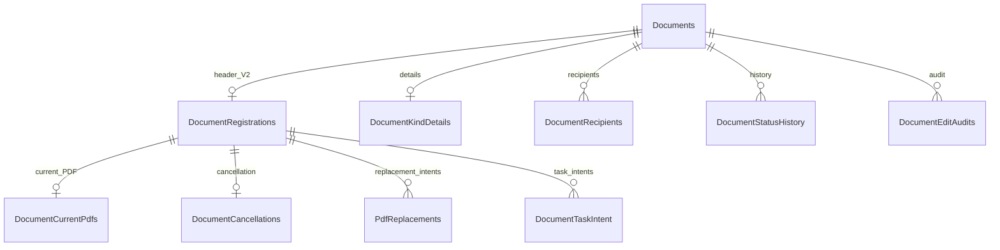

> Bản bàn giao database độc lập trên nhánh `database` của repo chính thức Seleton-VN/Intern-DocumentAdministration-BE. Đọc README.md và PROVISIONING.md trong thư mục này để sử dụng gói. Các đường dẫn backend/workflows/tools và lệnh QA bên dưới mô tả cây nguồn local dùng xây schema, không phải các công cụ được đưa lên trong lượt bàn giao chỉ database này.

# Tài liệu kỹ thuật database DAS

Tài liệu bàn giao cho lập trình viên làm việc trên database và tầng persistence của DAS. Đối chiếu ngày **07/10/2026** với DbContext, entity, model snapshot, migrations và workflow hiện hành trong repository. Quy tắc trong tài liệu mô tả code hiện có; những yêu cầu chưa có mapping/dữ liệu nguồn được ghi rõ để tránh tự tạo dữ liệu hoặc ràng buộc sai.

Toàn bộ lệnh chạy từ thư mục **`DAS-Collaboration`**. Dictionary ở cuối tài liệu liệt kê **43 bảng nghiệp vụ, 360 cột, 25 foreign key và 24 CHECK constraints** của SQL Server model hiện hành. Ngoài ra, mỗi store có bảng lịch sử migration `dbo.__EFMigrationsHistory`; bảng này không nằm trong số 43 bảng nghiệp vụ.

## Mục lục

1. [Kiến trúc và quyền sở hữu dữ liệu](#s1)
2. [Vị trí source và cách đọc schema](#s2)
3. [Quy ước kiểu dữ liệu, thời gian, NULL và phiên bản](#s3)
4. [Phân biệt công văn legacy và V2](#s4)
5. [Đăng ký, bộ đếm và số công văn](#s5)
6. [Ngày đăng ký, ngày phát hành và snapshot](#s6)
7. [Chỉnh sửa, trạng thái, hủy và khôi phục](#s7)
8. [Chi tiết theo loại, nơi nhận và liên kết công văn](#s8)
9. [Catalog và nhãn nơi phân phối](#s9)
10. [Auth, tổ chức và directory persistence](#s10)
11. [Đối tác và audit](#s11)
12. [File, PDF hiện hành và giao thức thay thế](#s12)
13. [Outbox, notification và chống gửi trùng](#s13)
14. [Nhắc hạn và task intent](#s14)
15. [Database Email Worker](#s15)
16. [Transaction, khóa, replay và xử lý lỗi](#s16)
17. [Provision database và cấu hình startup](#s17)
18. [Thay đổi schema và tạo migration](#s18)
19. [Đối soát, nhập dữ liệu cũ và truy vấn kiểm tra](#s19)
20. [Backup/restore, lưu giữ và kiểm thử database](#s20)
21. [Dictionary đầy đủ từng bảng/cột/index/FK/CHECK](#dictionary)
22. [Danh sách migration và nguồn đối chiếu](#migrations)

<a id="s1"></a>
## 1. Kiến trúc và quyền sở hữu dữ liệu

### 1.1. Sáu store

| Store | Project/DbContext sở hữu | Schema SQL | Bảng | Cột | FK | CHECK |
|---|---|---|---|---|---|---|
| Auth | `AuthService` / `AuthDbContext` | `auth` | 8 | 46 | 4 | 0 |
| Document | `DocumentService` / `DocumentDbContext` | `document` | 23 | 189 | 18 | 18 |
| Files | `FileService.API` / `FileDbContext` | `files` | 3 | 27 | 1 | 5 |
| Notification | `NotificationService` / `NotificationDbContext` | `notification` | 4 | 35 | 0 | 0 |
| Partner | `PartnerService` / `PartnerDbContext` | `partner` | 2 | 25 | 1 | 0 |
| Email Worker | `EmailWorkerService` / `EmailWorkerDbContext` | `emailworker` | 3 | 38 | 1 | 1 |

Một service chỉ sửa store của chính nó. Cấu hình `ConnectionStrings:Default` của từng host phải trỏ tới store tương ứng; chữ `Default` là tên cấu hình connection, không có nghĩa sáu host dùng chung một database. Schema là namespace bảng trong store, không phải tên database được bàn giao.

Auth/Document/Files/Notification/Partner dùng EF Core major 10; Email Worker dùng major 9. Không trộn migrations/snapshot hoặc dependency EF9 của Email vào DbContext EF10 khác. CLI xuất schema hiện dùng EF10.0.3 và EF9.0.0 tương ứng; khi sửa dependency cần đọc `.csproj` và `packages.lock.json` của đúng project.

### 1.2. Tham chiếu giữa store

| Trường/vùng dữ liệu | Đích logic | Ràng buộc hiện có |
|---|---|---|
| Các `*UserId`, `ActorId`, `RecipientId`, `AssigneeId` trong Document/Files/Notification/Partner | Người dùng/authority | GUID được service kiểm; không có FK xuyên sang `auth.Users` |
| `OwnerDepartmentId`, `SenderDepartmentId`, `DepartmentId` trong Document | Đơn vị tổ chức | Không có FK xuyên store; phải resolve đúng identity/phạm vi trước khi ghi |
| `Documents.PartnerId`, `DocumentKindDetails.SenderPartnerId`, recipient kiểu `ExternalEntity` | Partner | ID tham chiếu logic và snapshot tên; không có FK xuyên store |
| `DocumentAttachments.FileId`, `DocumentCurrentPdfs.FileId` | Files | Không có FK xuyên store; PDF V2 dùng proof/receipt và hash |
| `PdfUploads.DocumentId`, `PdfClaims.DocumentId` | Document V2 | Không có FK xuyên store; phải kiểm operation proof |
| `ReminderDelivery.NotificationId` | Notification receipt | Không có FK xuyên store; ghi từ phản hồi acceptance hợp lệ |
| `DocumentTaskIntent.RemoteTaskId` | Task Management bên ngoài | Chuỗi ID của hệ thống ngoài; không phải bản ghi task đầy đủ trong DAS |
| Các `FileId`, `PartnerId`, `DocumentId` trong Email item log | Correlation quá trình intake | Log tương quan; không tạo FK xuyên service |

Không thay các correlation này bằng một navigation EF xuyên service. Nếu cần dữ liệu liên quan, dùng hợp đồng của service sở hữu hoặc một projection đã được kiểm; không sửa store khác bằng connection của service hiện tại. Sự tồn tại của GUID hoặc hàng database không đồng nghĩa người gọi có quyền đọc/sửa.

### 1.3. Metadata file và byte file

Database Files lưu metadata/intent/claim. Byte PDF nằm tại storage được cấu hình riêng, không nằm trong cột BLOB của các bảng hiện hành. Backup SQL không tự chứa byte PDF. Khi restore Document/Files, phải đối soát cả ID, operation, size, SHA-256 và byte storage.

Frontend Prisma ở `database/prisma/schema.prisma` là phần schema template frontend đã có. Nó không sở hữu `document.Documents`, counters hoặc sáu store nghiệp vụ; không dùng Prisma migration để sửa database công văn.

<a id="s2"></a>
## 2. Vị trí source và cách đọc schema

| Thành phần | Đường dẫn tương đối từ root | Dùng khi nào |
|---|---|---|
| Migrations/snapshot | `database/migrations/<service>/` | DDL/lịch sử thay đổi của từng store |
| Model Document V2 | `backend/services/document-service/Data/DocumentV2Model.cs` | FK/CHECK/index/snapshot field và bất biến sau save |
| DbContext Document | `backend/services/document-service/Data/DocumentDbContext.cs` | Legacy, catalogs, task/reminder/delivery mapping |
| DbContext Auth | `backend/services/auth-service/Infrastructure/Persistence/AuthDbContext.cs` | Người dùng, role, department, directory ledger |
| DbContext Files | `backend/services/files-service/Data/FileDbContext.cs` | PDF upload/claim và metadata |
| DbContext Notification | `backend/services/notification-service/Data/NotificationDbContext.cs` | Inbox, chuông, preferences, log |
| DbContext Partner | `backend/services/partner-service/Infrastructure/Persistence/PartnerDbContext.cs` | Partner/audit và unique normalized keys |
| DbContext Email | `backend/services/email-worker-service/Data/EmailWorkerDbContext.cs` | Singleton settings và scan logs |
| Workflow business | `workflows/business/<service>/` | Transaction, validation, state machine, retry/reconcile |
| Shared database contracts | `backend/shared/` | Contract/protocol dùng giữa service; không phải store mới |
| SQL tests | `backend/tests/<Service>.Tests/*SqlTests.cs` | Constraint, transaction, concurrency và migration regression |
| Offline schema export | `tools/export-database-schema.py` | Kiểm snapshot và xuất SQL idempotent sáu store |
| SQL runner | `tools/qa/run-isolated-sql.py` | Thực thi tests trên instance SQL giả lập riêng |

`backend/Directory.Build.props` liên kết migrations và workflow canonical vào project sở hữu bằng `Compile Include`. Chỉ có một bản source. Không copy migration sang `backend/services/<service>/Migrations` rồi giữ cả hai bản.

Phân biệt ba lớp thông tin:

1. **Snapshot hiện hành:** cấu trúc model sau tất cả migrations; dùng đọc kiểu cột, NULL, PK/index/FK/CHECK.
2. **Migration:** các thao tác chuyển schema/dữ liệu từ mốc trước; có thể chứa SQL thủ công, guards hoặc seed.
3. **Workflow/entity:** cách application tạo giá trị, kiểm quyền, đổi trạng thái, tăng Version và bảo vệ bất biến. Những điều này không nhất thiết có CHECK/trigger tương ứng trong SQL.

Dictionary của tài liệu lấy kiểu SQL/NULL/index/FK/CHECK từ snapshot, rồi chú giải bằng workflow/entity. Nó không phải export từ database khách hàng đang chạy. Khi kiểm môi trường thật, phải đọc catalog `sys.*` và lịch sử migration của chính database đó.

<a id="s3"></a>
## 3. Quy ước kiểu dữ liệu, thời gian, NULL và phiên bản

### 3.1. Kiểu dữ liệu

| CLR/model | SQL Server trong schema | Quy tắc |
|---|---|---|
| `Guid`, `Guid?` | `uniqueidentifier` | GUID rỗng vẫn hợp lệ về kiểu SQL; service phải chặn khi trường yêu cầu identity thật |
| `int` | `int` | Dùng counter/year/count; không mặc nhiên có CHECK không âm |
| `long` | `bigint` | Version/revision/lease Unix; không phải `rowversion` |
| `bool` | `bit` | Cờ trạng thái; SQL không tự bảo vệ mọi tổ hợp giữa các cờ |
| `DateOnly` | `date` | Ngày nghiệp vụ không có giờ/timezone |
| `DateTime` | `datetime2` | Cột không lưu offset; code thường ghi UTC, cần giữ convention khi nhập/đọc |
| `DateTimeOffset` | `datetimeoffset` | Instant có offset; không thay thành chuỗi hiển thị địa phương |
| `string` | `nvarchar(n)` / `nvarchar(max)` | Độ dài vật lý phải đọc cột; không suy từ giới hạn DTO |

`IsRequired()`/NOT NULL chỉ chặn NULL, không chặn chuỗi rỗng, toàn khoảng trắng, JSON lỗi, email lỗi hay GUID rỗng. Các trường có CHECK cụ thể được liệt kê riêng. Không suy rằng tất cả string `State`, `Status` hoặc `PayloadJson` có enum/JSON CHECK.

Giá trị khởi tạo C# như `Guid.NewGuid()`, `Version=1`, `DateTime.UtcNow`, `State="Pending"` là giá trị application. Chúng không tự tạo SQL DEFAULT. Dictionary ghi SQL DEFAULT khi snapshot có `HasDefaultValue`/`HasDefaultValueSql`; `partner.Partners.Version` hiện có DEFAULT 1. Các GUID được EF ghi nhận `ValueGeneratedOnAdd` cũng không đồng nghĩa SQL dùng `IDENTITY` hoặc DEFAULT `NEWID()`.

**DEFAULT do lịch sử migration:** ngoài metadata snapshot, script migration hiện còn tạo những DEFAULT sau. Dictionary ghi thuộc tính model; bảng dưới ghi DDL bổ sung do migration, cần kiểm cả hai khi đối soát database vật lý.

| Bảng/cột | DEFAULT trong script nâng cấp | Nguồn |
|---|---|---|
| `auth.Departments.CreatedAt` | `SYSUTCDATETIME()` | `20260810130346_ImproveAuthModel` |
| `document.Documents.IsDeleted` | `CAST(0 AS bit)` | `20260827080431_AddSoftDeleteSqlServer` |
| `partner.Partners.Version` | `CAST(1 AS bigint)` | `20261005043235_ExternalEntityContactsAndConcurrency`; model cũng có DEFAULT 1 |

Hai DEFAULT đầu không được khai báo lại trong snapshot hiện hành, nhưng migration tạo constraint vật lý khi apply. Không suy rằng cột không có `HasDefaultValue` thì database triển khai từ toàn bộ lịch sử chắc chắn không có DEFAULT. SQL Server có thể tự sinh tên DEFAULT constraint; đọc `sys.default_constraints` để biết tên/biểu thức thực tế. DEFAULT chỉ áp dụng khi INSERT bỏ cột hoặc dùng từ khóa DEFAULT; nó không sửa giá trị đã được application truyền vào.

Một số EF `HasMaxLength` lớn hơn 4000 vẫn tạo `nvarchar(max)`, gồm `DocumentEditAudits.ChangesJson` (metadata 32000), `DocumentNotificationDelivery.PayloadJson` và `ReminderDelivery.PayloadJson` (metadata 8000). SQL không tự áp trần số ký tự đó bằng kiểu `nvarchar(max)`; muốn enforce tại DB phải bổ sung CHECK/migration được review. Không ghi giới hạn EF metadata thành một CHECK đã tồn tại.

Collation ảnh hưởng so sánh string, uniqueness và các CHECK dùng chuỗi. Code có những bước trim/uppercase/so sánh ordinal; SQL collation của môi trường cần được bàn giao và đối soát, không mặc nhiên tương đương mọi phép so sánh trong .NET.

### 3.2. Ngày và instant

Ngày đăng ký lấy từ một instant server qua timezone `Asia/Ho_Chi_Minh`. Ví dụ instant UTC `2026-12-31T17:00:00Z` cho ngày đăng ký Việt Nam `2027-01-01`, năm counter 2027. Không lấy năm từ `GETUTCDATE()` để đối chiếu ngày nghiệp vụ ở sát giao thừa.

`RegistrationDate`, `IssuedDate`, `ReceivingDate`, `ReminderBatch.Period` có mục đích khác nhau. Không thay một trường bằng trường khác chỉ vì cùng là `date`.

Các `LeaseUntilUnix` và `NextAttemptUnix` dùng **Unix seconds**, không phải milliseconds. So sánh với `DateTimeOffset.ToUnixTimeSeconds()`. Giá trị 0 thường là không giữ lease/không có lịch chờ; không convert 0 thành một deadline nghiệp vụ mới.

### 3.3. NULL

NULL thường nghĩa chưa có giá trị/kết quả: chưa có `IssuedDate`, chưa xác nhận intake, chưa có `RemoteTaskId`, chưa restore cancellation hoặc chưa publish directory event. Không chuyển hàng loạt NULL thành `Guid.Empty`, chuỗi rỗng hay ngày mặc định.

Email `DocumentId` là **string nullable**, khác GUID của `DocumentRegistrations.DocumentId`. Khi cần đối soát correlation Email với công văn, phải parse/kiểm hợp đồng, không assume SQL FK GUID.

### 3.4. Concurrency và Version

Version/revision là số `bigint` do application quản lý. Với tracked EF entity, `IsConcurrencyToken()` đưa giá trị cũ vào điều kiện UPDATE/DELETE để phát hiện tranh chấp; application vẫn phải tăng Version khi có thay đổi thật. Nó không tự tăng như SQL `rowversion`.

Với `ExecuteUpdateAsync`, không có bảo vệ concurrency tự động từ ChangeTracker. Worker phải đặt điều kiện `State`, `LeaseToken`, thời hạn lease hoặc Version trong WHERE và kiểm số hàng bị cập nhật. Không viết UPDATE chỉ theo ID rồi ghi đè kết quả của worker khác.

`Documents.Status` là concurrency token riêng của bảng legacy/base. V2 dùng thêm `DocumentRegistrations.Version` để CAS toàn aggregate. `PdfReplacements.State` cũng là concurrency token, trong khi `DocumentCurrentPdfs.Version`, `PdfUploads.Version`, `PdfClaims.Version` là các version riêng của từng bản ghi.

### 3.5. Soft delete

`Documents` và `Partners` có `IsDeleted`/`DeletedAt`, được EF query filter ẩn khỏi truy vấn thông thường. Filter không xóa hàng SQL, không miễn unique index và không bảo vệ truy vấn SQL raw. Raw SQL dùng cho dữ liệu hiện hành phải thêm điều kiện `IsDeleted=0` phù hợp.

`IgnoreQueryFilters()` dùng trong replay, đối soát hoặc phục hồi có kiểm soát để thấy cả tombstone. Không dùng nó để bỏ qua quyền nghiệp vụ. Không hard-delete để giải phóng số công văn, source message, idempotency key hay normalized partner key.

<a id="s4"></a>
## 4. Phân biệt công văn legacy và V2

`document.Documents` chứa dữ liệu chung của cả hai đường nghiệp vụ. V2 được nhận diện bởi bản ghi `document.DocumentRegistrations` cùng `DocumentId`, không phải chỉ bởi chuỗi `DocumentNumber`.

| Vùng dữ liệu | Legacy/base | V2 |
|---|---|---|
| Status | Constants legacy: `Draft`, `Reviewed`, `Distributed` | `InProgress`, `Distributed`, `Cancelled` |
| Số hiển thị | `CV-DEN-yyyy-XXXX`, `CV-DI-yyyy-XXXX`, `CV-NB-yyyy-XXXX` | Định dạng theo tháng/company/phòng/INT |
| Header đăng ký | Không bắt buộc có `DocumentRegistrations` | Bắt buộc có header, receipt và outbox khi đăng ký |
| Chi tiết loại | Có các trường base như `PartnerId`, `ReceivedAt`, `Summary` | Có `DocumentKindDetails` và typed recipients khi supplied |
| File | `DocumentAttachments` là metadata liên kết attachment | `DocumentCurrentPdfs` + replacement/claim quản lý PDF hiện hành |

Không coi `Documents.PartnerId` là luôn đồng nghĩa `DocumentKindDetails.SenderPartnerId`; không coi `Documents.ReceivedAt` là luôn đồng nghĩa `DocumentKindDetails.ReceivingDate`. Khi viết report/DTO V2 phải đọc đúng header/details theo hợp đồng.

Ba invariant đối soát V2 được service kiểm trước nhiều mutation:

```text
Documents.DocType = DocumentRegistrations.Kind
Documents.CreatedByUserId = DocumentRegistrations.InputterUserId
Documents.SenderDepartmentId = DocumentRegistrations.OwnerDepartmentId
```

SQL không có CHECK xuyên hai bảng để tự enforce ba điều kiện này. Nếu direct SQL/import làm lệch, workflow trả lỗi reconciliation thay vì đoán/sửa tự động. Một hàng `Documents` không có header có thể là legacy hợp lệ; phải phân loại trước khi kết luận dữ liệu bị hỏng.

Quan hệ chính trong store Document:



FK và delete behavior chính xác nằm ở dictionary; sơ đồ chỉ thể hiện nhóm quan hệ.

<a id="s5"></a>
## 5. Đăng ký, bộ đếm và số công văn

### 5.1. Khóa counter

PK `DocumentNumberCounters` là **`(DocType, Year)`**. Có ba dòng logic cho ba loại trong một năm: `INCOMING`, `OUTGOING`, `INTERNAL`. Counter dùng chung cho company/phòng; không chia thêm theo company, department, group hoặc tháng.

`CurrentValue` là số thứ tự đã cấp/commit cuối của loại/năm đó. Khi chưa có counter, writer tạo dòng với0 rồi tăng trong cùng transaction; số đầu tiên được cấp là 1. Không lấy `COUNT(Documents)+1` hoặc `MAX(DocumentNumber)+1` để đăng ký.

Ví dụ loại OUTGOING năm 2027: đăng ký company HL/phòng ADM số 1, sau đó company HV/phòng DRI số 2. Sang tháng 2 vẫn tiếp tục số 3; sang năm 2028 dùng khóa counter năm 2028. Không reset counter theo tháng.

### 5.2. Định dạng V2

| Loại | Định dạng | Ví dụ số 1, tháng 01/2027 |
|---|---|---|
| INCOMING | `yy-MM-XXXX/COMPANY` | `27-01-0001/HL` |
| OUTGOING | `yy-MM-XXXX/COMPANY/DEPARTMENT` | `27-01-0001/HL/ADM` |
| INTERNAL | `yy-MM-XXXX/INT/COMPANY/DEPARTMENT` | `27-01-0001/INT/HL/ADM` |

Mặc định `XXXX` là **tối thiểu 4 chữ số**:1→0001,99→0099,9999→9999. Chỉ khi vượt 9999 mới thành 5 chữ số:10000→10000. Không padding 5 chữ số cho các số từ 1 đến9999.

V2 formatter và CHECK sequence hỗ trợ đến 99999. Từ 100000 cần chính sách mới, hiện formatter từ chối; không tự mở lên 6 chữ số hoặc sửa CHECK để vượt giới hạn. Legacy formatter là đường tương thích riêng, không dùng nó để bỏ giới hạn V2.

Company hiện hỗ trợ `HL`, `HV`, `HLHV`. Department code được trim/uppercase, pattern `^[A-Z][A-Z0-9&-]{0,31}$`. Incoming không có segment phòng trong số, nhưng header vẫn lưu owner department đã được xác thực. Không tạo code phòng từ tên hiển thị một cách tùy ý.

### 5.3. Chống trùng và transaction đăng ký

Các lớp bảo vệ bổ sung nhau:

| Lớp | Cơ chế | Bảo vệ |
|---|---|---|
| Khóa counter | SQL application lock `das:document-number:<kind>:<year>` | Một writer cấp số cho cùng counter trong transaction |
| Khóa receipt | `das:registration:<actor N>:<kind>:<keyHash>` | Replay/race cùng registration key |
| Isolation | `Serializable` | Giữ tính nhất quán của đọc/ghi graph |
| Counter read | `UPDLOCK, HOLDLOCK` | Chống đọc rồi ghi đè counter cạnh tranh |
| Unique header | `(Kind, RegistrationYear, SequenceNumber)` | Không cấp lại cùng sequence trong một loại/năm |
| Unique số hiển thị | `Documents.DocumentNumber` | Không có hai số công văn hiện diện trùng nhau |
| Unique receipt | `(ActorUserId, Kind, KeyHash)` | Một registration intent cho một actor/loại/key |
| Unique source | `Documents.SourceMessageId`, filter NOT NULL | Một source message không sinh thêm công văn |

Writer commit cùng transaction: counter, `Documents`, header V2, history khởi tạo, receipt, outbox, và graph details/recipients/relations được cung cấp. Không commit counter trước rồi tạo công văn ở transaction sau.

Rollback relational undo phần tăng counter cùng graph của transaction chưa commit. Điều này không đồng nghĩa được tái sử dụng số đã commit rồi hủy/xóa. Không giảm counter khi Cancelled/soft-delete/restore hoặc chỉnh company/phòng.

`RegistrationRequest.KeyHash` là SHA-256 của idempotency key; `BodyHash` là SHA-256 của draft đã normalize/serialize. Cùng actor/loại/key và cùng body trả công văn đã đăng ký, không tăng counter. Cùng key nhưng body khác trả conflict. Receipt của công văn đã xóa hoặc không còn header hợp lệ không được tái sử dụng để tạo công văn mới.

Key HTTP V2 được service giới hạn1–128 ký tự theo `[A-Za-z0-9._:-]`. DB lưu hash 64 ký tự, không lưu key thô. Không tự tính BodyHash bằng serialization khác rồi thay vào receipt cũ; thứ tự/normalization của draft là một phần hợp đồng replay.

<a id="s6"></a>
## 6. Ngày đăng ký, ngày phát hành và snapshot

### 6.1. Những trường bất biến

V2 writer lấy một instant server cho cả ngày/số/audit, kể cả khi execution strategy retry. Từ instant đó, `RegisteredAt` được ghi, `RegistrationDate` được tính theo Việt Nam, `RegistrationYear` lấy từ ngày và `SequenceNumber` lấy counter.

Model EF chặn sửa sau save cho:

- `Kind`.
- `RegistrationDate`.
- `RegistrationYear`.
- `SequenceNumber`.
- `RegisteredAt`.
- `InputterUserId`.

Đây là `PropertySaveBehavior.Throw` của EF, **không phải trigger SQL chống UPDATE**. Direct SQL có thể bỏ qua EF; mọi script migration/import phải giữ các bất biến này trừ khi có phương án sửa dữ liệu được review rõ ràng.

CHECK ở SQL bảo vệ `RegistrationYear = YEAR(RegistrationDate)`, sequence 1–99999, Version≥1, kind/company/sensitivity hợp lệ. CHECK không tự chứng minh ngày đó là ngày server đã đăng ký hoặc actor có quyền.

### 6.2. Issued Date

`IssuedDate` là ngày phát hành và có thể nằm trong quá khứ theo thông tin nghiệp vụ đã chốt. Nó không quyết định ngày/tháng/năm hoặc counter của Registration Number. `IssuedDate` nullable để công văn có thể đăng ký trước khi hoàn tất phát hành.

Không cho người nhập hồi tố `RegistrationDate` bằng `IssuedDate`. Không thêm CHECK `IssuedDate >= RegistrationDate`; CHECK đó trái với việc cho phép ngày phát hành quá khứ. Code hiện hành không có CHECK so sánh hai ngày hoặc SQL rule chặn ngày tương lai cho IssuedDate; không tự mô tả thành một ràng buộc đã có.

### 6.3. Identity và snapshot

`InputterUserId` là người thực hiện nhập/đăng ký. `OriginatorUserId` là người thực sự gửi/khởi tạo nghiệp vụ. `OwnerDepartmentId` là phòng sở hữu đã được xác thực theo originator/selection hợp lệ, không mặc nhiên là phòng của inputter.

Header giữ code/name snapshot của company và owner department. Chi tiết giữ snapshot tên sender/catalog/recipient. Thay đổi tên danh mục hoặc người chuyển phòng không tự rewrite các công văn cũ.

Quy tắc cập nhật cuối cùng đã chốt: **cho phép sửa company và phòng qua authorized edit, giữ sequence/ngày/năm/loại**. Việc này khác directory synchronization: sync danh mục/tổ chức không được tự sửa owner/số công văn lịch sử. Editor dùng date/sequence cũ để dựng lại chuỗi số mới và ghi audit/version/outbox.

Ví dụ OUTGOING `27-01-0007/HL/ADM` được sửa company HV/phòng DRI thành `27-01-0007/HV/DRI`; `SequenceNumber=7` và counter không tăng/giảm. Unique `DocumentNumber` vẫn kiểm va chạm chuỗi khi sửa.

<a id="s7"></a>
## 7. Chỉnh sửa, trạng thái, hủy và khôi phục

### 7.1. Chỉnh sửa aggregate V2

Editor cần relational DbContext sạch, không có transaction/changes từ request khác. Nó mở transaction Serializable và lấy lock aggregate theo DocumentId; nếu có relation mutation thì lock relations được lấy trước.

Draft phải có `ExpectedVersion` hiện tại, subject không rỗng/≤2000 ký tự sau trim, remark≤4000, originator/owner GUID hợp lệ, sensitivity Normal/Confidential. Khi company/phòng/nguồn gửi thay đổi, phải resolve active reference và quyền vào phòng đích; không nhận code/name snapshot tùy ý từ client.

Mutation thật cùng commit:

1. Cập nhật `Documents` và header/details/recipients/relations tương ứng.
2. Tăng header Version; ghi `LastModifierUserId`, timestamp.
3. Thêm `DocumentEditAudits` ở version mới, ChangesJson ghi before/after.
4. Thêm outbox type `DocumentUpdated` ở cùng AggregateVersion.

Nếu state before/after không đổi, editor trả kết quả mà không tăng Version/audit/outbox. Unique audit `(DocumentId, Version)` và outbox `(DocumentId, Type, AggregateVersion)` chống duplicate graph theo version/type. Audit version V2 bắt đầu từ 2; version 1 là đăng ký, có status history và registration outbox.

### 7.2. State machine V2

| Action | Trạng thái trước | Trạng thái sau | Provenance cần giữ |
|---|---|---|---|
| Đăng ký | Chưa tồn tại | `InProgress` | Header/receipt/counter/history/outbox |
| Distribute | `InProgress` | `Distributed` | History + audit/version/outbox; ghi DistributedAt |
| Distribute lặp | `Distributed` | `Distributed` | No-op; không tạo thêm thay đổi |
| Cancel | `InProgress` hoặc `Distributed` | `Cancelled` | PreviousStatus + reason + người/ngày hủy |
| Restore | `Cancelled` có provenance chưa restore | PreviousStatus đã lưu | Người/ngày khôi phục + history/audit/outbox |

Restore về đúng `InProgress` hoặc `Distributed` trước khi hủy. Không mặc định mọi restore về InProgress. Nếu thiếu cancellation provenance hoặc provenance trái status thì dừng reconciliation, không đoán previous status.

`DocumentCancellations` có một hàng theo DocumentId, lưu cancellation hiện hành/gần nhất. Các vòng hủy/restore trước được truy vết bằng status history/edit audit; không coi bảng này là danh sách bất biến của mọi lần hủy.

SQL CHECK cancellation bảo vệ: PreviousStatus chỉ InProgress/Distributed; Reason trim không rỗng; hai trường RestoredAt/RestoredByUserId cùng NULL hoặc cùng có giá trị. Nó không tự enforce toàn state machine giữa `Documents` và cancellation.

Lifecycle cùng transaction ghi Status, header Version/LastModifier, status history, edit audit và outbox `DocumentStatusChanged`. Khi restore về Distributed, service kiểm lại yêu cầu metadata/nơi nhận. `DistributedAt` được cập nhật khi action Distribute; restore không được mô tả là luôn tạo một ngày phát hành mới.

### 7.3. Cancelled, soft delete và hoàn tất

Cancelled là trạng thái nghiệp vụ; `IsDeleted` là tombstone; chúng không phải cùng một cờ. Hủy không giải phóng registration number/counter/receipt hoặc xóa audit/file correlation.

Hoàn tất theo `DocumentCompletionEvaluator` cần đồng thời:

```text
Status = Distributed
Có current PDF thực sự khả dụng theo projection đã kiểm
IssuedDate có giá trị
```

Vì vậy Distributed nhưng chưa có IssuedDate/PDF vẫn có thể chưa hoàn tất. Không tạo CHECK giả định `Status=Distributed` đồng nghĩa đầy đủ hồ sơ. Service phân phối kiểm metadata theo loại; tiêu chí completion/PDF dùng ở đánh giá hồ sơ/report/reminder.

<a id="s8"></a>
## 8. Chi tiết theo loại, nơi nhận và liên kết công văn

### 8.1. `DocumentKindDetails`

Bảng dùng DocumentId làm PK/FK một-một với Documents. Các cột phần lớn nullable để hỗ trợ loại khác nhau và đăng ký header trước; tính hợp lệ theo loại do mapper/distribution workflow kiểm.

| Chi tiết được supplied | INCOMING | OUTGOING | INTERNAL |
|---|---|---|---|
| ReceivingDate | Bắt buộc trong supplied Incoming details | Không được supplied | Không được supplied |
| SenderPartnerId + snapshot | Bắt buộc, reference active khi chọn mới | Không được supplied | Không được supplied |
| ReferenceNumber | Cho phép | Không được supplied | Không được supplied |
| MethodCode | Bắt buộc khi Incoming details supplied | Cho phép | Không được supplied |
| DocumentTypeCode | Catalog `documentTypes` | Catalog `documentTypes` | Catalog `internalTypes` |
| CategoryCode | Catalog `categories`, khi chọn | Catalog `categories`, khi chọn | Catalog `categories`, khi chọn |
| ContractNumber | Cho phép | Cho phép | Không được supplied |
| OtherRecipients | Không được supplied | Cho phép | Không được supplied |
| Others | Cho phép theo giới hạn | Cho phép theo giới hạn | Cho phép theo giới hạn |
| Typed recipients | `DistributionTarget` | `ExternalEntity` | Không có recipient list trong contract hiện hành |

Không suy mọi trường ở bảng là bắt buộc khi registration header mới được tạo. Khi Distribute, Incoming phải có ngày nhận/sender/method và nơi nhận đúng kiểu; Outgoing phải có nơi nhận ExternalEntity; Internal không có recipients. Các checks này là workflow, không phải NOT NULL/CHECK toàn bộ tại SQL.

ReferenceNumber/ContractNumber tối đa200; OtherRecipients/Others tối đa4000 theo mapper. Code catalog normalize trim/uppercase, ≤64 ký tự, ASCII letter/digit/underscore. Khi chọn mới cần catalog active; giữ code/ID đã chọn trước có snapshot thì không rewrite tên lịch sử chỉ vì catalog vừa đổi tên/deactivate.

### 8.2. `DocumentRecipients`

PK `(DocumentId, ReferenceType, ReferenceId)` chống một recipient reference trùng trong cùng công văn/kiểu. CHECK chỉ cho `ExternalEntity` hoặc `DistributionTarget`; `NameSnapshot` lưu tên đã kiểm khi chọn.

ReferenceId là kiểu tham chiếu polymorphic. Không có FK tới hai bảng đích; service phải resolve đúng loại. PK không enforce rằng Incoming chỉ nhận DistributionTarget hoặc Outgoing chỉ nhận ExternalEntity; mapper/distribution workflow làm phần đó.

Danh sách ID khi supplied tối đa200, không GUID rỗng/trùng; service normalize/sort trước khi persist. Recipient list là nơi nhận nghiệp vụ, không tự tạo quyền xem công văn hoặc fanout email. `DocumentDepartmentAccess` là dữ liệu access legacy riêng; không được tự sinh access từ một label recipient.

### 8.3. `DocumentRelations`

Một edge lưu **IncomingDocumentId → OutgoingDocumentId**, PK gồm hai ID. SQL có hai FK Restrict tới DocumentRegistrations và CHECK hai đầu khác nhau. Không có CHECK SQL xuyên header để kiểm loại Incoming/Outgoing; service kiểm target là V2, đúng loại đối nghịch, nhất quán header và trong phạm vi đọc.

Internal không tạo relation kiểu này. Không lưu thêm hàng đảo chiều Outgoing→Incoming; đọc từ hai phía dùng cùng edge. Thêm/xóa relation thật còn tăng version, audit và outbox `DocumentRelationsChanged` của các target bị ảnh hưởng. Không chỉ INSERT/DELETE edge rồi bỏ qua aggregate metadata.

Service giới hạn tối đa200 ID cho từng danh sách add/remove, không GUID rỗng/trùng, không một ID vừa add vừa remove. Relation mutation lấy global relation lock trước các lock document để tránh thứ tự khóa tùy tiện.

<a id="s9"></a>
## 9. Catalog và nhãn nơi phân phối

### 9.1. Catalog nghiệp vụ

`BusinessCatalogEntries` chứa Group/Code/Name/SortOrder/IsActive/Version. Unique `(Group,Code)`; không unique Code riêng vì cùng code có thể xuất hiện ở nhóm khác. Service hiện hỗ trợ sáu group:

| Group | Seed hiện có | Cho tạo/sửa qua CatalogService |
|---|---|---|
| `companies` | HL, HV, HLHV | Cố định trong release hiện hành |
| `methods` | FAX, COURIER, EMAIL, HAND_DELIVER, EMAIL_FAX | Có |
| `documentTypes` | LETTER, NOTIFICATION, ANNOUNCEMENT, APPROVAL_REQUEST, INVITATION, STATEMENT | Có |
| `internalTypes` | MEMO, REPORT, STATEMENT, PURCHASE_REQUEST, OTHERS | Có |
| `sensitivity` | Normal, Confidential | Cố định trong release hiện hành |
| `categories` | Chưa có seed mặc định | Có |

Seed reference này có ID ổn định, được đưa qua migration `HasData`; không phải demo công văn/người dùng. `sensitivity` dùng code Normal/Confidential đúng hợp đồng, không tự uppercase thành NORMAL/CONFIDENTIAL để ghi header.

Catalog service không cho sửa Code/Group của entry hiện có. Đổi name/order/active cần Version đúng, tăng Version và commit `CatalogAuditEvents` cùng entry. Name phải trim không rỗng≤200; code tạo mới ASCII chữ/số/underscore≤64; SortOrder update 0–10000. SQL không có CHECK enforce toàn bộ miền Group/SortOrder/name không rỗng.

`CatalogAuditEvents.EntryId` là GUID correlation; context hiện **không có FK** tới BusinessCatalogEntries. Không mô tả nó như FK Cascade. BeforeJson/AfterJson lưu trạng thái audit trước/sau, Action Created/Updated; audit không tự cấp quyền sửa catalog.

### 9.2. `DistributionTargets`

Seed 14 nhãn: Management(MGM), Production(PRD), HSE(HSE), Project(PRJ), Subsurface(SUB), Finance(FIN), Administration(ADM), C&P(C&P), Drilling(DRI), HLHV Partners, Secretary List, VT Shore Base, HLHV Members, HLHV Managers(HLHVM).

Mỗi nhãn có GUID ổn định, LegacyId 1–14 unique, Initial có thể NULL, MappingState mặc định `Pending`. Đây là danh sách **nhãn nơi phân phối legacy**, không phải tự động một department trong cây tổ chức. Không tự coi MGM=MGT hoặc LegacyId 1=departmentId 1 của nguồn khác.

Import một nhãn không tạo membership, quyền tài liệu, danh sách email hoặc approval rule. MappingState không có CHECK enum tại DB. Khi chưa có contract mapping, giữ Pending và đợi nguồn được xác nhận; không viết Mapped để giả định kết nối đã hoàn tất.

<a id="s10"></a>
## 10. Auth, tổ chức và directory persistence

### 10.1. Local identity tables

Users có username unique, password hash, identity/display/contact/active, DepartmentId nullable. Roles có name unique. UserRoles PK `(UserId,RoleId)` và FK tới hai bảng để chống gán role trùng.

Departments có Id/Name/Code/IsActive/timestamps, Code unique. **Bảng này hiện không có ParentId, IsDepartment hoặc bảng membership nhiều phòng.** Không hướng dẫn đồng nghiệp thêm dữ liệu hierarchy vào một cột chưa tồn tại hoặc coi DepartmentId đơn lẻ của Users là toàn bộ nguồn membership.

FK Users.DepartmentId dùng SetNull khi department bị hard-delete; FK refresh token/user và UserRoles dùng Cascade. Điều đó là DDL hiện có, không phải khuyến nghị hard-delete identity đang có audit/correlation ở các store khác. Các cross-store user/department GUID vẫn cần đối soát riêng.

RefreshTokens có token unique, UserId FK, CreatedAt/ExpiresAt/RevokedAt. Token là dữ liệu nhạy cảm; entity hiện lưu trường string Token, không có cột tokenHash riêng. Không mô tả thành đã hash at rest, không đưa giá trị token vào SQL report/log hoặc tài liệu. RevokedAt NULL không đủ chứng minh token còn dùng được: còn expiry và trạng thái người dùng/policy.

### 10.2. Directory projection nằm trong JSON

`DirectoryProjections` lưu head theo SourceId: Sequence, AuthorizationRevision, Fingerprint, Payload và VerifiedAt. Payload là normalized full snapshot do DAS kiểm, không phải wire schema EAP và không phải JSON role tùy ý từ browser.

Các phần normalized snapshot:

- Units: Id, Name, Code nullable, ParentId nullable, IsDepartment, IsActive.
- Users: Id, DisplayName, IsActive.
- Memberships: UnitId, UserId, IsActive.
- Leadership: DepartmentId, LineManagerUserId và danh sách deputy.

Cây tổ chức được validator kiểm tại application: đúng một department root không parent; department còn lại trực tiếp dưới root; group cần parent là department; không self-parent, không parent thiếu, active unit không có inactive parent. Active department cần leadership hợp lệ. Group membership được resolve về owning department theo model hiện hành, không tạo một department mới.

MGT có thể là mã/tên root từ dữ liệu được bàn giao; code validator không tự hardcode một GUID phòng MGT. Không nối nhãn MGM legacy trong DistributionTargets vào root chỉ vì gần giống tên.

Database không có FK/check JSON để enforce các parent/user/membership/leader bên trong Payload. `OrganizationSnapshotValidator`/`OrganizationProjectionPlanner` làm validation; `OrganizationDirectoryStore` persist kết quả đã normalize. Tài liệu này không yêu cầu triển khai adapter EAP.

### 10.3. Inbox/head/outbox transaction

DirectoryInbox PK `(SourceId,MessageId)`; receipt giữ PayloadHash/Result/ReceivedAt. Cùng messageId và canonical digest thì trả receipt duplicate; reuse messageId cho payload/sequence khác trả MessageConflict.

Directory store giới hạn normalized payload 1 MiB, SourceId≤64 ASCII chữ/số/`-_.`, MessageId trim ổn định≤128. Writer Serializable, lấy transaction lock theo source (`DAS.Directory.<sourceId>`). Khi snapshot Prepared, head Sequence/Payload/Fingerprint/VerifiedAt cập nhật, AuthorizationRevision tăng và một DirectoryOutbox event được thêm cùng transaction với inbox receipt.

Head.AuthorizationRevision là concurrency token; outbox unique `(SourceId,AuthorizationRevision)`. Sequence của stream và AuthorizationRevision của quyền là hai khái niệm, không tự gộp thành cùng counter. Prepared làm tăng revision; Unchanged/Rejected không được tự tạo một revision quyền mới.

ReadFresh yêu cầu maxAge trong `(0,5 phút]`, chặn head thiếu, timestamp tương lai, stale hoặc Payload/Fingerprint/Sequence không khớp. Không đổi VerifiedAt chỉ để vượt freshness gate. Payload/Result có kiểu nvarchar(max), không có SQL `ISJSON` CHECK hiện hành.

<a id="s11"></a>
## 11. Đối tác và audit

Partners là danh mục external entities; EntityType hợp đồng nhận Sender/Recipient/Both. Đây là validation application, không có CHECK enum tương ứng trong snapshot hiện hành.

| Trường nhập | Validation của PartnerBusinessService | Kiểu SQL cần lưu ý |
|---|---|---|
| FullName | Trim, bắt buộc, ≤500 | nvarchar(max), không có DB CHECK 500 |
| ShortName/TaxCode | Trim hoặc NULL, ≤450 | nvarchar(450) |
| NormalizedShortName/NormalizedTaxCode | Uppercase invariant từ giá trị đã trim | nvarchar(450), unique filtered NOT NULL |
| Email | ≤254, địa chỉ được parser chấp nhận | nvarchar(max), validation ở service |
| Phone | ≤50; ≥3 chữ số; ký tự trong tập cho phép | nvarchar(max) |
| Address | ≤1000; multiline theo hợp đồng | nvarchar(max) |
| ContactPerson | ≤500 | nvarchar(max) |
| ContactInformation | ≤2000; multiline theo hợp đồng | nvarchar(max) |

Không cho client ghi normalized fields hoặc Version tùy ý. Hai unique index filtered chỉ bỏ hàng có normalized NULL; **không bỏ hàng IsDeleted=1**. Tên viết tắt/mã số thuế của đối tác đã xóa vẫn bị giữ để restore không xung đột. Không xóa/reuse tombstone key để né duplicate.

Update/delete/restore yêu cầu ExpectedVersion khớp, version hợp lệ với giới hạn service; tăng Version và thêm PartnerAudit cùng transaction SaveChanges. Unique audit `(PartnerId,Version)`; FK audit→Partner Restrict. Audit chỉ lưu actor/action/version/time, **không có BeforeJson/AfterJson** như DocumentEditAudit; không hứa có lịch sử mọi giá trị contact trong bảng này.

Delete là soft-delete, ghi DeletedAt và giữ IsActive trước đó. Restore clear IsDeleted/DeletedAt và giữ active flag trước; đối tác inactive vẫn inactive sau restore. Không coi restore là tự động activate.

<a id="s12"></a>
## 12. File, PDF hiện hành và giao thức thay thế

### 12.1. Các bảng và correlation

| Bảng | Vai trò | Khóa/ràng buộc cần nhớ |
|---|---|---|
| files.Files | Metadata file | Id; byte ở storage, không có blob |
| files.PdfUploads | Durable upload intent/readiness | FileId; StorageKey unique; state/size/version CHECK |
| files.PdfClaims | File được một operation/document claim | OperationId; FileId unique; FK→PdfUploads Restrict |
| document.PdfReplacements | Intent thay PDF của aggregate | OperationId; FileId unique; FK→DocumentRegistrations Restrict |
| document.DocumentCurrentPdfs | Một link PDF hiện hành/công văn | DocumentId; FileId và OperationId unique; FK→header Restrict |

`PdfUploads` cố ý **không FK tới files.Files**: intent được ghi trước khi byte/metadata hoàn thành. Không tự thêm FK này mà không thay quy trình durable upload. Files.PdfClaims FK→PdfUploads là quan hệ thật; DocumentId phía Files chỉ là cross-store correlation.

StorageKey của managed PDF là `FileId.ToString("N") + ".pdf"`, không phải tên upload hoặc đường dẫn client. Receipt kiểm OriginalName ≤200, size 1–26.214.400 byte (25 MiB), SHA-256 đúng 64 ký tự hex, IDs/actor/operation/expectedVersion khớp. Các giới hạn định dạng/hash là protocol/application; CHECK size/version/state riêng có ở DB.

### 12.2. Trạng thái

| Vùng | Giá trị state có CHECK SQL |
|---|---|
| PdfUploads | Receiving, Available, PendingScan, Rejected, Failed, Missing |
| PdfClaims | Prepared, Active, Retired, Deleted |
| PdfReplacements | Preparing, Committed, Aborted |
| DocumentCurrentPdfs | Pending, Ready, Missing |

State Current/Desired/Superseded mà Document operation API trả là **projection suy ra**, không phải giá trị để ghi vào PdfReplacements.State. Committed operation trỏ current link chưa Ready→Desired; current Ready→Current; committed operation không còn là link hiện hành→Superseded.

### 12.3. Saga thay PDF

1. Transaction Document kiểm header/authority/ExpectedVersion và lưu Preparing operation; OperationId là correlation idempotent.
2. Ra khỏi transaction, Files prepare kiểm proof và byte/hash; claim Prepared + upload.DocumentId được ghi trong transaction Files theo FileId.
3. Transaction Document kiểm lại quyền/version/proof, cập nhật CurrentPdf ở trạng thái Pending, header Version/LastModifier, commit replacement, ghi audit và outbox PdfActivate.
4. Dispatcher activate claim bên Files; receipt Active khớp metadata thì Document link chuyển Ready.
5. Chỉ khi current mới Ready mới enqueue/retire các operation PDF cũ theo proof. Không xóa PDF cũ vì HTTP prepare/activate chưa trả lời.

Không có transaction SQL nguyên tử xuyên Document+Files+byte storage. Durable operation/outbox và reconciliation là cơ chế phục hồi. Cùng OperationId với DocumentId/FileId/actor/expectedVersion khác phải conflict; FileId đã dùng không được gắn sang operation khác.

Preparing quá 2 giờ được ghi terminal Aborted theo workflow; không hard-delete receipt để “thử lại”. Dependency outage không chứng minh byte thiếu: refresh readiness chỉ ghi Missing khi có proof/receipt kiểm được về thiếu file, không đổi Ready→Missing vì timeout mạng.

Version của current PDF và header registration là hai counter khác nhau. MarkReady/reconcile có thể đổi Version của current PDF mà không tạo một edit của subject/header. Không join/so sánh hai version như cùng số.

<a id="s13"></a>
## 13. Outbox, notification và chống gửi trùng

### 13.1. Document outbox và fanout ledger

Outbox được commit với aggregate mutation trước khi gọi bên ngoài. Type hiện gồm DocumentRegistered/DocumentUpdated/DocumentStatusChanged/DocumentRelationsChanged/PdfActivate/PdfRetire tùy writer. Không coi mọi event type đều đã có cùng một notification consumer: `DocumentNotifications.PlanAsync` hiện nhận Registered/Updated/StatusChanged.

`DocumentNotificationDelivery` giữ một hàng theo `(EventId,RecipientId)` unique. Event FK Restrict; payload/lease/state/version giữ receipt fanout. Audience phải resolve người active và quyền hiện tại; recipient label/snapshot không phải danh sách người có quyền.

Dispatcher claim bằng state + deadline + lease, persist payload trước HTTP, dùng DeliveryId làm idempotency key bên Notification. Khi payload đã đóng băng mà projection mới khác, chuyển RequiresReconciliation, không overwrite body rồi reuse key cũ. Accepted nghĩa bên nhận đã nhận bền vững, không nghĩa SMTP đã gửi.

Các state workflow của delivery gồm Pending/Dispatching/PendingConfiguration/Retryable/Accepted/Suppressed/RequiresReconciliation/DeadLetter. Không có CHECK enum SQL cho bảng này; DTO/workflow phải giữ đúng spelling. Retryable đạt5 attempts thì DeadLetter; lease 60 giây và next retry 300 giây theo code hiện hành.

### 13.2. Notification inbox

`notification.DeliveryInbox` unique `(SenderId,KeyHash)`, lưu BodyHash/PayloadJson/State và lease/retry/version. SenderId là danh tính nguồn đã xác thực của request service, không phải tự lấy từ recipient.

Accept commit inbox và InAppNotification được phép tạo trong cùng transaction. InAppNotification.Id dùng cùng Inbox.Id theo code, nhưng **không có FK** giữa hai bảng. Preferences có thể làm một inbox không có hàng in-app và/hoặc không cần email.

`UserNotificationPreferences` PK UserId; EmailEnabled/InAppEnabled/UrgentOnly quyết định suppression. Notification payload validation: subject≤250, body≤1000, recipient email≤200, notification type Info/Urgent/Success/Warning; ActionUrl là đường dẫn nội bộ≤500, không `//`, không backslash/control; CC≤20 theo parser. Đây là checks ở application; dictionary chỉ liệt kê DB constraints thật.

### 13.3. SMTP delivery và unknown outcome

SMTP worker claim Queued/PendingConfiguration/Retryable thành Sending, lease 120 giây, tăng Attempts/Version. Sending hết lease chuyển UnknownOutcome trước khi claim mới; **không tự resend** khi không biết SMTP đã gửi hay chưa.

Kết quả có thể Sent/NoEmail/Retryable/PendingConfiguration/UnknownOutcome; Retryable đạt5 attempts thành DeadLetter. Backoff Retryable hiện min(3600,30 × 2^Attempts) giây; state khác đặt chu kỳ 300 giây. Không đổi UnknownOutcome→Queued bằng SQL chỉ để queue “sạch”. Cần reconciliation qua bằng chứng transport trước khi cho gửi lại.

NotificationLogs là log transport legacy/khác được ghi theo path sử dụng; không có FK từ DeliveryInbox và không nên coi mỗi durable inbox nhất thiết có log tương ứng. InAppNotifications lưu trạng thái đọc, không phải bằng chứng email đã gửi.

<a id="s14"></a>
## 14. Nhắc hạn và task intent

### 14.1. Điều kiện nhắc

Ngưỡng hiện hành là **quá 7 ngày theo lịch Việt Nam**, không phải14. Đúng7 ngày chưa đủ điều kiện; từ ngày thứ 8 mới vượt ngưỡng. Lịch kỳ nhắc tuần là thứHai08:00 UTC+7, Period là ngày thứHai của kỳ.

Eligibility trong code: loại OUTGOING/INTERNAL, không Cancelled, chưa complete theo Status/PDF/IssuedDate và `todayVN - RegistrationDate > 7`. Incoming bị loại khỏi nhắc này. Không rút gọn thành chỉ `Status != Distributed`: Distributed thiếuPDF/ngày phát hành vẫn chưa complete.

`ReminderBatch` unique `(DepartmentId,Period)` đảm bảo mỗi phòng/kỳ có một batch logic. Period được tính theo lịch: trước08:00 sáng thứHai, DuePeriod vẫn là kỳ thứHai tuần trước. Không dùng giờ UTC ngày thứHai để tạo một Period mới sai mốc.

Payload batch/plan chứa audience/document snapshot. Khi dispatch, service resolve plan mới trong scope phòng hiện tại; batch kỳ cũ chuyển Superseded thay vì gửi snapshot cũ sau outage dài. Không tự lấy toàn bộ users trong department bằng join localUsers rồi coi đó là audience đã xác thực.

### 14.2. Fanout cố định

`ReminderFanoutManifest` PK/FK BatchId lưu PlanHash. `ReminderDelivery` FK→manifest, unique `(BatchId,InputterUserId)`; mỗi người nhập có một delivery payload của kỳ/plan đó. Manifest và toàn recipient set được commit trước HTTP.

Plan được canonicalize/sort và SHA-256; nếu đã có manifest mà plan hash mới khác, chuyển RequiresReconciliation, không thay tập recipients rồi reuse BatchId. Payload chứa tài liệu đủ để tạo lời nhắc theo phạm vi được cấp; không suy permission từ bản snapshot cũ.

Plan hiện giới hạn≤1000 envelopes và≤1000 documents tổng, IDs unique/nonempty, document thuộc đúng department/kind/status/version hợp lệ; CC≤20. Inputter email thiếu và confidentiality audience chưa chốt được ghi cảnh báo/không tự nới scope.

ReminderDelivery Accepted giữ NotificationId/NotificationState của inbox bên nhận; toàn delivery Accepted cho batch ở trạng thái Queued, vẫn không suy Sent. Ledger tách Attempts và Failures: Retryable tăng Failures,5 failures→DeadLetter. Không xóa ledger/manifest để resend một kỳ đã accepted.

### 14.3. Task intent và My Staff

`DocumentTaskIntent` là durable intent tạo task liên quan công văn, không phải bảng task đầy đủ. Nó lưu DocumentId/ActorId/AssigneeId/Title/hash/state/remoteTaskId/lease/version. FK DocumentId chỉ cho header V2; unique `(ActorId,KeyHash)` chống tạo intent trùng của actor.

BodyHash bao gồm document và draft; cùng key/body trả intent hiện có; body khác conflict. Title≤250, AssigneeId nonempty, actor phải có quyền đọc công văn và assignee là chính mình hoặc nhân sự thuộc managed scope đã được xác thực. Không infer MyStaff scope chỉ từ `auth.Users.DepartmentId`.

State hiện có: PendingConfiguration → Preparing → Linked/Rejected/PendingConfiguration/UnknownOutcome theo response. Linked cần RemoteTaskId có giá trị≤200; không ghi Linked khi chỉ lưu intent local. Khi timeout tạo bên ngoài, giữ UnknownOutcome và reconcile correlationId, không gọi create mới với key khác để đoán.

Reconciliation từ Preparing/UnknownOutcome sau hết lease chỉ hỏi outcome; phản hồi PendingConfiguration khi reconcile không chứng minh remote task chưa tồn tại nên vẫn UnknownOutcome. My Staff đọc task qua connector/authority, không có bảng MyStaff local hoặc Tasks local đầy đủ trong schema này.

<a id="s15"></a>
## 15. Database Email Worker

### 15.1. Singleton settings

`emailworker.EmailImapSettings` có PK kiểu int, cột Id và CHECK Id=1. Model hiện `ValueGeneratedNever()`, không IDENTITY. Application tạo/update cấu hình duy nhất với Id 1; không lưu nhiều hộp thư bằng cách thêm Id 2.

AppPassword là cột nvarchar(500) chứa cấu hình nhạy cảm theo model hiện có; schema không có encryption mapping tự động. Không tuyên bố đã mã hóa at rest hoặc dùng nó trong tài liệu/SELECT/log. Khi bàn giao môi trường thật cần cơ chế secret, quyền đọc backup và phương án chuyển đổi được chốt riêng.

Host/email≤200, whitelist≤1000 do kiểu SQL/model. Port/scan interval/SSL có kiểu int/bit; **không có CHECK port range/interval range** ở snapshot. C# defaults host/port 993/SSL true/interval 60 không phải SQL DEFAULT; provisioning schema không seed mailbox/password.

### 15.2. Scan và item logs

EmailScanLogs lưu một đợt scan: StartedAt/FinishedAt nullable, tổng/đã quét/ready/skipped/failed/documents created, trigger/currentmail/error/success. EmailScanItemLogs FK ScanLogId→scan log Cascade, có index ScanLogId; các correlation FileId/PartnerId/DocumentId không FK xuyên store.

Status item là string≤50, không có CHECK enum. Các giá trị workflow/log có thể gồm Scanning/ReadyForIntake/IntakeCompleted/UploadFailed/OcrFailed và các giá trị khác của scanner path; không lấy danh sách trạng thái trong một restore fixture làm enum đầy đủ của Production.

ProcessedAt/IntakeConfirmedAt có thể NULL hợp lệ. ReadyForIntakeCount không đồng nghĩa DocumentsCreated; một file sẵn sàng intake không chứng minh đã đăng ký công văn. Do có Cascade, hard-delete scan log sẽ xóa item logs; cần retention được quyết định theo traceability, không xóa log chỉ để giảm dung lượng.

### 15.3. Migrations Email

1. `20261006121013_EmailWorkerBaseline`: ba bảng/log relationship; settings Id ở baseline là IDENTITY.
2. `20261006154722_FixedEmailSettingsKey`: chuyển settings sang fixedId 1 và thêm CHECK singleton.

SQL Server không ALTER trực tiếp bỏ IDENTITY. Migration thứ 2 rebuild bảng trong transaction, copy toàn bộ 9 cột, swap tên và giữ PK; rollback dựng lại IDENTITY tương ứng. Nó dừng khi có ID khác1, schema không như baseline hoặc FK/index/trigger/quyền/CHECK/default tùy chỉnh. Down chỉ cho phép singleton CHECK chuẩn của migration; không bỏ guard để chạy qua database đã custom.

Migration được kiểm Up→Down→Up giữ cấu hình, các refusal giữ row/metadata/history. Không đổi baseline đã dùng rồi coi existing database tự khớp. Database cũ tạo EnsureCreated cần audited baseline/upgrade riêng; không tự INSERT migration history.

Việc có schema Email không bật IMAP/SMTP/OCR. Worker/manual transport gates là cấu hình riêng; khi restore phải giữ chúng tắt cho đến khi kiểm outcome/correlation.

<a id="s16"></a>
## 16. Transaction, khóa, replay và xử lý lỗi

### 16.1. Các nhóm ghi nguyên tử

| Mutation | Các hàng phải commit cùng nhau trong store |
|---|---|
| Register V2 | Counter + Documents + header + initial history + receipt + outbox + supplied details/recipients/relations |
| Edit V2 | Base/header/details/recipient changes + Version/last modifier + edit audit + outbox; relation target updates khi có |
| Change status | Base Status + cancellation provenance + header Version + status history + edit audit + outbox |
| Catalog update | Entry + CatalogAuditEvents |
| Partner mutation | Partner + PartnerAudit cùng Version |
| Directory apply | Head khi Prepared + inbox receipt + outbox khi revision đổi |
| Notification accept | DeliveryInbox + in-app row khi preferences cho phép |
| Reminder initial fanout | Manifest + tất cả recipient ledger rows |
| PDF Document commit | Current link + registration Version + replacement + edit audit + activation outbox |

HTTP/SMTP/byte-file work ở ngoài các transaction store, có durable intent/receipt để recover. Không giữ transaction SQL dài trong lúc chờ remote API hoặc upload file; không dùng rollback SQL để suy rằng remote side effect đã rollback.

### 16.2. DbContext và retry

Registration/editor/lifecycle/PDF claim/replacement yêu cầu clean unit of work. Không tái dùng một DbContext có Added/Modified entities của request trước. Workflow clear ChangeTracker khi retry/failure để không persist graph thất bại trong request sau.

Execution strategy bao toàn bộ transaction khi cần. Sau mất commit acknowledgment, re-read receipt/operation/audit có correlation trước khi tạo graph khác. Không coi timeout là chắc chắn chưa commit. Unique index là cơ chế bảo vệ race, không là lý do bỏ qua BodyHash/identity checks.

### 16.3. Lock order

| Vùng | Lock/key được code sử dụng | Chú ý |
|---|---|---|
| Registration receipt | actor+kind+keyhash | Lấy trước đọc receipt absent/key range |
| Counter | kind+year | Transaction-owned; không chia khóa theo company/phòng |
| Relation mutation | Global relation lock trước aggregate locks | Giữ thứ tự hiện có khi thêm workflow |
| Aggregate Document | DocumentId | Serialize mutation cùng công văn |
| Files PDF | FileId; resource `DAS:pdf:<id N>` | Claim/activate/retire trong transaction Files |
| Directory | SourceId; resource `DAS.Directory.<sourceId>` | Một writer của source, gồm lần tạo head đầu |

`sp_getapplock` âm phải coi là không lấy được lock. Counter/replay/PDF lock timeout hiện15s; directory10s. Không bỏ kiểm return hoặc fallback sang LINQ unlocked khi SQL báo lỗi. Muốn chỉnh timeout phải có phép đo lock/transaction/tải, không chỉ sửa để một test pass.

### 16.4. Các lỗi cần phân loại

- Unique conflict 2601/2627: đọc winner theo business key khi hợp đồng cho replay; kiểm body/identity; không tạo duplicate row mới.
- EF DbUpdateConcurrencyException: trả conflict hoặc retry có đọc lại theo workflow; không overwrite bản mới.
- CHECK/FK violation: draft/schema/mapping có lỗi; rollback graph, không disable constraint để tiếp tục.
- Timeout/connection unavailable trước hoặc sau commit: giữ receipt/outcome không chắc chắn; recover theo correlation.
- LeaseLost/NotClaimed: worker hiện tại không được ghi kết quả nếu lease/token không còn thuộc nó.
- RequiresReconciliation/UnknownOutcome: cần đối soát trạng thái, không reset toàn bộ queue bằng SQL.

<a id="s17"></a>
## 17. Provision database và cấu hình startup

### 17.1. Cấu hình chính xác của từng host

| Service | Provider/connection | Flag initialization code thực sự đọc | Seed flag |
|---|---|---|---|
| Auth | `Database:Provider`, `ConnectionStrings:Default` | `Database:Initialize` | `Database:SeedDemoUsers` |
| Document | Như trên | `Database:Initialize` | `Database:SeedDemoUsers` |
| Files | Như trên | `Database:Initialize` | Không có seed nghiệp vụ mặc định ở mapping này |
| Notification | Như trên | `Database:Initialize` | Không seed recipients/email |
| Partner | Như trên | **`Database:InitializeOnStartup`** | `Database:SeedExamples` |
| Email Worker | Như trên | `Database:Initialize` | Không seed mailbox/password |

Production yêu cầu SqlServer và flag initialization/seed tương ứng false. Partner không dùng `Database:Initialize` làm cờ thay cho InitializeOnStartup; những service khác không lấy InitializeOnStartup làm cờ thay cho Initialize. Khi tạo config tổng hợp nên ghi rõ cả hai flag false để tránh dùng nhầm, nhưng vẫn phải biết host đọc key nào.

SQLite chỉ dùng Development. Một số host có fallback cấu hình ở Development; không dựa vào fallback để provision môi trường thật. Connection phải có server/catalog đúng store, không dùng design-only connection hoặc đường dẫn SQLite preview làm cấu hình Production.

Startup kiểm pending migrations/schema theo từng host; Email còn kiểm HasPendingModelChanges và đọc thử cả ba bảng. Đã tạo bảng bằng EnsureCreated nhưng thiếu lịch sử migrations không được tự nhận thành migrated. Migration initialization Development SQL dùng Migrate, còn các path SQLite Development có EnsureCreated/upgrade riêng; không áp dụng SQL Server migration nguyên xi vào SQLite.

### 17.2. Xuất SQL để review

```powershell
python tools/export-database-schema.py --output .artifacts/qa/schema-review-unique
```

Output phải chưa tồn tại và nằm dưới artifacts QA theo guard. Tool cài EF CLI major phù hợp, locked restore/build, kiểm `has-pending-model-changes`, list migration `--no-connect`, xuất SQL `--idempotent`; không kết nối database thật, không apply/seed/startworker. Review `summary.json`, migration IDs và hash của cả sáu script trước khi dùng.

Schema generation thành công không chứng minh script đã được thực thi; model/snapshot khớp không chứng minh database khách hàng khớp. SQL idempotent dùng migration history để quyết định migration chưa chạy, không tự sửa mọi schema drift hoặc bảng đã tạo thủ công.

### 17.3. Database mới

1. Người vận hành tạo/định danh sáu store và quyền phù hợp theo môi trường được bàn giao.
2. Chốt source/migration set, xuất và review SQL của đúng store.
3. Xác nhận database đích chưa có dữ liệu hoặc schema cần được bảo toàn; đọc connection/catalog bằng công cụ quản trị, không đoán từ tên mẫu.
4. Apply script đã review bằng danh tính migration riêng; application identity không tự tạo/sửa schema Production.
5. Kiểm history, tables/columns/index/FK/CHECK/reference seeds; kiểm constraint trusted/enabled.
6. Khởi động với Provider SqlServer, initialization/seed false, worker chưa bật; kiểm startup/schema/read trước nghiệp vụ.

Không đưa secret vào command line/tracked config. Danh tính runtime cần DML của store và quyền/procedure phù hợp với application locks; quyền migration/backup không được mặc nhiên cấp cho mọi runtime account. Quyền cụ thể phải kiểm trên môi trường thật.

Script EF hiện tạo/tham chiếu `__EFMigrationsHistory` không ghi rõ schema trong mọi câu lệnh. Quy ước triển khai là `dbo`; cần kiểm default schema của danh tính apply và vị trí history thật trước khi chạy. Không mặc nhiên coi một bảng history trong schema khác là đúng chỉ vì tên giống nhau.

<a id="s18"></a>
## 18. Thay đổi schema và tạo migration

### 18.1. Quy trình khi thêm cột/bảng/index

1. Xác định service sở hữu và đọc entity/DbContext/snapshot/workflow liên quan.
2. Xác định DB constraint và validation application riêng: NULL, type, length, DEFAULT, uniqueness, FK, delete behavior, version/replay/state.
3. Thiết kế dữ liệu cũ: cột mới NOT NULL cần backfill xác định được; unique mới cần kiểm duplicate trước; enum mới cần đọc writer/reader cũ.
4. Sửa model và workflow của service sở hữu; không sửa store khác để tiện join.
5. Dùng CLI EF đúng major/context tạo migration và review toàn Up/Down/designer/snapshot.
6. Đảm bảo các file nằm ở `database/migrations/<service>` duy nhất, không có snapshot thứ hai dưới project.
7. Xuất script/idempotent và kiểm model parity; chạy SQL focused của service và checks liên quan transaction/cross-store protocol nếu thay đổi.
8. Diễn tập upgrade trên dữ liệu cũ giả lập/bản sao được phép, replay script, refusal không mất dữ liệu và restore khi thay kiểu dữ liệu/constraint quan trọng.

Ví dụ template **chỉ tạo migration source**, không apply database:

```powershell
# Dùng executable EF10 đã được chuẩn bị cho project Document.
& '<EF10_TOOL_PATH>/dotnet-ef.exe' migrations add '<MigrationName>' `
  --project backend/services/document-service/DocumentService.csproj `
  --context DocumentDbContext `
  --output-dir '<TemporaryGeneratedMigrationFolder>'
```

`--output-dir` của EF tính tương đối với project, không phải tự động thư mục root database. Có thể dùng folder staging được kiểm rồi đưa migration/designer/snapshot về canonical; kiểm resolved path trước khi di chuyển. Sau đó xóa bản trùng sinh ra theo thao tác file có kiểm tra, không xóa migrations cũ.

### 18.2. Những thay đổi cần đặc biệt kiểm

| Thay đổi | Điều phải đối soát |
|---|---|
| Tạo unique index | Duplicates, NULL/filter, collation, tombstones |
| Thêm NOT NULL | Dữ liệu NULL cũ, backfill có nguồn, writer cũ |
| Thu hẹp string/type | Giá trị vượt giới hạn, conversion/truncation, rollback |
| Đổi FK/delete behavior | Orphans, audit retention, cascade paths, cross-store reference |
| Đổi date/time | UTC/Vietnam/offset, ngày giao thừa, NULL và dữ liệu lịch sử |
| Đổi Version/replay key | Existing receipts, duplicate audit/outbox, compare-and-set |
| Rebuild bảng | Custom index/FK/CHECK/default/trigger/permissions, transactional preservation |
| Đổi enum State/Status | Writer/worker retry/reconcile/report và row hiện có |
| Đổi catalog/code | Snapshot lịch sử, formatter và fixed company/sensitivity contract |

Không sửa/xóa ID migration đã áp dụng; tạo migration mới. Không thay snapshot đơn lẻ để che model drift. Down không mặc nhiên an toàn nếu code/data mới không thể chạy với schema cũ; chuẩn bị restore hoặc rollback có phương án, không chạy drop-table Down vào dữ liệu cần giữ.

### 18.3. Hợp tác source

Khi nhiều người cùng tạo migration một service, phải reconcile snapshot và thứ tự migrations trên source đã gộp; không giữ hai snapshot khác nhau cùng DbContext hoặc tự đổi timestamp migration đã có lịch sử. Lockfile/tool major giữ ổn định; build output/DB/backup/config thật không đưa vào source migrations.

<a id="s19"></a>
## 19. Đối soát, nhập dữ liệu cũ và truy vấn kiểm tra

### 19.1. Trước nhập dữ liệu

Cần bảng nguồn/schema export, PDF và manifest hash/size, ID mapping, company/phòng/người dùng/partner/catalog mapping, status/cancellation provenance, năm/loại/sequence/counter và các receipt/outcome cũ. Không có mapping thì không tự suy từ mã/tên gần giống hoặc integer Id trùng ở hai hệ thống.

Không dùng việc “bảng có tồn tại” thay lịch sử migration. DB EnsureCreated/legacy cần được kiểm schema và lập audited baseline/upgrade; không tự thêm tất cả migration IDs vào `__EFMigrationsHistory` để startup xanh.

Nhập dữ liệu phải giữ:

- ID công văn và quan hệ xác định được, number/date/year/sequence đã cấp; không tự đăng ký lại qua writer để đổi số lịch sử.
- Code/name snapshot và identity snapshot của công văn cũ; thay đổi nguồn tổ chức không rewrite lịch sử.
- Status/hủy/khôi phục và audit provenance; Cancelled không đủ dữ liệu PreviousStatus cần xử lý riêng.
- Current PDF correlation, operation/claim/size/hash và byte; không đánh Ready chỉ vì có filename.
- Tombstones và source/idempotency keys để không tái sử dụng intent đã commit.
- Outbox/delivery/task/reminder outcomes và leases cần recovery; không reset UnknownOutcome thành chưa gửi.

Counter đích tối thiểu phải đủ cho các sequence đã commit của từng loại/năm, và mapping phải xét các dữ liệu legacy/đã xóa cùng dùng counter. `MAX(sequence)` chỉ là phép đối soát, không phải instruction cập nhật counter live. Mọi sửa counter phải trên phương án migration có writer được tạm dừng/khóa và source được xác nhận.

### 19.2. Truy vấn chỉ đọc phục vụ người vận hành database

Các query dưới đây chạy tại **store được chỉ định**, có quyền vận hành phù hợp. Chúng không thay thế quyền đọc tài liệu của application và không dùng làm endpoint public. Các tham số phải bind; không nối raw input thành SQL.

**Lịch sử migration, từng store:**

```sql
SELECT MigrationId, ProductVersion
FROM dbo.__EFMigrationsHistory
ORDER BY MigrationId;
```

**Counter và sequence V2, store Document:**

```sql
SELECT c.DocType, c.[Year], c.CurrentValue,
       MAX(r.SequenceNumber) AS MaximumV2Sequence
FROM document.DocumentNumberCounters AS c
LEFT JOIN document.DocumentRegistrations AS r
  ON r.Kind=c.DocType AND r.RegistrationYear=c.[Year]
GROUP BY c.DocType, c.[Year], c.CurrentValue;
```

MaxV2Sequence không bao phủ sequence legacy nếu không có header; khoảng lệch không tự là lỗi. Không lọc IsDeleted trước khi đối soát số đã cấp, vì tombstone vẫn giữ số.

**Header/base lệch invariant, store Document:**

```sql
SELECT d.Id, d.DocType, r.Kind, d.SenderDepartmentId, r.OwnerDepartmentId
FROM document.DocumentRegistrations AS r
JOIN document.Documents AS d ON d.Id=r.DocumentId
WHERE d.DocType<>r.Kind
   OR d.CreatedByUserId<>r.InputterUserId
   OR d.SenderDepartmentId IS NULL
   OR d.SenderDepartmentId<>r.OwnerDepartmentId;
```

**Công văn không có header, chỉ phân loại legacy/mapping:**

```sql
SELECT d.Id, d.DocType, d.Status, d.DocumentNumber, d.IsDeleted
FROM document.Documents AS d
LEFT JOIN document.DocumentRegistrations AS r ON r.DocumentId=d.Id
WHERE r.DocumentId IS NULL;
```

**Current PDF cần reconciliation, store Document:**

```sql
SELECT DocumentId, OperationId, FileId, State, SizeBytes, Sha256, LastCheckedAt
FROM document.DocumentCurrentPdfs
WHERE State IN ('Pending','Missing');
```

Query này không chứng minh byte hiện có; cần receipt/storage kiểm hash. Không chạy UPDATE thành Ready bằng kết quả query.

**Unknown SMTP outcome, store Notification:**

```sql
SELECT Id, State, Attempts, LeaseUntilUnix, NextAttemptUnix, Version
FROM notification.DeliveryInbox
WHERE State IN ('UnknownOutcome','DeadLetter');
```

**Partner normalized key/tombstone, store Partner:**

```sql
SELECT Id, NormalizedShortName, NormalizedTaxCode, IsDeleted, IsActive, Version
FROM partner.Partners
WHERE IsDeleted=1 OR IsActive=0;
```

**Cấu hình Email không lộ password, store Email:**

```sql
SELECT Id, ImapHost, ImapPort, UseSsl, AutoScanIntervalMinutes, UpdatedAt
FROM emailworker.EmailImapSettings;
```

Không SELECT AppPassword/RefreshTokens.Token/Users.PasswordHash vào report. Không SELECT * từ bảng settings hoặc JSON payload chứa thông tin contact/tài liệu khi chỉ cần kiểm state/count.

**CHECK/FK bị disable hoặc không trusted, từng store:**

```sql
SELECT name, OBJECT_SCHEMA_NAME(parent_object_id) AS SchemaName,
       OBJECT_NAME(parent_object_id) AS TableName, is_disabled, is_not_trusted
FROM sys.check_constraints
WHERE is_disabled=1 OR is_not_trusted=1;

SELECT name, OBJECT_SCHEMA_NAME(parent_object_id) AS SchemaName,
       OBJECT_NAME(parent_object_id) AS TableName, is_disabled, is_not_trusted
FROM sys.foreign_keys
WHERE is_disabled=1 OR is_not_trusted=1;
```

Phát hiện constraint không trusted cần kiểm dữ liệu và quy trình migration; không bật hoặc drop tùy tiện để bỏ lỗi. Không dùng `NOLOCK` cho đọc phục vụ replay/counter/consistency.

<a id="s20"></a>
## 20. Backup/restore, lưu giữ và kiểm thử database

### 20.1. Thành phần cần bảo toàn

Một recovery hợp lệ phải giữ dữ liệu nghiệp vụ cùng audit/history/counter/receipt/outbox/claim/ledger và migration history. Backup chỉ Documents hoặc bỏ queue tables sẽ làm mất khả năng chống trùng/reconcile.

Scope byte PDF phải đi cùng metadata Document/Files đã chốt. Backup Email có AppPassword; backup Auth có password hash/token; bảo vệ bằng cơ chế vận hành được bàn giao, không upload database/backup/PDF thật vào Git hoặc CI artifact public.

Retention chưa được quyết định không có nghĩa có thể tự purge. Xóa audit/receipt/outbox/ledger có thể mất provenance hoặc cho replay tạo mới. Trước mỗi job purge phải xác định trạng thái terminal, thời gian lưu giữ, tham chiếu FK/logic, yêu cầu đối soát và restore; không cascade xóa hàng có UnknownOutcome.

### 20.2. Sau restore

1. Giữ transport/worker tắt: SMTP/IMAP/manualscan/reminder/task dispatch cho đến khi kiểm dữ liệu/outcome.
2. Kiểm migration history/model/schema thực tế; không auto-initialize Production để cố sửa mismatch.
3. Đối chiếu row counts và hash toàn bộ trường quan trọng, IDs, dates NULL, snapshots, tombstones, history/audit, counters/receipts.
4. Kiểm PDF/storage hash, operation/claim/readiness và mapping cross-store.
5. Kiểm leases/Sending/Dispatching/Preparing/UnknownOutcome; mất lease không phải bằng chứng side effect chưa xảy ra.
6. Xác nhận mục tiêu RPO/RTO và phạm vi backup; coordinated cut nhiều store cần quy trình riêng, không gộp các backup độc lập bằng tên thư mục.

### 20.3. Các lệnh kiểm có sẵn

```powershell
# SQL core của đúng service, instance giả lập riêng.
python tools/qa/run-isolated-sql.py --profile core --service EmailWorkerService `
  --output .artifacts/qa/sql-email-unique

# Sáu store core, load và hai restore drill, chạy tuần tự.
python tools/qa/run-isolated-sql.py --profile all `
  --output .artifacts/qa/sql-all-unique

# QA Python qua source/path compatibility view canonical.
python tools/run-checks.py --profile qa `
  --output .artifacts/qa/python-qa-unique
```

Runner không nhận connection/DB/container có sẵn; tự tạo instance owned, loopback và password QA riêng. Nó không apply vào database công ty. Chỉ gọi thành công khi tests thật pass, không fail/skip, source không đổi và cleanup confirmed; `--service` chỉ chứng minh service được chọn.

Profile load kiểm300 registrations/300 replays, ba counters, atomic graph/conflict; không phải HTTP/Production SLA. Restore hiện có **hai cut độc lập**: năm store core+PDF và EmailWorker; chưa là backup đồng bộ sáu store/PDF.

Khi thay database, tối thiểu cần kiểm: PK/FK/CHECK/NULL/unique; replay cùng body và conflict body; transaction rollback không để partial graph; concurrency Version/race counter; idempotent DDL replay; upgrade/refusal/rollback giữ dữ liệu; backup checksum/restore hash; logic worker không resend UnknownOutcome. SQLite/InMemory không chứng minh SQL Server locking/filtered index/CHECK/provider DDL.

<a id="dictionary"></a>
## 21. Dictionary đầy đủ từng bảng

Trong mỗi bảng bên dưới:

- `NULL` là khả năng NULL của model SQL Server hiện hành, không phải việc một field bắt buộc ở một API cụ thể.
- `PK` là khóa chính; unique/index/FK/CHECK được liệt kê sau bảng cột.
- `CAS` là EF concurrency token; không phải SQL rowversion.
- `EF OnAdd` là metadata phát sinh khi thêm; không tự đồng nghĩa DB DEFAULT/IDENTITY.
- `EF max` là metadata độ dài khi khác cách đọc trực tiếp kiểu SQL; với nvarchar(max) phải đọc thêm mục 3.
- “Không có FK/CHECK” nghĩa snapshot không khai báo, không phải không cần validation nghiệp vụ.


### Tra cứu nhanh các bảng

| Store | Bảng |
|---|---|
| `auth` | [Departments](#dict-auth-departments), [DirectoryInbox](#dict-auth-directoryinbox), [DirectoryOutbox](#dict-auth-directoryoutbox), [DirectoryProjections](#dict-auth-directoryprojections), [RefreshTokens](#dict-auth-refreshtokens), [Roles](#dict-auth-roles), [Users](#dict-auth-users), [UserRoles](#dict-auth-userroles) |
| `document` | [BusinessCatalogEntries](#dict-document-businesscatalogentries), [CatalogAuditEvents](#dict-document-catalogauditevents), [DistributionTargets](#dict-document-distributiontargets), [Documents](#dict-document-documents), [DocumentAttachments](#dict-document-documentattachments), [DocumentCancellations](#dict-document-documentcancellations), [DocumentCurrentPdfs](#dict-document-documentcurrentpdfs), [DocumentDepartmentAccess](#dict-document-documentdepartmentaccess), [DocumentEditAudits](#dict-document-documenteditaudits), [DocumentKindDetails](#dict-document-documentkinddetails), [DocumentNotificationDelivery](#dict-document-documentnotificationdelivery), [DocumentNumberCounters](#dict-document-documentnumbercounters), [DocumentOutboxEvents](#dict-document-documentoutboxevents), [DocumentRecipients](#dict-document-documentrecipients), [DocumentRegistrations](#dict-document-documentregistrations), [DocumentRelations](#dict-document-documentrelations), [DocumentStatusHistory](#dict-document-documentstatushistory), [DocumentTaskIntent](#dict-document-documenttaskintent), [PdfReplacements](#dict-document-pdfreplacements), [RegistrationRequests](#dict-document-registrationrequests), [ReminderBatch](#dict-document-reminderbatch), [ReminderDelivery](#dict-document-reminderdelivery), [ReminderFanoutManifest](#dict-document-reminderfanoutmanifest) |
| `emailworker` | [EmailImapSettings](#dict-emailworker-emailimapsettings), [EmailScanItemLogs](#dict-emailworker-emailscanitemlogs), [EmailScanLogs](#dict-emailworker-emailscanlogs) |
| `files` | [Files](#dict-files-files), [PdfClaims](#dict-files-pdfclaims), [PdfUploads](#dict-files-pdfuploads) |
| `notification` | [DeliveryInbox](#dict-notification-deliveryinbox), [InAppNotifications](#dict-notification-inappnotifications), [NotificationLogs](#dict-notification-notificationlogs), [UserNotificationPreferences](#dict-notification-usernotificationpreferences) |
| `partner` | [Partners](#dict-partner-partners), [PartnerAudits](#dict-partner-partneraudits) |

FK `Restrict` được SQL Server thể hiện bằng `ON DELETE NO ACTION`; `Cascade` xóa dependent khi principal bị xóa, còn `SetNull` đặt FK nullable về NULL. Đây là tác động khi **hard-delete**, không phải soft-delete. Một aggregate có cả nhánh Cascade và dependent Restrict vẫn có thể bị chặn xóa; không suy rằng xóa Documents sẽ tự xóa trọn graph nghiệp vụ.

### 21.1. Store `auth`

Snapshot: `database/migrations/auth-service/AuthDbContextModelSnapshot.cs`. Bảng/cột dưới đây thuộc `auth-service`.

<a id="dict-auth-departments"></a>
#### `auth.Departments`

Danh mục phòng local của Auth; chưa chứa parent/group hierarchy. Code unique; người dùng có thể có DepartmentId NULL.

Entity: `AuthService.Department`. PK: `Id`. Constraint SQL: `PK_Departments`.

| Cột | Kiểu SQL | NULL | Thuộc tính/ràng buộc model | Ý nghĩa |
|---|---|---|---|---|
| `Id` | `uniqueidentifier` | Không | PK; EF OnAdd | Định danh bản ghi; xem PK/generation của bảng. |
| `Code` | `nvarchar(450)` | Không | — | Mã department local unique; không có parent hierarchy trong bảng này. |
| `CreatedAt` | `datetime2` | Không | — | Thời điểm tạo bản ghi; xem workflow/entity để biết giá trị được ghi, không tự là SQL DEFAULT. |
| `IsActive` | `bit` | Không | — | Cờ hoạt động danh mục/identity; không đồng nghĩa có quyền hoặc không bị soft-delete. |
| `Name` | `nvarchar(max)` | Không | — | Tên danh mục/role/đơn vị theo bảng; không dùng như khóa ngoại thay ID. |
| `UpdatedAt` | `datetime2` | Có | — | Thời điểm cập nhật theo workflow; nullable tùy entity, không tự DEFAULT SQL. |

**Index ngoài PK:**

| Index | Cột theo thứ tự | Unique | Filter |
|---|---|---|---|
| `IX_Departments_Code` | `Code` | Có | Không |

**Foreign key nội bộ store:**

Không có FK khai báo trong snapshot. Các ID tham chiếu logic cần validation ở service.

**CHECK constraints:**

Không có CHECK khai báo trong snapshot; đọc quy tắc application ở các mục phía trên.

<a id="dict-auth-directoryinbox"></a>
#### `auth.DirectoryInbox`

Receipt chống xử lý lặp một normalized directory message theo source/message; giữ cả kết quả áp dụng/từ chối.

Entity: `AuthService.Organization.DirectoryInboxReceipt`. PK: `SourceId`, `MessageId`. Constraint SQL: `PK_DirectoryInbox`.

| Cột | Kiểu SQL | NULL | Thuộc tính/ràng buộc model | Ý nghĩa |
|---|---|---|---|---|
| `SourceId` | `nvarchar(64)` | Không | PK; EF max 64 | Namespace normalized directory source, không phải ID unit/user. |
| `MessageId` | `nvarchar(128)` | Không | PK; EF max 128 | Stable ID message normalized directory trong một SourceId. |
| `PayloadHash` | `nvarchar(64)` | Không | EF max 64 | SHA-256 canonical directory message, gồm ordering/sequence theo workflow. |
| `ReceivedAt` | `datetimeoffset` | Không | — | Timestamp nhận theo base document/email item hoặc directory inbox; xem vai trò bảng. |
| `Result` | `nvarchar(max)` | Không | — | JSON receipt kết quả directory apply/unchanged/rejected/conflict. |

**Index ngoài PK:**

Snapshot không khai báo index ngoài PK.

**Foreign key nội bộ store:**

Không có FK khai báo trong snapshot. Các ID tham chiếu logic cần validation ở service.

**CHECK constraints:**

Không có CHECK khai báo trong snapshot; đọc quy tắc application ở các mục phía trên.

<a id="dict-auth-directoryoutbox"></a>
#### `auth.DirectoryOutbox`

Event bền vững sau đổi directory authorization revision; PublishedAt NULL khi chưa ghi nhận publish.

Entity: `AuthService.Organization.DirectoryOutboxEvent`. PK: `Id`. Constraint SQL: `PK_DirectoryOutbox`.

| Cột | Kiểu SQL | NULL | Thuộc tính/ràng buộc model | Ý nghĩa |
|---|---|---|---|---|
| `Id` | `uniqueidentifier` | Không | PK; EF OnAdd | Định danh bản ghi; xem PK/generation của bảng. |
| `AuthorizationRevision` | `bigint` | Không | — | Revision quyền của normalized directory, khác Sequence stream. |
| `CreatedAt` | `datetimeoffset` | Không | — | Thời điểm tạo bản ghi; xem workflow/entity để biết giá trị được ghi, không tự là SQL DEFAULT. |
| `EventType` | `nvarchar(64)` | Không | EF max 64 | Loại directory outbox event; mặc định application DirectoryChanged. |
| `PublishedAt` | `datetimeoffset` | Có | — | Thời điểm event directory ghi nhận đã publish, nullable. |
| `Sequence` | `bigint` | Không | — | Sequence ordering của normalized full-snapshot stream. |
| `SourceId` | `nvarchar(64)` | Không | EF max 64 | Namespace normalized directory source, không phải ID unit/user. |

**Index ngoài PK:**

| Index | Cột theo thứ tự | Unique | Filter |
|---|---|---|---|
| `IX_DirectoryOutbox_PublishedAt` | `PublishedAt` | Không | Không |
| `IX_DirectoryOutbox_SourceId_AuthorizationRevision` | `SourceId`, `AuthorizationRevision` | Có | Không |

**Foreign key nội bộ store:**

Không có FK khai báo trong snapshot. Các ID tham chiếu logic cần validation ở service.

**CHECK constraints:**

Không có CHECK khai báo trong snapshot; đọc quy tắc application ở các mục phía trên.

<a id="dict-auth-directoryprojections"></a>
#### `auth.DirectoryProjections`

Head normalized directory theo SourceId. Payload chứa units/users/memberships/leadership; không phải các bảng hierarchy quan hệ.

Entity: `AuthService.Organization.DirectoryProjectionState`. PK: `SourceId`. Constraint SQL: `PK_DirectoryProjections`.

| Cột | Kiểu SQL | NULL | Thuộc tính/ràng buộc model | Ý nghĩa |
|---|---|---|---|---|
| `SourceId` | `nvarchar(64)` | Không | PK; EF max 64 | Namespace normalized directory source, không phải ID unit/user. |
| `AuthorizationRevision` | `bigint` | Không | CAS | Revision quyền của normalized directory, khác Sequence stream. |
| `Fingerprint` | `nvarchar(64)` | Không | EF max 64 | Fingerprint normalized directory content, khác PayloadHash của một message. |
| `Payload` | `nvarchar(max)` | Không | — | JSON normalized directory full snapshot. |
| `Sequence` | `bigint` | Không | — | Sequence ordering của normalized full-snapshot stream. |
| `VerifiedAt` | `datetimeoffset` | Không | — | Instant normalized directory head được kiểm/ghi; dùng freshness. |

**Index ngoài PK:**

Snapshot không khai báo index ngoài PK.

**Foreign key nội bộ store:**

Không có FK khai báo trong snapshot. Các ID tham chiếu logic cần validation ở service.

**CHECK constraints:**

Không có CHECK khai báo trong snapshot; đọc quy tắc application ở các mục phía trên.

<a id="dict-auth-refreshtokens"></a>
#### `auth.RefreshTokens`

Token refresh và thời hạn/thu hồi. Token là dữ liệu nhạy cảm; không xuất giá trị trong báo cáo kiểm database.

Entity: `AuthService.RefreshToken`. PK: `Id`. Constraint SQL: `PK_RefreshTokens`.

| Cột | Kiểu SQL | NULL | Thuộc tính/ràng buộc model | Ý nghĩa |
|---|---|---|---|---|
| `Id` | `uniqueidentifier` | Không | PK; EF OnAdd | Định danh bản ghi; xem PK/generation của bảng. |
| `CreatedAt` | `datetime2` | Không | — | Thời điểm tạo bản ghi; xem workflow/entity để biết giá trị được ghi, không tự là SQL DEFAULT. |
| `ExpiresAt` | `datetime2` | Không | — | Thời điểm hết hạn refresh token. |
| `RevokedAt` | `datetime2` | Có | — | Timestamp thu hồi refresh token, nullable. |
| `Token` | `nvarchar(450)` | Không | — | Giá trị refresh token nhạy cảm theo entity hiện có; không phải trường hash. |
| `UserId` | `uniqueidentifier` | Không | — | GUID người dùng tham chiếu hoặc khóa preference; FK thật tùy bảng. |

**Index ngoài PK:**

| Index | Cột theo thứ tự | Unique | Filter |
|---|---|---|---|
| `IX_RefreshTokens_Token` | `Token` | Có | Không |
| `IX_RefreshTokens_UserId` | `UserId` | Không | Không |

**Foreign key nội bộ store:**

| Constraint SQL | Cột dependent | Bảng/cột principal | EF delete behavior |
|---|---|---|---|
| `FK_RefreshTokens_Users_UserId` | `UserId` | `auth.Users` (`Id`) | `Cascade` |

**CHECK constraints:**

Không có CHECK khai báo trong snapshot; đọc quy tắc application ở các mục phía trên.

<a id="dict-auth-roles"></a>
#### `auth.Roles`

Danh mục role local, Name unique; hàng role không tự cấp phạm vi mọi công văn.

Entity: `AuthService.Role`. PK: `Id`. Constraint SQL: `PK_Roles`.

| Cột | Kiểu SQL | NULL | Thuộc tính/ràng buộc model | Ý nghĩa |
|---|---|---|---|---|
| `Id` | `uniqueidentifier` | Không | PK; EF OnAdd | Định danh bản ghi; xem PK/generation của bảng. |
| `Description` | `nvarchar(max)` | Có | — | Mô tả role, nullable. |
| `Name` | `nvarchar(450)` | Không | — | Tên role local unique. |

**Index ngoài PK:**

| Index | Cột theo thứ tự | Unique | Filter |
|---|---|---|---|
| `IX_Roles_Name` | `Name` | Có | Không |

**Foreign key nội bộ store:**

Không có FK khai báo trong snapshot. Các ID tham chiếu logic cần validation ở service.

**CHECK constraints:**

Không có CHECK khai báo trong snapshot; đọc quy tắc application ở các mục phía trên.

<a id="dict-auth-users"></a>
#### `auth.Users`

Identity local, thông tin người dùng và phòng nullable. PasswordHash là dữ liệu nhạy cảm.

Entity: `AuthService.User`. PK: `Id`. Constraint SQL: `PK_Users`.

| Cột | Kiểu SQL | NULL | Thuộc tính/ràng buộc model | Ý nghĩa |
|---|---|---|---|---|
| `Id` | `uniqueidentifier` | Không | PK; EF OnAdd | Định danh bản ghi; xem PK/generation của bảng. |
| `CreatedAt` | `datetime2` | Không | — | Thời điểm tạo bản ghi; xem workflow/entity để biết giá trị được ghi, không tự là SQL DEFAULT. |
| `DepartmentId` | `uniqueidentifier` | Có | — | GUID phòng/department correlation theo bảng; FK thật chỉ khi được liệt kê. |
| `Email` | `nvarchar(max)` | Có | — | Địa chỉ liên hệ người dùng/đối tác, nullable theo bảng. |
| `FullName` | `nvarchar(max)` | Không | — | Tên hiển thị đầy đủ người dùng/đối tác; giới hạn input do service kiểm. |
| `IsActive` | `bit` | Không | — | Cờ hoạt động danh mục/identity; không đồng nghĩa có quyền hoặc không bị soft-delete. |
| `LastLoginAt` | `datetime2` | Có | — | Thời điểm đăng nhập gần nhất local, nullable. |
| `PasswordHash` | `nvarchar(max)` | Không | — | Hash mật khẩu identity local; không lưu plaintext/report giá trị. |
| `Phone` | `nvarchar(max)` | Có | — | Điện thoại liên hệ, nullable. |
| `UpdatedAt` | `datetime2` | Có | — | Thời điểm cập nhật theo workflow; nullable tùy entity, không tự DEFAULT SQL. |
| `Username` | `nvarchar(450)` | Không | — | Username identity local, unique. |

**Index ngoài PK:**

| Index | Cột theo thứ tự | Unique | Filter |
|---|---|---|---|
| `IX_Users_DepartmentId` | `DepartmentId` | Không | Không |
| `IX_Users_Username` | `Username` | Có | Không |

**Foreign key nội bộ store:**

| Constraint SQL | Cột dependent | Bảng/cột principal | EF delete behavior |
|---|---|---|---|
| `FK_Users_Departments_DepartmentId` | `DepartmentId` | `auth.Departments` (`Id`) | `SetNull` |

**CHECK constraints:**

Không có CHECK khai báo trong snapshot; đọc quy tắc application ở các mục phía trên.

<a id="dict-auth-userroles"></a>
#### `auth.UserRoles`

Join người dùng–role, PK ghép chống gán trùng. Hai FK nội bộ Auth.

Entity: `AuthService.UserRole`. PK: `UserId`, `RoleId`. Constraint SQL: `PK_UserRoles`.

| Cột | Kiểu SQL | NULL | Thuộc tính/ràng buộc model | Ý nghĩa |
|---|---|---|---|---|
| `UserId` | `uniqueidentifier` | Không | PK | GUID người dùng tham chiếu hoặc khóa preference; FK thật tùy bảng. |
| `RoleId` | `uniqueidentifier` | Không | PK | GUID role ở join UserRoles. |

**Index ngoài PK:**

| Index | Cột theo thứ tự | Unique | Filter |
|---|---|---|---|
| `IX_UserRoles_RoleId` | `RoleId` | Không | Không |

**Foreign key nội bộ store:**

| Constraint SQL | Cột dependent | Bảng/cột principal | EF delete behavior |
|---|---|---|---|
| `FK_UserRoles_Roles_RoleId` | `RoleId` | `auth.Roles` (`Id`) | `Cascade` |
| `FK_UserRoles_Users_UserId` | `UserId` | `auth.Users` (`Id`) | `Cascade` |

**CHECK constraints:**

Không có CHECK khai báo trong snapshot; đọc quy tắc application ở các mục phía trên.


### 21.2. Store `document`

Snapshot: `database/migrations/document-service/DocumentDbContextModelSnapshot.cs`. Bảng/cột dưới đây thuộc `document-service`.

<a id="dict-document-businesscatalogentries"></a>
#### `document.BusinessCatalogEntries`

Reference catalog theo Group/Code, có Version và IsActive. Seed có ID ổn định; lịch sử công văn giữ snapshot.

Entity: `DocumentService.BusinessCatalogEntry`. PK: `Id`. Constraint SQL: `PK_BusinessCatalogEntries`.

| Cột | Kiểu SQL | NULL | Thuộc tính/ràng buộc model | Ý nghĩa |
|---|---|---|---|---|
| `Id` | `uniqueidentifier` | Không | PK; EF OnAdd | Định danh bản ghi; xem PK/generation của bảng. |
| `Code` | `nvarchar(64)` | Không | EF max 64 | Mã danh mục/role tổ chức theo bảng; uniqueness/validation xem nhóm nghiệp vụ. |
| `Group` | `nvarchar(32)` | Không | EF max 32 | Nhóm business catalog; unique kết hợp Code. |
| `IsActive` | `bit` | Không | — | Cờ hoạt động danh mục/identity; không đồng nghĩa có quyền hoặc không bị soft-delete. |
| `Name` | `nvarchar(200)` | Không | EF max 200 | Tên danh mục/role/đơn vị theo bảng; không dùng như khóa ngoại thay ID. |
| `SortOrder` | `int` | Không | — | Thứ tự hiển thị catalog; miền update do CatalogService kiểm. |
| `Version` | `bigint` | Không | CAS | Số phiên bản của bản ghi do service tăng; CAS khi có annotation, không SQL rowversion. |

**Index ngoài PK:**

| Index | Cột theo thứ tự | Unique | Filter |
|---|---|---|---|
| `IX_BusinessCatalogEntries_Group_Code` | `Group`, `Code` | Có | Không |

**Foreign key nội bộ store:**

Không có FK khai báo trong snapshot. Các ID tham chiếu logic cần validation ở service.

**CHECK constraints:**

Không có CHECK khai báo trong snapshot; đọc quy tắc application ở các mục phía trên.

<a id="dict-document-catalogauditevents"></a>
#### `document.CatalogAuditEvents`

Audit thao tác catalog, có before/after JSON. EntryId hiện là correlation không có FK.

Entity: `DocumentService.CatalogAuditEvent`. PK: `Id`. Constraint SQL: `PK_CatalogAuditEvents`.

| Cột | Kiểu SQL | NULL | Thuộc tính/ràng buộc model | Ý nghĩa |
|---|---|---|---|---|
| `Id` | `uniqueidentifier` | Không | PK; EF OnAdd | Định danh bản ghi; xem PK/generation của bảng. |
| `Action` | `nvarchar(32)` | Không | EF max 32 | Tên thao tác audit; giá trị cụ thể theo service sở hữu. |
| `ActorUserId` | `uniqueidentifier` | Không | — | GUID người thực hiện mutation/intent được ghi audit hoặc receipt. |
| `AfterJson` | `nvarchar(max)` | Không | — | Trạng thái catalog sau thao tác, JSON audit. |
| `BeforeJson` | `nvarchar(max)` | Không | — | Trạng thái catalog trước thao tác, JSON audit; lúc tạo có thể chuỗi rỗng. |
| `CreatedAt` | `datetimeoffset` | Không | — | Thời điểm tạo bản ghi; xem workflow/entity để biết giá trị được ghi, không tự là SQL DEFAULT. |
| `EntryId` | `uniqueidentifier` | Không | — | GUID entry catalog được audit; hiện không FK. |

**Index ngoài PK:**

| Index | Cột theo thứ tự | Unique | Filter |
|---|---|---|---|
| `IX_CatalogAuditEvents_EntryId` | `EntryId` | Không | Không |

**Foreign key nội bộ store:**

Không có FK khai báo trong snapshot. Các ID tham chiếu logic cần validation ở service.

**CHECK constraints:**

Không có CHECK khai báo trong snapshot; đọc quy tắc application ở các mục phía trên.

<a id="dict-document-distributiontargets"></a>
#### `document.DistributionTargets`

Nhãn nơi phân phối legacy với LegacyId unique; MappingState Pending không tự là department/membership hay quyền tài liệu.

Entity: `DocumentService.DistributionTarget`. PK: `Id`. Constraint SQL: `PK_DistributionTargets`.

| Cột | Kiểu SQL | NULL | Thuộc tính/ràng buộc model | Ý nghĩa |
|---|---|---|---|---|
| `Id` | `uniqueidentifier` | Không | PK; EF OnAdd | Định danh bản ghi; xem PK/generation của bảng. |
| `Initial` | `nvarchar(32)` | Có | EF max 32 | Mã viết tắt nhãn distribution target; có thể NULL, không tự là department code đã map. |
| `IsActive` | `bit` | Không | — | Cờ hoạt động danh mục/identity; không đồng nghĩa có quyền hoặc không bị soft-delete. |
| `LegacyId` | `int` | Không | — | Integer ID nhãn distribution target nguồn legacy; unique và khác GUID Id. |
| `MappingState` | `nvarchar(16)` | Không | EF max 16 | Trạng thái mapping nhãn nguồn; Pending mặc định application, không CHECK enum tại SQL. |
| `Name` | `nvarchar(200)` | Không | EF max 200 | Tên danh mục/role/đơn vị theo bảng; không dùng như khóa ngoại thay ID. |
| `Version` | `bigint` | Không | CAS | Số phiên bản của bản ghi do service tăng; CAS khi có annotation, không SQL rowversion. |

**Index ngoài PK:**

| Index | Cột theo thứ tự | Unique | Filter |
|---|---|---|---|
| `IX_DistributionTargets_LegacyId` | `LegacyId` | Có | Không |

**Foreign key nội bộ store:**

Không có FK khai báo trong snapshot. Các ID tham chiếu logic cần validation ở service.

**CHECK constraints:**

Không có CHECK khai báo trong snapshot; đọc quy tắc application ở các mục phía trên.

<a id="dict-document-documents"></a>
#### `document.Documents`

Bản ghi base của legacy và V2, unique số hiển thị/source message, status CAS và soft-delete filter ở EF.

Entity: `DocumentService.Document`. PK: `Id`. Constraint SQL: `PK_Documents`.

| Cột | Kiểu SQL | NULL | Thuộc tính/ràng buộc model | Ý nghĩa |
|---|---|---|---|---|
| `Id` | `uniqueidentifier` | Không | PK; EF OnAdd | Định danh bản ghi; xem PK/generation của bảng. |
| `CreatedAt` | `datetime2` | Không | — | Thời điểm tạo bản ghi; xem workflow/entity để biết giá trị được ghi, không tự là SQL DEFAULT. |
| `CreatedByUserId` | `uniqueidentifier` | Không | — | GUID người tạo bản ghi; với công văn V2 phải khớp InputterUserId. |
| `DeletedAt` | `datetime2` | Có | — | Thời điểm soft-delete, nullable khi chưa xóa/đã restore theo workflow. |
| `DistributedAt` | `datetime2` | Có | — | Timestamp action phân phối của base document; không phải RegistrationDate/IssuedDate. |
| `DocType` | `nvarchar(450)` | Không | — | Loại công văn base/counter: INCOMING/OUTGOING/INTERNAL theo writer. |
| `DocumentNumber` | `nvarchar(450)` | Không | — | Chuỗi số công văn hiển thị, unique; V2 dựng từ date/sequence/company/department. |
| `IsDeleted` | `bit` | Không | — | Tombstone soft-delete, không phải status Cancelled. |
| `PartnerId` | `uniqueidentifier` | Có | — | GUID đối tác correlation theo bảng; không tự FK xuyên store. |
| `ReceivedAt` | `datetime2` | Có | — | Timestamp nhận theo base document/email item hoặc directory inbox; xem vai trò bảng. |
| `SenderDepartmentId` | `uniqueidentifier` | Có | — | GUID owner của base document; với V2 phải khớp header OwnerDepartmentId. |
| `SourceMessageId` | `nvarchar(450)` | Có | — | ID source incoming đã trim; unique khi non-NULL, kể cả công văn soft-deleted. |
| `Status` | `nvarchar(450)` | Không | CAS | Base status CAS; legacy Draft/Reviewed/Distributed hoặc V2 InProgress/Distributed/Cancelled theo path. |
| `Summary` | `nvarchar(max)` | Có | — | Tóm tắt base/legacy document, nullable; khác Remark header V2. |
| `Title` | `nvarchar(max)` | Không | — | Subject công văn, title task hoặc notification tùy bảng. |
| `UpdatedAt` | `datetime2` | Có | — | Thời điểm cập nhật theo workflow; nullable tùy entity, không tự DEFAULT SQL. |

**Index ngoài PK:**

| Index | Cột theo thứ tự | Unique | Filter |
|---|---|---|---|
| `IX_Documents_DocumentNumber` | `DocumentNumber` | Có | Không |
| `IX_Documents_PartnerId` | `PartnerId` | Không | Không |
| `IX_Documents_SourceMessageId` | `SourceMessageId` | Có | `[SourceMessageId] IS NOT NULL` |
| `IX_Documents_DocType_Status` | `DocType`, `Status` | Không | Không |

**Foreign key nội bộ store:**

Không có FK khai báo trong snapshot. Các ID tham chiếu logic cần validation ở service.

**CHECK constraints:**

Không có CHECK khai báo trong snapshot; đọc quy tắc application ở các mục phía trên.

<a id="dict-document-documentattachments"></a>
#### `document.DocumentAttachments`

Liên kết attachment legacy/general. FileId là tham chiếu store Files, không FK xuyên store và không tự là current PDF V2.

Entity: `DocumentService.DocumentAttachment`. PK: `Id`. Constraint SQL: `PK_DocumentAttachments`.

| Cột | Kiểu SQL | NULL | Thuộc tính/ràng buộc model | Ý nghĩa |
|---|---|---|---|---|
| `Id` | `uniqueidentifier` | Không | PK; EF OnAdd | Định danh bản ghi; xem PK/generation của bảng. |
| `AttachmentType` | `nvarchar(max)` | Có | — | Loại attachment theo path sử dụng; không có CHECK enum ở bảng. |
| `CreatedAt` | `datetime2` | Không | — | Thời điểm tạo bản ghi; xem workflow/entity để biết giá trị được ghi, không tự là SQL DEFAULT. |
| `DocumentId` | `uniqueidentifier` | Không | — | ID công văn correlation hoặc FK theo bảng; đọc kiểu SQL và FK, không mặc định mọi bảng là GUID FK. |
| `FileId` | `uniqueidentifier` | Không | — | GUID file/upload correlation; FK thật và unique tùy bảng. |

**Index ngoài PK:**

| Index | Cột theo thứ tự | Unique | Filter |
|---|---|---|---|
| `IX_DocumentAttachments_DocumentId` | `DocumentId` | Không | Không |

**Foreign key nội bộ store:**

| Constraint SQL | Cột dependent | Bảng/cột principal | EF delete behavior |
|---|---|---|---|
| `FK_DocumentAttachments_Documents_DocumentId` | `DocumentId` | `document.Documents` (`Id`) | `Cascade` |

**CHECK constraints:**

Không có CHECK khai báo trong snapshot; đọc quy tắc application ở các mục phía trên.

<a id="dict-document-documentcancellations"></a>
#### `document.DocumentCancellations`

Provenance lần hủy hiện hành/gần nhất của V2. PreviousStatus dùng restore, reason bắt buộc theo CHECK.

Entity: `DocumentService.DocumentCancellation`. PK: `DocumentId`. Constraint SQL: `PK_DocumentCancellations`.

| Cột | Kiểu SQL | NULL | Thuộc tính/ràng buộc model | Ý nghĩa |
|---|---|---|---|---|
| `DocumentId` | `uniqueidentifier` | Không | PK | ID công văn correlation hoặc FK theo bảng; đọc kiểu SQL và FK, không mặc định mọi bảng là GUID FK. |
| `CancelledAt` | `datetimeoffset` | Không | — | Instant hủy công văn. |
| `CancelledByUserId` | `uniqueidentifier` | Không | — | GUID người hủy. |
| `PreviousStatus` | `nvarchar(16)` | Không | EF max 16 | Status trước khi hủy, InProgress hoặc Distributed, dùng khôi phục. |
| `Reason` | `nvarchar(4000)` | Không | EF max 4000 | Lý do hủy đã trim; CHECK không rỗng. |
| `RestoredAt` | `datetimeoffset` | Có | — | Instant khôi phục cancellation, phải cùng NULL/non-NULL với actor restore. |
| `RestoredByUserId` | `uniqueidentifier` | Có | — | GUID người khôi phục; đồng bộ cặp với RestoredAt. |

**Index ngoài PK:**

Snapshot không khai báo index ngoài PK.

**Foreign key nội bộ store:**

| Constraint SQL | Cột dependent | Bảng/cột principal | EF delete behavior |
|---|---|---|---|
| `FK_DocumentCancellations_DocumentRegistrations_DocumentId` | `DocumentId` | `document.DocumentRegistrations` (`DocumentId`) | `Restrict` |

**CHECK constraints:**

| Tên CHECK | Biểu thức SQL Server |
|---|---|
| `CK_DocumentCancellation_PreviousStatus` | `[PreviousStatus] IN ('InProgress', 'Distributed')` |
| `CK_DocumentCancellation_Reason` | `LEN(TRIM([Reason])) > 0` |
| `CK_DocumentCancellation_Restore` | `([RestoredAt] IS NULL AND [RestoredByUserId] IS NULL) OR ([RestoredAt] IS NOT NULL AND [RestoredByUserId] IS NOT NULL)` |

<a id="dict-document-documentcurrentpdfs"></a>
#### `document.DocumentCurrentPdfs`

Một link PDF hiện hành của header V2; readiness/operation/file/hash/version riêng, không chứa byte PDF.

Entity: `DocumentService.DocumentCurrentPdf`. PK: `DocumentId`. Constraint SQL: `PK_DocumentCurrentPdfs`.

| Cột | Kiểu SQL | NULL | Thuộc tính/ràng buộc model | Ý nghĩa |
|---|---|---|---|---|
| `DocumentId` | `uniqueidentifier` | Không | PK | ID công văn correlation hoặc FK theo bảng; đọc kiểu SQL và FK, không mặc định mọi bảng là GUID FK. |
| `FileId` | `uniqueidentifier` | Không | — | GUID file/upload correlation; FK thật và unique tùy bảng. |
| `LastCheckedAt` | `datetime2` | Không | — | Timestamp kiểm readiness PDF gần nhất; default C# UnixEpoch, không SQL DEFAULT. |
| `OperationId` | `uniqueidentifier` | Không | — | GUID idempotent operation PDF; correlation xuyên Document/Files. |
| `OriginalName` | `nvarchar(200)` | Không | EF max 200 | Tên file gốc để hiển thị; không dùng làm storage path/key. |
| `Sha256` | `nvarchar(64)` | Không | EF max 64 | SHA-256 byte PDF đã kiểm; độ dài metadata 64 không tự chứng minh hash đúng với file. |
| `SizeBytes` | `bigint` | Không | — | Kích thước byte file/PDF; miền CHECK tùy bảng, không suy tất cả files đều PDF 25 MiB. |
| `State` | `nvarchar(16)` | Không | EF max 16 | Trạng thái persistence/worker của bảng; không dùng chung enum giữa các bảng. |
| `Version` | `bigint` | Không | CAS | Version readiness/link PDF riêng, không phải header registration Version. |

**Index ngoài PK:**

| Index | Cột theo thứ tự | Unique | Filter |
|---|---|---|---|
| `IX_DocumentCurrentPdfs_FileId` | `FileId` | Có | Không |
| `IX_DocumentCurrentPdfs_OperationId` | `OperationId` | Có | Không |

**Foreign key nội bộ store:**

| Constraint SQL | Cột dependent | Bảng/cột principal | EF delete behavior |
|---|---|---|---|
| `FK_DocumentCurrentPdfs_DocumentRegistrations_DocumentId` | `DocumentId` | `document.DocumentRegistrations` (`DocumentId`) | `Restrict` |

**CHECK constraints:**

| Tên CHECK | Biểu thức SQL Server |
|---|---|
| `CK_CurrentPdf_Size` | `[SizeBytes] BETWEEN 1 AND 26214400` |
| `CK_CurrentPdf_State` | `[State] IN ('Pending','Ready','Missing')` |
| `CK_CurrentPdf_Version` | `[Version] >= 1` |

<a id="dict-document-documentdepartmentaccess"></a>
#### `document.DocumentDepartmentAccess`

Assignment access theo department của đường legacy. Không tự suy quyền V2 hoặc audience từ bảng này.

Entity: `DocumentService.DocumentDepartmentAccess`. PK: `DocumentId`, `DepartmentId`. Constraint SQL: `PK_DocumentDepartmentAccess`.

| Cột | Kiểu SQL | NULL | Thuộc tính/ràng buộc model | Ý nghĩa |
|---|---|---|---|---|
| `DocumentId` | `uniqueidentifier` | Không | PK | ID công văn correlation hoặc FK theo bảng; đọc kiểu SQL và FK, không mặc định mọi bảng là GUID FK. |
| `DepartmentId` | `uniqueidentifier` | Không | PK | GUID phòng/department correlation theo bảng; FK thật chỉ khi được liệt kê. |
| `AssignedAt` | `datetime2` | Không | — | Thời điểm gán access department. |
| `AssignedByUserId` | `uniqueidentifier` | Không | — | GUID người gán access. |

**Index ngoài PK:**

Snapshot không khai báo index ngoài PK.

**Foreign key nội bộ store:**

| Constraint SQL | Cột dependent | Bảng/cột principal | EF delete behavior |
|---|---|---|---|
| `FK_DocumentDepartmentAccess_Documents_DocumentId` | `DocumentId` | `document.Documents` (`Id`) | `Cascade` |

**CHECK constraints:**

Không có CHECK khai báo trong snapshot; đọc quy tắc application ở các mục phía trên.

<a id="dict-document-documenteditaudits"></a>
#### `document.DocumentEditAudits`

Before/after changes của aggregate V2 ở version mới, gồm edit/lifecycle/PDF/relation mutation.

Entity: `DocumentService.DocumentEditAudit`. PK: `Id`. Constraint SQL: `PK_DocumentEditAudits`.

| Cột | Kiểu SQL | NULL | Thuộc tính/ràng buộc model | Ý nghĩa |
|---|---|---|---|---|
| `Id` | `uniqueidentifier` | Không | PK; EF OnAdd | Định danh bản ghi; xem PK/generation của bảng. |
| `ActorUserId` | `uniqueidentifier` | Không | — | GUID người thực hiện mutation/intent được ghi audit hoặc receipt. |
| `ChangedAt` | `datetimeoffset` | Không | — | Thời điểm thay đổi ghi history/audit; CLR time type ở cột cần được giữ đúng. |
| `ChangesJson` | `nvarchar(max)` | Không | EF max 32000 | Before/after các trường đã đổi ở aggregate V2; không chỉ là comment tự do. |
| `DocumentId` | `uniqueidentifier` | Không | — | ID công văn correlation hoặc FK theo bảng; đọc kiểu SQL và FK, không mặc định mọi bảng là GUID FK. |
| `Version` | `bigint` | Không | — | Số phiên bản của bản ghi do service tăng; CAS khi có annotation, không SQL rowversion. |

**Index ngoài PK:**

| Index | Cột theo thứ tự | Unique | Filter |
|---|---|---|---|
| `IX_DocumentEditAudits_DocumentId_Version` | `DocumentId`, `Version` | Có | Không |

**Foreign key nội bộ store:**

| Constraint SQL | Cột dependent | Bảng/cột principal | EF delete behavior |
|---|---|---|---|
| `FK_DocumentEditAudits_Documents_DocumentId` | `DocumentId` | `document.Documents` (`Id`) | `Restrict` |

**CHECK constraints:**

| Tên CHECK | Biểu thức SQL Server |
|---|---|
| `CK_DocumentEditAudit_Version` | `[Version] >= 2` |

<a id="dict-document-documentkinddetails"></a>
#### `document.DocumentKindDetails`

Chi tiết tùy loại của công văn; trường nullable và điều kiện theo loại do mapper/distribution workflow kiểm.

Entity: `DocumentService.DocumentKindDetails`. PK: `DocumentId`. Constraint SQL: `PK_DocumentKindDetails`.

| Cột | Kiểu SQL | NULL | Thuộc tính/ràng buộc model | Ý nghĩa |
|---|---|---|---|---|
| `DocumentId` | `uniqueidentifier` | Không | PK | ID công văn correlation hoặc FK theo bảng; đọc kiểu SQL và FK, không mặc định mọi bảng là GUID FK. |
| `CategoryCode` | `nvarchar(64)` | Có | EF max 64 | Code category được chọn; nhóm categories. |
| `CategoryNameSnapshot` | `nvarchar(200)` | Có | EF max 200 | Tên category tại lúc chọn/ghi; không join tên hiện tại để rewrite lịch sử. |
| `ContractNumber` | `nvarchar(200)` | Có | EF max 200 | Số hợp đồng theo details loại; mapper chặn ở Internal. |
| `DocumentTypeCode` | `nvarchar(64)` | Có | EF max 64 | Code loại văn bản; documentTypes hoặc internalTypes tùy Kind. |
| `DocumentTypeNameSnapshot` | `nvarchar(200)` | Có | EF max 200 | Tên loại văn bản khi chọn. |
| `MethodCode` | `nvarchar(64)` | Có | EF max 64 | Code phương thức nhận/gửi theo nhóm methods. |
| `MethodNameSnapshot` | `nvarchar(200)` | Có | EF max 200 | Tên phương thức lúc chọn. |
| `OtherRecipients` | `nvarchar(4000)` | Có | EF max 4000 | Chuỗi nơi nhận khác của Outgoing theo mapper, không thay typed recipient list. |
| `Others` | `nvarchar(4000)` | Có | EF max 4000 | Thông tin bổ sung details theo contract. |
| `ReceivingDate` | `date` | Có | — | Ngày nhận của Incoming details; không phải RegistrationDate. |
| `ReferenceNumber` | `nvarchar(200)` | Có | EF max 200 | Số tham chiếu của công văn Đến, không Registration Number. |
| `SenderNameSnapshot` | `nvarchar(200)` | Có | EF max 200 | Tên sender external entity tại lúc chọn. |
| `SenderPartnerId` | `uniqueidentifier` | Có | — | GUID sender external entity của Incoming details. |

**Index ngoài PK:**

| Index | Cột theo thứ tự | Unique | Filter |
|---|---|---|---|
| `IX_DocumentKindDetails_SenderPartnerId` | `SenderPartnerId` | Không | Không |

**Foreign key nội bộ store:**

| Constraint SQL | Cột dependent | Bảng/cột principal | EF delete behavior |
|---|---|---|---|
| `FK_DocumentKindDetails_Documents_DocumentId` | `DocumentId` | `document.Documents` (`Id`) | `Cascade` |

**CHECK constraints:**

Không có CHECK khai báo trong snapshot; đọc quy tắc application ở các mục phía trên.

<a id="dict-document-documentnotificationdelivery"></a>
#### `document.DocumentNotificationDelivery`

Fanout receipt theo event/recipient, đóng băng payload và giữ lease/retry/state để acceptance không tạo trùng.

Entity: `DocumentService.DocumentNotificationDelivery`. PK: `Id`. Constraint SQL: `PK_DocumentNotificationDelivery`.

| Cột | Kiểu SQL | NULL | Thuộc tính/ràng buộc model | Ý nghĩa |
|---|---|---|---|---|
| `Id` | `uniqueidentifier` | Không | PK; EF OnAdd | Định danh bản ghi; xem PK/generation của bảng. |
| `Attempts` | `int` | Không | — | Số lần claim/thử xử lý theo workflow của bảng; không luôn đồng nghĩa số lần gửi thành công. |
| `EventId` | `uniqueidentifier` | Không | — | GUID DocumentOutboxEvent được delivery xử lý. |
| `LeaseToken` | `uniqueidentifier` | Có | — | GUID token ownership của worker đang giữ lease, nullable khi thả. |
| `LeaseUntilUnix` | `bigint` | Không | — | Deadline lease Unix seconds; 0 khi không giữ lease theo workflow. |
| `NextAttemptUnix` | `bigint` | Không | — | Thời điểm lần thử kế tiếp Unix seconds. |
| `PayloadJson` | `nvarchar(max)` | Không | EF max 8000 | Payload durable event/intent/plan/message của bảng; schema không mặc định có JSON validation. |
| `RecipientId` | `uniqueidentifier` | Không | — | GUID recipient của document notification delivery. |
| `State` | `nvarchar(32)` | Không | EF max 32 | Trạng thái persistence/worker của bảng; không dùng chung enum giữa các bảng. |
| `Version` | `bigint` | Không | CAS | Số phiên bản của bản ghi do service tăng; CAS khi có annotation, không SQL rowversion. |

**Index ngoài PK:**

| Index | Cột theo thứ tự | Unique | Filter |
|---|---|---|---|
| `IX_DocumentNotificationDelivery_EventId_RecipientId` | `EventId`, `RecipientId` | Có | Không |
| `IX_DocumentNotificationDelivery_State_NextAttemptUnix` | `State`, `NextAttemptUnix` | Không | Không |

**Foreign key nội bộ store:**

| Constraint SQL | Cột dependent | Bảng/cột principal | EF delete behavior |
|---|---|---|---|
| `FK_DocumentNotificationDelivery_DocumentOutboxEvents_EventId` | `EventId` | `document.DocumentOutboxEvents` (`Id`) | `Restrict` |

**CHECK constraints:**

Không có CHECK khai báo trong snapshot; đọc quy tắc application ở các mục phía trên.

<a id="dict-document-documentnumbercounters"></a>
#### `document.DocumentNumberCounters`

Counter dùng chung theo DocType/năm. Không phân company/phòng/tháng. Writer khóa và commit cùng graph.

Entity: `DocumentService.DocumentNumberCounter`. PK: `DocType`, `Year`. Constraint SQL: `PK_DocumentNumberCounters`.

| Cột | Kiểu SQL | NULL | Thuộc tính/ràng buộc model | Ý nghĩa |
|---|---|---|---|---|
| `DocType` | `nvarchar(450)` | Không | PK | Loại công văn base/counter: INCOMING/OUTGOING/INTERNAL theo writer. |
| `Year` | `int` | Không | PK | Năm nghiệp vụ của counter lấy từ ngày đăng ký Việt Nam. |
| `CurrentValue` | `int` | Không | — | Số thứ tự counter đã commit cuối theo loại/năm. |

**Index ngoài PK:**

Snapshot không khai báo index ngoài PK.

**Foreign key nội bộ store:**

Không có FK khai báo trong snapshot. Các ID tham chiếu logic cần validation ở service.

**CHECK constraints:**

Không có CHECK khai báo trong snapshot; đọc quy tắc application ở các mục phía trên.

<a id="dict-document-documentoutboxevents"></a>
#### `document.DocumentOutboxEvents`

Intent/event bền vững cùng aggregate; unique document/type/version, xử lý bên ngoài sau commit.

Entity: `DocumentService.DocumentOutboxEvent`. PK: `Id`. Constraint SQL: `PK_DocumentOutboxEvents`.

| Cột | Kiểu SQL | NULL | Thuộc tính/ràng buộc model | Ý nghĩa |
|---|---|---|---|---|
| `Id` | `uniqueidentifier` | Không | PK; EF OnAdd | Định danh bản ghi; xem PK/generation của bảng. |
| `AggregateVersion` | `bigint` | Không | — | Version aggregate gắn event; không phải số attempts của dispatcher. |
| `Attempts` | `int` | Không | — | Số lần claim/thử xử lý theo workflow của bảng; không luôn đồng nghĩa số lần gửi thành công. |
| `CreatedAt` | `datetimeoffset` | Không | — | Thời điểm tạo bản ghi; xem workflow/entity để biết giá trị được ghi, không tự là SQL DEFAULT. |
| `DocumentId` | `uniqueidentifier` | Không | — | ID công văn correlation hoặc FK theo bảng; đọc kiểu SQL và FK, không mặc định mọi bảng là GUID FK. |
| `PayloadJson` | `nvarchar(1000)` | Không | EF max 1000 | Payload durable event/intent/plan/message của bảng; schema không mặc định có JSON validation. |
| `State` | `nvarchar(16)` | Không | EF max 16 | Trạng thái persistence/worker của bảng; không dùng chung enum giữa các bảng. |
| `Type` | `nvarchar(64)` | Không | EF max 64 | Loại document outbox event; chỉ consumer tương ứng xử lý. |

**Index ngoài PK:**

| Index | Cột theo thứ tự | Unique | Filter |
|---|---|---|---|
| `IX_DocumentOutboxEvents_State` | `State` | Không | Không |
| `IX_DocumentOutboxEvents_DocumentId_Type_AggregateVersion` | `DocumentId`, `Type`, `AggregateVersion` | Có | Không |

**Foreign key nội bộ store:**

| Constraint SQL | Cột dependent | Bảng/cột principal | EF delete behavior |
|---|---|---|---|
| `FK_DocumentOutboxEvents_Documents_DocumentId` | `DocumentId` | `document.Documents` (`Id`) | `Restrict` |

**CHECK constraints:**

| Tên CHECK | Biểu thức SQL Server |
|---|---|
| `CK_DocumentOutbox_Attempts` | `[Attempts] >= 0` |

<a id="dict-document-documentrecipients"></a>
#### `document.DocumentRecipients`

Typed recipient snapshot theo công văn/type/reference. Đích polymorphic không FK tới Partner/DistributionTargets.

Entity: `DocumentService.DocumentRecipient`. PK: `DocumentId`, `ReferenceType`, `ReferenceId`. Constraint SQL: `PK_DocumentRecipients`.

| Cột | Kiểu SQL | NULL | Thuộc tính/ràng buộc model | Ý nghĩa |
|---|---|---|---|---|
| `DocumentId` | `uniqueidentifier` | Không | PK | ID công văn correlation hoặc FK theo bảng; đọc kiểu SQL và FK, không mặc định mọi bảng là GUID FK. |
| `ReferenceType` | `nvarchar(32)` | Không | PK; EF max 32 | ExternalEntity hoặc DistributionTarget, có CHECK SQL. |
| `ReferenceId` | `uniqueidentifier` | Không | PK | ID polymorphic recipient theo ReferenceType; không có FK đích tự động. |
| `NameSnapshot` | `nvarchar(200)` | Không | EF max 200 | Tên recipient tại lúc chọn/ghi lịch sử. |

**Index ngoài PK:**

| Index | Cột theo thứ tự | Unique | Filter |
|---|---|---|---|
| `IX_DocumentRecipients_ReferenceType_ReferenceId` | `ReferenceType`, `ReferenceId` | Không | Không |

**Foreign key nội bộ store:**

| Constraint SQL | Cột dependent | Bảng/cột principal | EF delete behavior |
|---|---|---|---|
| `FK_DocumentRecipients_Documents_DocumentId` | `DocumentId` | `document.Documents` (`Id`) | `Cascade` |

**CHECK constraints:**

| Tên CHECK | Biểu thức SQL Server |
|---|---|
| `CK_DocumentRecipient_Type` | `[ReferenceType] IN ('ExternalEntity', 'DistributionTarget')` |

<a id="dict-document-documentregistrations"></a>
#### `document.DocumentRegistrations`

Header V2 một-một với Documents; giữ số thứ tự/ngày/năm/identity/snapshot/sensitivity/version.

Entity: `DocumentService.DocumentRegistration`. PK: `DocumentId`. Constraint SQL: `PK_DocumentRegistrations`.

| Cột | Kiểu SQL | NULL | Thuộc tính/ràng buộc model | Ý nghĩa |
|---|---|---|---|---|
| `DocumentId` | `uniqueidentifier` | Không | PK | ID công văn correlation hoặc FK theo bảng; đọc kiểu SQL và FK, không mặc định mọi bảng là GUID FK. |
| `CompanyCode` | `nvarchar(8)` | Không | EF max 8 | Code company của công văn, HL/HV/HLHV. |
| `CompanyNameSnapshot` | `nvarchar(200)` | Không | EF max 200 | Tên company được chốt khi đăng ký/chỉnh hợp lệ. |
| `InputterUserId` | `uniqueidentifier` | Không | — | GUID người thực hiện đăng ký, bất biến header sau save. |
| `IssuedDate` | `date` | Có | — | Ngày phát hành, nullable và có thể quá khứ; không quyết định counter/date registration. |
| `Kind` | `nvarchar(16)` | Không | EF max 16 | Loại header/receipt đăng ký V2. |
| `LastModifierUserId` | `uniqueidentifier` | Không | — | GUID người sửa aggregate V2 cuối theo mutation được kiểm. |
| `OriginatorUserId` | `uniqueidentifier` | Không | — | GUID người thực sự gửi/khởi tạo nghiệp vụ; khác InputterUserId. |
| `OwnerDepartmentCodeSnapshot` | `nvarchar(32)` | Không | EF max 32 | Mã owner phòng đã kiểm, dùng formatter Đi/Nội bộ. |
| `OwnerDepartmentId` | `uniqueidentifier` | Không | — | GUID phòng sở hữu của header; sửa qua authorized edit, không rewrite do sync. |
| `OwnerDepartmentNameSnapshot` | `nvarchar(200)` | Không | EF max 200 | Tên phòng sở hữu lúc ghi/chỉnh hợp lệ. |
| `RegisteredAt` | `datetimeoffset` | Không | — | Instant server đăng ký V2, bất biến sau save. |
| `RegistrationDate` | `date` | Không | — | Ngày server đăng ký theo Việt Nam; bất biến và quyết định tháng/năm số công văn. |
| `RegistrationYear` | `int` | Không | — | Năm từ RegistrationDate; CHECK bằng YEAR(date). |
| `Remark` | `nvarchar(4000)` | Có | EF max 4000 | Ghi chú header V2, nullable, giới hạn4000. |
| `Sensitivity` | `nvarchar(16)` | Không | EF max 16 | Normal hoặc Confidential; CHECK tại header và policy application. |
| `SequenceNumber` | `int` | Không | — | Số thứ tự cấp trong counter kind/year; không đổi khi edit company/phòng. |
| `Version` | `bigint` | Không | CAS | Số phiên bản của bản ghi do service tăng; CAS khi có annotation, không SQL rowversion. |

**Index ngoài PK:**

| Index | Cột theo thứ tự | Unique | Filter |
|---|---|---|---|
| `IX_DocumentRegistrations_InputterUserId` | `InputterUserId` | Không | Không |
| `IX_DocumentRegistrations_OriginatorUserId` | `OriginatorUserId` | Không | Không |
| `IX_DocumentRegistrations_OwnerDepartmentId_RegistrationDate` | `OwnerDepartmentId`, `RegistrationDate` | Không | Không |
| `IX_DocumentRegistrations_Kind_RegistrationYear_SequenceNumber` | `Kind`, `RegistrationYear`, `SequenceNumber` | Có | Không |

**Foreign key nội bộ store:**

| Constraint SQL | Cột dependent | Bảng/cột principal | EF delete behavior |
|---|---|---|---|
| `FK_DocumentRegistrations_Documents_DocumentId` | `DocumentId` | `document.Documents` (`Id`) | `Cascade` |

**CHECK constraints:**

| Tên CHECK | Biểu thức SQL Server |
|---|---|
| `CK_Registration_Company` | `[CompanyCode] IN ('HL', 'HV', 'HLHV')` |
| `CK_Registration_Kind` | `[Kind] IN ('INCOMING', 'OUTGOING', 'INTERNAL')` |
| `CK_Registration_Sensitivity` | `[Sensitivity] IN ('Normal', 'Confidential')` |
| `CK_Registration_Sequence` | `[SequenceNumber] BETWEEN 1 AND 99999` |
| `CK_Registration_Version` | `[Version] >= 1` |
| `CK_Registration_Year` | `[RegistrationYear] = YEAR([RegistrationDate])` |

<a id="dict-document-documentrelations"></a>
#### `document.DocumentRelations`

Một edge Incoming–Outgoing V2, hai FK header Restrict; loại hai đầu/quyền do service kiểm.

Entity: `DocumentService.DocumentRelation`. PK: `IncomingDocumentId`, `OutgoingDocumentId`. Constraint SQL: `PK_DocumentRelations`.

| Cột | Kiểu SQL | NULL | Thuộc tính/ràng buộc model | Ý nghĩa |
|---|---|---|---|---|
| `IncomingDocumentId` | `uniqueidentifier` | Không | PK | Đầu công văn Đến của relation V2. |
| `OutgoingDocumentId` | `uniqueidentifier` | Không | PK | Đầu công văn Đi của relation V2. |
| `CreatedAt` | `datetimeoffset` | Không | — | Thời điểm tạo bản ghi; xem workflow/entity để biết giá trị được ghi, không tự là SQL DEFAULT. |
| `CreatedByUserId` | `uniqueidentifier` | Không | — | GUID người tạo bản ghi; với công văn V2 phải khớp InputterUserId. |

**Index ngoài PK:**

| Index | Cột theo thứ tự | Unique | Filter |
|---|---|---|---|
| `IX_DocumentRelations_OutgoingDocumentId` | `OutgoingDocumentId` | Không | Không |

**Foreign key nội bộ store:**

| Constraint SQL | Cột dependent | Bảng/cột principal | EF delete behavior |
|---|---|---|---|
| `FK_DocumentRelations_DocumentRegistrations_IncomingDocumentId` | `IncomingDocumentId` | `document.DocumentRegistrations` (`DocumentId`) | `Restrict` |
| `FK_DocumentRelations_DocumentRegistrations_OutgoingDocumentId` | `OutgoingDocumentId` | `document.DocumentRegistrations` (`DocumentId`) | `Restrict` |

**CHECK constraints:**

| Tên CHECK | Biểu thức SQL Server |
|---|---|
| `CK_DocumentRelation_DifferentEnds` | `[IncomingDocumentId] <> [OutgoingDocumentId]` |

<a id="dict-document-documentstatushistory"></a>
#### `document.DocumentStatusHistory`

Lịch sử thay trạng thái của base document; registration có một hàng khởi tạo OldStatus NULL.

Entity: `DocumentService.DocumentStatusHistory`. PK: `Id`. Constraint SQL: `PK_DocumentStatusHistory`.

| Cột | Kiểu SQL | NULL | Thuộc tính/ràng buộc model | Ý nghĩa |
|---|---|---|---|---|
| `Id` | `uniqueidentifier` | Không | PK; EF OnAdd | Định danh bản ghi; xem PK/generation của bảng. |
| `ChangedAt` | `datetime2` | Không | — | Thời điểm thay đổi ghi history/audit; CLR time type ở cột cần được giữ đúng. |
| `ChangedByUserId` | `uniqueidentifier` | Không | — | GUID actor đổi status. |
| `DocumentId` | `uniqueidentifier` | Không | — | ID công văn correlation hoặc FK theo bảng; đọc kiểu SQL và FK, không mặc định mọi bảng là GUID FK. |
| `NewStatus` | `nvarchar(max)` | Không | — | Status sau một lần thay trạng thái. |
| `Note` | `nvarchar(max)` | Có | — | Ghi chú của status history, nullable. |
| `OldStatus` | `nvarchar(max)` | Có | — | Status trước mutation; NULL hợp lệ cho initial registration history. |

**Index ngoài PK:**

| Index | Cột theo thứ tự | Unique | Filter |
|---|---|---|---|
| `IX_DocumentStatusHistory_DocumentId` | `DocumentId` | Không | Không |

**Foreign key nội bộ store:**

| Constraint SQL | Cột dependent | Bảng/cột principal | EF delete behavior |
|---|---|---|---|
| `FK_DocumentStatusHistory_Documents_DocumentId` | `DocumentId` | `document.Documents` (`Id`) | `Cascade` |

**CHECK constraints:**

Không có CHECK khai báo trong snapshot; đọc quy tắc application ở các mục phía trên.

<a id="dict-document-documenttaskintent"></a>
#### `document.DocumentTaskIntent`

Intent/correlation tạo task qua hệ thống ngoài, không phải dữ liệu task đầy đủ của My Staff.

Entity: `DocumentService.DocumentTaskIntent`. PK: `Id`. Constraint SQL: `PK_DocumentTaskIntent`.

| Cột | Kiểu SQL | NULL | Thuộc tính/ràng buộc model | Ý nghĩa |
|---|---|---|---|---|
| `Id` | `uniqueidentifier` | Không | PK; EF OnAdd | Định danh bản ghi; xem PK/generation của bảng. |
| `ActorId` | `uniqueidentifier` | Không | — | GUID actor tạo task intent; không phải assignee. |
| `AssigneeId` | `uniqueidentifier` | Không | — | GUID người nhận task theo scope đã kiểm. |
| `BodyHash` | `nvarchar(64)` | Không | EF max 64 | SHA-256 body canonical/serialized dùng kiểm replay với cùng key. |
| `DocumentId` | `uniqueidentifier` | Không | — | ID công văn correlation hoặc FK theo bảng; đọc kiểu SQL và FK, không mặc định mọi bảng là GUID FK. |
| `KeyHash` | `nvarchar(64)` | Không | EF max 64 | SHA-256 idempotency key trong phạm vi composite unique của bảng. |
| `LeaseToken` | `uniqueidentifier` | Có | — | GUID token ownership của worker đang giữ lease, nullable khi thả. |
| `LeaseUntilUnix` | `bigint` | Không | — | Deadline lease Unix seconds; 0 khi không giữ lease theo workflow. |
| `RemoteTaskId` | `nvarchar(200)` | Có | EF max 200 | ID task bên ngoài, chỉ Linked hợp lệ mới có ID theo workflow. |
| `State` | `nvarchar(32)` | Không | EF max 32 | Trạng thái persistence/worker của bảng; không dùng chung enum giữa các bảng. |
| `Title` | `nvarchar(250)` | Không | EF max 250 | Subject công văn, title task hoặc notification tùy bảng. |
| `Version` | `bigint` | Không | CAS | Số phiên bản của bản ghi do service tăng; CAS khi có annotation, không SQL rowversion. |

**Index ngoài PK:**

| Index | Cột theo thứ tự | Unique | Filter |
|---|---|---|---|
| `IX_DocumentTaskIntent_DocumentId` | `DocumentId` | Không | Không |
| `IX_DocumentTaskIntent_ActorId_KeyHash` | `ActorId`, `KeyHash` | Có | Không |

**Foreign key nội bộ store:**

| Constraint SQL | Cột dependent | Bảng/cột principal | EF delete behavior |
|---|---|---|---|
| `FK_DocumentTaskIntent_DocumentRegistrations_DocumentId` | `DocumentId` | `document.DocumentRegistrations` (`DocumentId`) | `Restrict` |

**CHECK constraints:**

Không có CHECK khai báo trong snapshot; đọc quy tắc application ở các mục phía trên.

<a id="dict-document-pdfreplacements"></a>
#### `document.PdfReplacements`

Durable operation thay PDF V2; Preparing/Committed/Aborted và expected/committed aggregate version.

Entity: `DocumentService.PdfReplacement`. PK: `OperationId`. Constraint SQL: `PK_PdfReplacements`.

| Cột | Kiểu SQL | NULL | Thuộc tính/ràng buộc model | Ý nghĩa |
|---|---|---|---|---|
| `OperationId` | `uniqueidentifier` | Không | PK; EF OnAdd | GUID idempotent operation PDF; correlation xuyên Document/Files. |
| `ActorUserId` | `uniqueidentifier` | Không | — | GUID người thực hiện mutation/intent được ghi audit hoặc receipt. |
| `CommittedVersion` | `bigint` | Có | — | Header registration version lúc operation PDF commit; NULL khi chưa commit. |
| `CreatedAt` | `datetime2` | Không | — | Thời điểm tạo bản ghi; xem workflow/entity để biết giá trị được ghi, không tự là SQL DEFAULT. |
| `DocumentId` | `uniqueidentifier` | Không | — | ID công văn correlation hoặc FK theo bảng; đọc kiểu SQL và FK, không mặc định mọi bảng là GUID FK. |
| `ExpectedVersion` | `bigint` | Không | — | Version mà operation dự kiến sửa; không tự bằng committed version. |
| `FileId` | `uniqueidentifier` | Không | — | GUID file/upload correlation; FK thật và unique tùy bảng. |
| `State` | `nvarchar(16)` | Không | CAS; EF max 16 | Preparing/Committed/Aborted; CAS trên state. |

**Index ngoài PK:**

| Index | Cột theo thứ tự | Unique | Filter |
|---|---|---|---|
| `IX_PdfReplacements_DocumentId` | `DocumentId` | Không | Không |
| `IX_PdfReplacements_FileId` | `FileId` | Có | Không |
| `IX_PdfReplacements_State` | `State` | Không | Không |

**Foreign key nội bộ store:**

| Constraint SQL | Cột dependent | Bảng/cột principal | EF delete behavior |
|---|---|---|---|
| `FK_PdfReplacements_DocumentRegistrations_DocumentId` | `DocumentId` | `document.DocumentRegistrations` (`DocumentId`) | `Restrict` |

**CHECK constraints:**

| Tên CHECK | Biểu thức SQL Server |
|---|---|
| `CK_PdfReplacement_State` | `[State] IN ('Preparing','Committed','Aborted')` |
| `CK_PdfReplacement_Version` | `[ExpectedVersion] >= 1 AND ([CommittedVersion] IS NULL OR [CommittedVersion] > [ExpectedVersion])` |

<a id="dict-document-registrationrequests"></a>
#### `document.RegistrationRequests`

Receipt đăng ký idempotent theo actor/kind/keyhash; BodyHash dùng nhận diện replay/conflict.

Entity: `DocumentService.RegistrationRequest`. PK: `Id`. Constraint SQL: `PK_RegistrationRequests`.

| Cột | Kiểu SQL | NULL | Thuộc tính/ràng buộc model | Ý nghĩa |
|---|---|---|---|---|
| `Id` | `uniqueidentifier` | Không | PK; EF OnAdd | Định danh bản ghi; xem PK/generation của bảng. |
| `ActorUserId` | `uniqueidentifier` | Không | — | GUID người thực hiện mutation/intent được ghi audit hoặc receipt. |
| `BodyHash` | `nvarchar(64)` | Không | EF max 64 | SHA-256 body canonical/serialized dùng kiểm replay với cùng key. |
| `CreatedAt` | `datetimeoffset` | Không | — | Thời điểm tạo bản ghi; xem workflow/entity để biết giá trị được ghi, không tự là SQL DEFAULT. |
| `DocumentId` | `uniqueidentifier` | Không | — | ID công văn correlation hoặc FK theo bảng; đọc kiểu SQL và FK, không mặc định mọi bảng là GUID FK. |
| `KeyHash` | `nvarchar(64)` | Không | EF max 64 | SHA-256 idempotency key trong phạm vi composite unique của bảng. |
| `Kind` | `nvarchar(16)` | Không | EF max 16 | Loại header/receipt đăng ký V2. |

**Index ngoài PK:**

| Index | Cột theo thứ tự | Unique | Filter |
|---|---|---|---|
| `IX_RegistrationRequests_DocumentId` | `DocumentId` | Không | Không |
| `IX_RegistrationRequests_ActorUserId_Kind_KeyHash` | `ActorUserId`, `Kind`, `KeyHash` | Có | Không |

**Foreign key nội bộ store:**

| Constraint SQL | Cột dependent | Bảng/cột principal | EF delete behavior |
|---|---|---|---|
| `FK_RegistrationRequests_Documents_DocumentId` | `DocumentId` | `document.Documents` (`Id`) | `Restrict` |

**CHECK constraints:**

Không có CHECK khai báo trong snapshot; đọc quy tắc application ở các mục phía trên.

<a id="dict-document-reminderbatch"></a>
#### `document.ReminderBatch`

Batch nhắc theo phòng/kỳ thứHai; plan/state/lease, unique department/period.

Entity: `DocumentService.ReminderBatch`. PK: `Id`. Constraint SQL: `PK_ReminderBatch`.

| Cột | Kiểu SQL | NULL | Thuộc tính/ràng buộc model | Ý nghĩa |
|---|---|---|---|---|
| `Id` | `uniqueidentifier` | Không | PK; EF OnAdd | Định danh bản ghi; xem PK/generation của bảng. |
| `Attempts` | `int` | Không | — | Số lần claim/thử xử lý theo workflow của bảng; không luôn đồng nghĩa số lần gửi thành công. |
| `CreatedAt` | `datetimeoffset` | Không | — | Thời điểm tạo bản ghi; xem workflow/entity để biết giá trị được ghi, không tự là SQL DEFAULT. |
| `DepartmentId` | `uniqueidentifier` | Không | — | GUID phòng/department correlation theo bảng; FK thật chỉ khi được liệt kê. |
| `ErrorCode` | `nvarchar(100)` | Có | EF max 100 | Code lỗi của reminder batch, nullable. |
| `LeaseToken` | `uniqueidentifier` | Có | — | GUID token ownership của worker đang giữ lease, nullable khi thả. |
| `LeaseUntilUnix` | `bigint` | Không | — | Deadline lease Unix seconds; 0 khi không giữ lease theo workflow. |
| `PayloadJson` | `nvarchar(max)` | Không | — | Payload durable event/intent/plan/message của bảng; schema không mặc định có JSON validation. |
| `Period` | `date` | Không | — | Ngày thứHai của kỳ nhắc; không phải instant gửi. |
| `State` | `nvarchar(32)` | Không | EF max 32 | Trạng thái persistence/worker của bảng; không dùng chung enum giữa các bảng. |
| `Version` | `bigint` | Không | CAS | Số phiên bản của bản ghi do service tăng; CAS khi có annotation, không SQL rowversion. |

**Index ngoài PK:**

| Index | Cột theo thứ tự | Unique | Filter |
|---|---|---|---|
| `IX_ReminderBatch_DepartmentId_Period` | `DepartmentId`, `Period` | Có | Không |

**Foreign key nội bộ store:**

Không có FK khai báo trong snapshot. Các ID tham chiếu logic cần validation ở service.

**CHECK constraints:**

Không có CHECK khai báo trong snapshot; đọc quy tắc application ở các mục phía trên.

<a id="dict-document-reminderdelivery"></a>
#### `document.ReminderDelivery`

Ledger từng inputter của manifest kỳ nhắc; receipt/state bên Notification và retry failures.

Entity: `DocumentService.ReminderDelivery`. PK: `Id`. Constraint SQL: `PK_ReminderDelivery`.

| Cột | Kiểu SQL | NULL | Thuộc tính/ràng buộc model | Ý nghĩa |
|---|---|---|---|---|
| `Id` | `uniqueidentifier` | Không | PK; EF OnAdd | Định danh bản ghi; xem PK/generation của bảng. |
| `Attempts` | `int` | Không | — | Số lần claim/thử xử lý theo workflow của bảng; không luôn đồng nghĩa số lần gửi thành công. |
| `BatchId` | `uniqueidentifier` | Không | — | GUID batch nhắc; xem FK để biết trỏ batch hay fanout manifest. |
| `Failures` | `int` | Không | — | Số failure Retryable của reminder delivery; khác tổng Attempts. |
| `InputterUserId` | `uniqueidentifier` | Không | — | GUID người thực hiện đăng ký, bất biến header sau save. |
| `LeaseToken` | `uniqueidentifier` | Có | — | GUID token ownership của worker đang giữ lease, nullable khi thả. |
| `LeaseUntilUnix` | `bigint` | Không | — | Deadline lease Unix seconds; 0 khi không giữ lease theo workflow. |
| `NextAttemptUnix` | `bigint` | Không | — | Thời điểm lần thử kế tiếp Unix seconds. |
| `NotificationId` | `uniqueidentifier` | Có | — | Receipt GUID do Notification acceptance trả, cross-store correlation. |
| `NotificationState` | `nvarchar(32)` | Có | EF max 32 | Trạng thái inbox bên Notification tại acceptance; không tự đồng nghĩa Sent. |
| `PayloadJson` | `nvarchar(max)` | Không | EF max 8000 | Payload durable event/intent/plan/message của bảng; schema không mặc định có JSON validation. |
| `State` | `nvarchar(32)` | Không | EF max 32 | Trạng thái persistence/worker của bảng; không dùng chung enum giữa các bảng. |
| `Version` | `bigint` | Không | CAS | Số phiên bản của bản ghi do service tăng; CAS khi có annotation, không SQL rowversion. |

**Index ngoài PK:**

| Index | Cột theo thứ tự | Unique | Filter |
|---|---|---|---|
| `IX_ReminderDelivery_BatchId_InputterUserId` | `BatchId`, `InputterUserId` | Có | Không |
| `IX_ReminderDelivery_State_NextAttemptUnix` | `State`, `NextAttemptUnix` | Không | Không |

**Foreign key nội bộ store:**

| Constraint SQL | Cột dependent | Bảng/cột principal | EF delete behavior |
|---|---|---|---|
| `FK_ReminderDelivery_ReminderFanoutManifest_BatchId` | `BatchId` | `document.ReminderFanoutManifest` (`BatchId`) | `Restrict` |

**CHECK constraints:**

Không có CHECK khai báo trong snapshot; đọc quy tắc application ở các mục phía trên.

<a id="dict-document-reminderfanoutmanifest"></a>
#### `document.ReminderFanoutManifest`

Dấu đóng băng plan canonical trước HTTP; BatchId PK/FK và PlanHash ngăn reuse batch với plan khác.

Entity: `DocumentService.ReminderFanoutManifest`. PK: `BatchId`. Constraint SQL: `PK_ReminderFanoutManifest`.

| Cột | Kiểu SQL | NULL | Thuộc tính/ràng buộc model | Ý nghĩa |
|---|---|---|---|---|
| `BatchId` | `uniqueidentifier` | Không | PK | GUID batch nhắc; xem FK để biết trỏ batch hay fanout manifest. |
| `PlanHash` | `nvarchar(64)` | Không | EF max 64 | SHA-256 canonical reminder envelopes; khóa nội dung fanout cố định. |

**Index ngoài PK:**

Snapshot không khai báo index ngoài PK.

**Foreign key nội bộ store:**

| Constraint SQL | Cột dependent | Bảng/cột principal | EF delete behavior |
|---|---|---|---|
| `FK_ReminderFanoutManifest_ReminderBatch_BatchId` | `BatchId` | `document.ReminderBatch` (`Id`) | `Restrict` |

**CHECK constraints:**

Không có CHECK khai báo trong snapshot; đọc quy tắc application ở các mục phía trên.


### 21.3. Store `emailworker`

Snapshot: `database/migrations/email-worker-service/EmailWorkerDbContextModelSnapshot.cs`. Bảng/cột dưới đây thuộc `email-worker-service`.

<a id="dict-emailworker-emailimapsettings"></a>
#### `emailworker.EmailImapSettings`

Một cấu hình duy nhất Id 1, không IDENTITY. AppPassword nhạy cảm; schema không seed mailbox/password.

Entity: `EmailWorkerService.Models.EmailImapSettings`. PK: `Id`. Constraint SQL: `PK_EmailImapSettings`.

| Cột | Kiểu SQL | NULL | Thuộc tính/ràng buộc model | Ý nghĩa |
|---|---|---|---|---|
| `Id` | `int` | Không | PK | Khóa cố định1, ValueGeneratedNever và CHECK singleton; không IDENTITY. |
| `AppPassword` | `nvarchar(500)` | Không | EF max 500 | Thông tin xác thực mailbox nhạy cảm; không SELECT/log/export công khai. |
| `AutoScanIntervalMinutes` | `int` | Không | — | Chu kỳ scan theo phút; SQL int không có CHECK range hiện hành. |
| `EmailAddress` | `nvarchar(200)` | Không | EF max 200 | Địa chỉ mailbox settings; nhạy cảm về cấu hình. |
| `ImapHost` | `nvarchar(200)` | Không | EF max 200 | Hostname IMAP được cấu hình. |
| `ImapPort` | `int` | Không | — | Port IMAP; schema hiện không CHECK port range. |
| `UpdatedAt` | `datetime2` | Không | — | Thời điểm cập nhật theo workflow; nullable tùy entity, không tự DEFAULT SQL. |
| `UseSsl` | `bit` | Không | — | Cờ SSL của IMAP settings. |
| `WhitelistedDomains` | `nvarchar(1000)` | Không | EF max 1000 | Chuỗi cấu hình domain whitelist mailbox, không FK/catalog. |

**Index ngoài PK:**

Snapshot không khai báo index ngoài PK.

**Foreign key nội bộ store:**

Không có FK khai báo trong snapshot. Các ID tham chiếu logic cần validation ở service.

**CHECK constraints:**

| Tên CHECK | Biểu thức SQL Server |
|---|---|
| `CK_EmailImapSettings_Singleton` | `[Id] = 1` |

<a id="dict-emailworker-emailscanitemlogs"></a>
#### `emailworker.EmailScanItemLogs`

Log từng email/item trong scan; FK tới scan log, các ID khác chỉ correlation; DocumentId string nullable.

Entity: `EmailWorkerService.Models.EmailScanItemLog`. PK: `Id`. Constraint SQL: `PK_EmailScanItemLogs`.

| Cột | Kiểu SQL | NULL | Thuộc tính/ràng buộc model | Ý nghĩa |
|---|---|---|---|---|
| `Id` | `uniqueidentifier` | Không | PK; EF OnAdd | Định danh bản ghi; xem PK/generation của bảng. |
| `AttachmentName` | `nvarchar(500)` | Có | EF max 500 | Tên attachment ghi trong email item log, nullable. |
| `DocumentId` | `nvarchar(100)` | Có | EF max 100 | String correlation tới công văn, nullable; không phải SQL uniqueidentifier/FK. |
| `ErrorMessage` | `nvarchar(2000)` | Có | EF max 2000 | Thông tin lỗi/log, nullable; không lưu credential hoặc dữ liệu vượt scope. |
| `ExtractedReferenceNumber` | `nvarchar(200)` | Có | EF max 200 | Thông tin số tham chiếu ghi từ quá trình extract, nullable; không phải registration number chắc chắn. |
| `ExtractedSubject` | `nvarchar(1000)` | Có | EF max 1000 | Subject extract/log, nullable; không chứng minh đã có công văn. |
| `FileId` | `uniqueidentifier` | Có | — | GUID file/upload correlation; FK thật và unique tùy bảng. |
| `IntakeConfirmedAt` | `datetime2` | Có | — | Thời điểm xác nhận intake, nullable; không thay thế ProcessedAt. |
| `PartnerId` | `uniqueidentifier` | Có | — | GUID đối tác correlation theo bảng; không tự FK xuyên store. |
| `ProcessedAt` | `datetime2` | Có | — | Thời điểm item xử lý, nullable. |
| `ReceivedAt` | `datetime2` | Không | — | Timestamp nhận theo base document/email item hoặc directory inbox; xem vai trò bảng. |
| `ScanLogId` | `uniqueidentifier` | Không | — | GUID đợt scan cha, FK nội bộ Email và index. |
| `SenderEmail` | `nvarchar(320)` | Không | EF max 320 | Địa chỉ sender của email item log. |
| `Status` | `nvarchar(50)` | Không | EF max 50 | Trạng thái item scan/intake, string≤50; không CHECK enum tại SQL. |
| `Subject` | `nvarchar(1000)` | Có | EF max 1000 | Tiêu đề email/log; không tự là subject công văn đã đăng ký. |

**Index ngoài PK:**

| Index | Cột theo thứ tự | Unique | Filter |
|---|---|---|---|
| `IX_EmailScanItemLogs_ScanLogId` | `ScanLogId` | Không | Không |

**Foreign key nội bộ store:**

| Constraint SQL | Cột dependent | Bảng/cột principal | EF delete behavior |
|---|---|---|---|
| `FK_EmailScanItemLogs_EmailScanLogs_ScanLogId` | `ScanLogId` | `emailworker.EmailScanLogs` (`Id`) | `Cascade` |

**CHECK constraints:**

Không có CHECK khai báo trong snapshot; đọc quy tắc application ở các mục phía trên.

<a id="dict-emailworker-emailscanlogs"></a>
#### `emailworker.EmailScanLogs`

Log đợt scan và các số đếm tiến trình/kết quả; FinishedAt NULL hợp lệ khi chưa kết thúc.

Entity: `EmailWorkerService.Models.EmailScanLog`. PK: `Id`. Constraint SQL: `PK_EmailScanLogs`.

| Cột | Kiểu SQL | NULL | Thuộc tính/ràng buộc model | Ý nghĩa |
|---|---|---|---|---|
| `Id` | `uniqueidentifier` | Không | PK; EF OnAdd | Định danh bản ghi; xem PK/generation của bảng. |
| `CurrentEmailSubject` | `nvarchar(1000)` | Có | EF max 1000 | Subject email hiện đang xử lý trong scan, nullable. |
| `CurrentSenderEmail` | `nvarchar(320)` | Có | EF max 320 | Sender hiện đang xử lý trong scan, nullable. |
| `DocumentsCreated` | `int` | Không | — | Số công văn đã tạo ghi nhận trong scan; không đồng nghĩa ready-for-intake. |
| `EmailsScanned` | `int` | Không | — | Số email đã quét trong đợt. |
| `ErrorMessage` | `nvarchar(2000)` | Có | EF max 2000 | Thông tin lỗi/log, nullable; không lưu credential hoặc dữ liệu vượt scope. |
| `FailedCount` | `int` | Không | — | Số item thất bại ghi trong scan. |
| `FinishedAt` | `datetime2` | Có | — | Thời điểm kết thúc scan; NULL khi chưa kết thúc. |
| `ReadyForIntakeCount` | `int` | Không | — | Số item sẵn sàng intake, khác số công văn tạo thành công. |
| `SkippedCount` | `int` | Không | — | Số email/item bỏ qua trong scan. |
| `StartedAt` | `datetime2` | Không | — | Thời điểm bắt đầu scan. |
| `Success` | `bit` | Không | — | Kết quả scan ghi nhận; không chứng minh toàn bộ intake đã hoàn tất. |
| `TotalEmails` | `int` | Không | — | Tổng email trong scan được ghi nhận. |
| `TriggerType` | `nvarchar(20)` | Không | EF max 20 | Nguồn kích hoạt scan, mặc định Scheduled ở C#; SQL không CHECK enum. |

**Index ngoài PK:**

Snapshot không khai báo index ngoài PK.

**Foreign key nội bộ store:**

Không có FK khai báo trong snapshot. Các ID tham chiếu logic cần validation ở service.

**CHECK constraints:**

Không có CHECK khai báo trong snapshot; đọc quy tắc application ở các mục phía trên.


### 21.4. Store `files`

Snapshot: `database/migrations/files-service/FileDbContextModelSnapshot.cs`. Bảng/cột dưới đây thuộc `files-service`.

<a id="dict-files-files"></a>
#### `files.Files`

Metadata file. Byte nằm ngoài database; không phải durable upload intent và không đủ chứng minh readiness.

Entity: `FilesService.Models.Entities.FileRecord`. PK: `Id`. Constraint SQL: `PK_Files`.

| Cột | Kiểu SQL | NULL | Thuộc tính/ràng buộc model | Ý nghĩa |
|---|---|---|---|---|
| `Id` | `uniqueidentifier` | Không | PK; EF OnAdd | Định danh bản ghi; xem PK/generation của bảng. |
| `ContentType` | `nvarchar(max)` | Không | — | MIME metadata file; cần validation byte/protocol, không chứng minh file hợp lệ chỉ từ string này. |
| `CreatedAt` | `datetime2` | Không | — | Thời điểm tạo bản ghi; xem workflow/entity để biết giá trị được ghi, không tự là SQL DEFAULT. |
| `OriginalName` | `nvarchar(max)` | Không | — | Tên file gốc để hiển thị; không dùng làm storage path/key. |
| `SizeBytes` | `bigint` | Không | — | Kích thước byte file/PDF; miền CHECK tùy bảng, không suy tất cả files đều PDF 25 MiB. |
| `StoragePath` | `nvarchar(max)` | Không | — | Metadata đường dẫn file; managed PDF dùng storage policy để kiểm path/byte. |
| `UploadedByUserId` | `uniqueidentifier` | Không | — | GUID người upload metadata file. |

**Index ngoài PK:**

Snapshot không khai báo index ngoài PK.

**Foreign key nội bộ store:**

Không có FK khai báo trong snapshot. Các ID tham chiếu logic cần validation ở service.

**CHECK constraints:**

Không có CHECK khai báo trong snapshot; đọc quy tắc application ở các mục phía trên.

<a id="dict-files-pdfclaims"></a>
#### `files.PdfClaims`

Claim một FileId cho một operation/document; FK tới PdfUploads, không FK sang Document store.

Entity: `FilesService.Models.Entities.PdfClaim`. PK: `OperationId`. Constraint SQL: `PK_PdfClaims`.

| Cột | Kiểu SQL | NULL | Thuộc tính/ràng buộc model | Ý nghĩa |
|---|---|---|---|---|
| `OperationId` | `uniqueidentifier` | Không | PK; EF OnAdd | GUID idempotent operation PDF; correlation xuyên Document/Files. |
| `CreatedAt` | `datetimeoffset` | Không | — | Thời điểm tạo bản ghi; xem workflow/entity để biết giá trị được ghi, không tự là SQL DEFAULT. |
| `DocumentId` | `uniqueidentifier` | Không | — | ID công văn correlation hoặc FK theo bảng; đọc kiểu SQL và FK, không mặc định mọi bảng là GUID FK. |
| `ExpectedVersion` | `bigint` | Không | — | Version mà operation dự kiến sửa; không tự bằng committed version. |
| `FileId` | `uniqueidentifier` | Không | — | GUID file/upload correlation; FK thật và unique tùy bảng. |
| `State` | `nvarchar(16)` | Không | EF max 16 | Trạng thái persistence/worker của bảng; không dùng chung enum giữa các bảng. |
| `UploaderUserId` | `uniqueidentifier` | Không | — | GUID người thực hiện upload/claim managed PDF. |
| `Version` | `bigint` | Không | CAS | Số phiên bản của bản ghi do service tăng; CAS khi có annotation, không SQL rowversion. |

**Index ngoài PK:**

| Index | Cột theo thứ tự | Unique | Filter |
|---|---|---|---|
| `IX_PdfClaims_FileId` | `FileId` | Có | Không |
| `IX_PdfClaims_State` | `State` | Không | Không |

**Foreign key nội bộ store:**

| Constraint SQL | Cột dependent | Bảng/cột principal | EF delete behavior |
|---|---|---|---|
| `FK_PdfClaims_PdfUploads_FileId` | `FileId` | `files.PdfUploads` (`FileId`) | `Restrict` |

**CHECK constraints:**

| Tên CHECK | Biểu thức SQL Server |
|---|---|
| `CK_PdfClaim_State` | `[State] IN ('Prepared','Active','Retired','Deleted')` |
| `CK_PdfClaim_Version` | `[Version] >= 1 AND [ExpectedVersion] >= 1` |

<a id="dict-files-pdfuploads"></a>
#### `files.PdfUploads`

Intent upload tồn tại trước byte/Files metadata; không FK tới Files; storage key/readiness/hash/version.

Entity: `FilesService.Models.Entities.PdfUpload`. PK: `FileId`. Constraint SQL: `PK_PdfUploads`.

| Cột | Kiểu SQL | NULL | Thuộc tính/ràng buộc model | Ý nghĩa |
|---|---|---|---|---|
| `FileId` | `uniqueidentifier` | Không | PK; EF OnAdd | GUID file/upload correlation; FK thật và unique tùy bảng. |
| `CreatedAt` | `datetimeoffset` | Không | — | Thời điểm tạo bản ghi; xem workflow/entity để biết giá trị được ghi, không tự là SQL DEFAULT. |
| `DocumentId` | `uniqueidentifier` | Có | — | GUID binding/correlation document, NULL khi chưa claim; không FK sang Document. |
| `FailureCode` | `nvarchar(64)` | Có | EF max 64 | Code lỗi upload/readiness PDF, nullable. |
| `OriginalName` | `nvarchar(200)` | Không | EF max 200 | Tên file gốc để hiển thị; không dùng làm storage path/key. |
| `Sha256` | `nvarchar(64)` | Có | EF max 64 | SHA-256 byte PDF đã kiểm; độ dài metadata 64 không tự chứng minh hash đúng với file. |
| `SizeBytes` | `bigint` | Có | — | Kích thước byte file/PDF; miền CHECK tùy bảng, không suy tất cả files đều PDF 25 MiB. |
| `State` | `nvarchar(16)` | Không | EF max 16 | Trạng thái persistence/worker của bảng; không dùng chung enum giữa các bảng. |
| `StorageKey` | `nvarchar(36)` | Không | EF max 36 | Key managed PDF dạng FileId N + .pdf; unique, không nhận đường dẫn tùy ý. |
| `UpdatedAt` | `datetimeoffset` | Không | — | Thời điểm cập nhật theo workflow; nullable tùy entity, không tự DEFAULT SQL. |
| `UploaderUserId` | `uniqueidentifier` | Không | — | GUID người thực hiện upload/claim managed PDF. |
| `Version` | `bigint` | Không | CAS | Số phiên bản của bản ghi do service tăng; CAS khi có annotation, không SQL rowversion. |

**Index ngoài PK:**

| Index | Cột theo thứ tự | Unique | Filter |
|---|---|---|---|
| `IX_PdfUploads_StorageKey` | `StorageKey` | Có | Không |
| `IX_PdfUploads_UploaderUserId` | `UploaderUserId` | Không | Không |
| `IX_PdfUploads_State_CreatedAt` | `State`, `CreatedAt` | Không | Không |

**Foreign key nội bộ store:**

Không có FK khai báo trong snapshot. Các ID tham chiếu logic cần validation ở service.

**CHECK constraints:**

| Tên CHECK | Biểu thức SQL Server |
|---|---|
| `CK_PdfUpload_Size` | `[SizeBytes] IS NULL OR [SizeBytes] BETWEEN 1 AND 26214400` |
| `CK_PdfUpload_State` | `[State] IN ('Receiving','Available','PendingScan','Rejected','Failed','Missing')` |
| `CK_PdfUpload_Version` | `[Version] >= 1` |


### 21.5. Store `notification`

Snapshot: `database/migrations/notification-service/NotificationDbContextModelSnapshot.cs`. Bảng/cột dưới đây thuộc `notification-service`.

<a id="dict-notification-deliveryinbox"></a>
#### `notification.DeliveryInbox`

Durable acceptance theo sender/keyhash. State/lease/retry phục vụ SMTP; không resend UnknownOutcome tự động.

Entity: `NotificationService.Models.DeliveryInbox`. PK: `Id`. Constraint SQL: `PK_DeliveryInbox`.

| Cột | Kiểu SQL | NULL | Thuộc tính/ràng buộc model | Ý nghĩa |
|---|---|---|---|---|
| `Id` | `uniqueidentifier` | Không | PK; EF OnAdd | Định danh bản ghi; xem PK/generation của bảng. |
| `Attempts` | `int` | Không | — | Số lần claim/thử xử lý theo workflow của bảng; không luôn đồng nghĩa số lần gửi thành công. |
| `BodyHash` | `nvarchar(64)` | Không | EF max 64 | SHA-256 body canonical/serialized dùng kiểm replay với cùng key. |
| `CreatedAt` | `datetime2` | Không | — | Thời điểm tạo bản ghi; xem workflow/entity để biết giá trị được ghi, không tự là SQL DEFAULT. |
| `KeyHash` | `nvarchar(64)` | Không | EF max 64 | SHA-256 idempotency key trong phạm vi composite unique của bảng. |
| `LeaseToken` | `uniqueidentifier` | Có | — | GUID token ownership của worker đang giữ lease, nullable khi thả. |
| `LeaseUntilUnix` | `bigint` | Không | — | Deadline lease Unix seconds; 0 khi không giữ lease theo workflow. |
| `NextAttemptUnix` | `bigint` | Không | — | Thời điểm lần thử kế tiếp Unix seconds. |
| `PayloadJson` | `nvarchar(max)` | Không | — | Payload durable event/intent/plan/message của bảng; schema không mặc định có JSON validation. |
| `SenderId` | `uniqueidentifier` | Không | — | GUID nguồn/service sender của durable notification acceptance. |
| `State` | `nvarchar(32)` | Không | EF max 32 | Trạng thái persistence/worker của bảng; không dùng chung enum giữa các bảng. |
| `Version` | `bigint` | Không | CAS | Số phiên bản của bản ghi do service tăng; CAS khi có annotation, không SQL rowversion. |

**Index ngoài PK:**

| Index | Cột theo thứ tự | Unique | Filter |
|---|---|---|---|
| `IX_DeliveryInbox_SenderId_KeyHash` | `SenderId`, `KeyHash` | Có | Không |
| `IX_DeliveryInbox_State_NextAttemptUnix` | `State`, `NextAttemptUnix` | Không | Không |

**Foreign key nội bộ store:**

Không có FK khai báo trong snapshot. Các ID tham chiếu logic cần validation ở service.

**CHECK constraints:**

Không có CHECK khai báo trong snapshot; đọc quy tắc application ở các mục phía trên.

<a id="dict-notification-inappnotifications"></a>
#### `notification.InAppNotifications`

Thông báo trong app, recipient và read state; ID có thể trùng inbox ID theo workflow nhưng không có FK giữa hai bảng.

Entity: `NotificationService.Models.InAppNotification`. PK: `Id`. Constraint SQL: `PK_InAppNotifications`.

| Cột | Kiểu SQL | NULL | Thuộc tính/ràng buộc model | Ý nghĩa |
|---|---|---|---|---|
| `Id` | `uniqueidentifier` | Không | PK; EF OnAdd | PK notification; durable accept dùng cùng GUID với inbox nhưng không FK. |
| `ActionUrl` | `nvarchar(500)` | Có | EF max 500 | Đường dẫn mở trong ứng dụng, không phải arbitrary external URL. |
| `CreatedAt` | `datetime2` | Không | — | Thời điểm tạo bản ghi; xem workflow/entity để biết giá trị được ghi, không tự là SQL DEFAULT. |
| `IsRead` | `bit` | Không | — | Cờ đã đọc thông báo in-app. |
| `Message` | `nvarchar(1000)` | Không | EF max 1000 | Nội dung notification in-app, giới hạn1000 ký tự theo model. |
| `NotificationType` | `nvarchar(50)` | Không | EF max 50 | Info/Urgent/Success/Warning theo contract application; không CHECK enum chung ở DB. |
| `ReadAt` | `datetime2` | Có | — | Thời điểm đánh dấu đã đọc notification, nullable. |
| `RecipientUserId` | `uniqueidentifier` | Không | — | GUID người nhận notification, có thể NULL ở log hoặc contract email-only. |
| `RelatedDocumentId` | `uniqueidentifier` | Có | — | GUID tài liệu liên quan notification; correlation cross-store, nullable. |
| `Title` | `nvarchar(250)` | Không | EF max 250 | Subject công văn, title task hoặc notification tùy bảng. |

**Index ngoài PK:**

| Index | Cột theo thứ tự | Unique | Filter |
|---|---|---|---|
| `IX_InAppNotifications_RecipientUserId_IsRead_CreatedAt` | `RecipientUserId`, `IsRead`, `CreatedAt` | Không | Không |

**Foreign key nội bộ store:**

Không có FK khai báo trong snapshot. Các ID tham chiếu logic cần validation ở service.

**CHECK constraints:**

Không có CHECK khai báo trong snapshot; đọc quy tắc application ở các mục phía trên.

<a id="dict-notification-notificationlogs"></a>
#### `notification.NotificationLogs`

Log gửi email theo transport path sử dụng; không phải FK receipt bắt buộc của mọi durable inbox.

Entity: `NotificationService.Models.NotificationLog`. PK: `Id`. Constraint SQL: `PK_NotificationLogs`.

| Cột | Kiểu SQL | NULL | Thuộc tính/ràng buộc model | Ý nghĩa |
|---|---|---|---|---|
| `Id` | `uniqueidentifier` | Không | PK; EF OnAdd | Định danh bản ghi; xem PK/generation của bảng. |
| `ErrorMessage` | `nvarchar(1000)` | Có | EF max 1000 | Thông tin lỗi/log, nullable; không lưu credential hoặc dữ liệu vượt scope. |
| `RecipientEmail` | `nvarchar(200)` | Không | EF max 200 | Email đích transport/log, đọc scope/secret trước export. |
| `RecipientUserId` | `uniqueidentifier` | Có | — | GUID người nhận notification, có thể NULL ở log hoặc contract email-only. |
| `RelatedDocumentId` | `uniqueidentifier` | Có | — | GUID tài liệu liên quan notification; correlation cross-store, nullable. |
| `SentAt` | `datetime2` | Không | — | Timestamp log transport gửi email; không suy mọi inbox đã Sent từ sự có mặt của log. |
| `Status` | `nvarchar(20)` | Không | EF max 20 | Trạng thái log transport (entity mô tả Sent/Failed); không CHECK enum ở SQL. |
| `Subject` | `nvarchar(300)` | Không | EF max 300 | Tiêu đề email/log; không tự là subject công văn đã đăng ký. |

**Index ngoài PK:**

| Index | Cột theo thứ tự | Unique | Filter |
|---|---|---|---|
| `IX_NotificationLogs_SentAt` | `SentAt` | Không | Không |

**Foreign key nội bộ store:**

Không có FK khai báo trong snapshot. Các ID tham chiếu logic cần validation ở service.

**CHECK constraints:**

Không có CHECK khai báo trong snapshot; đọc quy tắc application ở các mục phía trên.

<a id="dict-notification-usernotificationpreferences"></a>
#### `notification.UserNotificationPreferences`

Tùy chọn email/in-app/urgent theo UserId; ID liên hệ người dùng bên Auth nhưng không FK xuyên store.

Entity: `NotificationService.Models.UserNotificationPreference`. PK: `UserId`. Constraint SQL: `PK_UserNotificationPreferences`.

| Cột | Kiểu SQL | NULL | Thuộc tính/ràng buộc model | Ý nghĩa |
|---|---|---|---|---|
| `UserId` | `uniqueidentifier` | Không | PK; EF OnAdd | GUID người dùng tham chiếu hoặc khóa preference; FK thật tùy bảng. |
| `EmailEnabled` | `bit` | Không | — | Preference cho phép email notification. |
| `InAppEnabled` | `bit` | Không | — | Preference cho phép thông báo in-app. |
| `UpdatedAt` | `datetime2` | Không | — | Thời điểm cập nhật theo workflow; nullable tùy entity, không tự DEFAULT SQL. |
| `UrgentOnly` | `bit` | Không | — | Preference chỉ nhận loại Urgent; ảnh hưởng suppression. |

**Index ngoài PK:**

Snapshot không khai báo index ngoài PK.

**Foreign key nội bộ store:**

Không có FK khai báo trong snapshot. Các ID tham chiếu logic cần validation ở service.

**CHECK constraints:**

Không có CHECK khai báo trong snapshot; đọc quy tắc application ở các mục phía trên.


### 21.6. Store `partner`

Snapshot: `database/migrations/partner-service/PartnerDbContextModelSnapshot.cs`. Bảng/cột dưới đây thuộc `partner-service`.

<a id="dict-partner-partners"></a>
#### `partner.Partners`

External entity có normalized unique keys, contact, active/version và soft-delete; deleted keys vẫn giữ uniqueness.

Entity: `PartnerService.Partner`. PK: `Id`. Constraint SQL: `PK_Partners`.

| Cột | Kiểu SQL | NULL | Thuộc tính/ràng buộc model | Ý nghĩa |
|---|---|---|---|---|
| `Id` | `uniqueidentifier` | Không | PK; EF OnAdd | Định danh bản ghi; xem PK/generation của bảng. |
| `Address` | `nvarchar(max)` | Có | — | Địa chỉ liên hệ đối tác. |
| `ContactInformation` | `nvarchar(max)` | Có | — | Thông tin liên hệ bổ sung của đối tác; có thể multiline. |
| `ContactPerson` | `nvarchar(max)` | Có | — | Tên người liên hệ của đối tác. |
| `CreatedAt` | `datetime2` | Không | — | Thời điểm tạo bản ghi; xem workflow/entity để biết giá trị được ghi, không tự là SQL DEFAULT. |
| `CreatedByUserId` | `uniqueidentifier` | Không | — | GUID người tạo bản ghi; với công văn V2 phải khớp InputterUserId. |
| `DeletedAt` | `datetime2` | Có | — | Thời điểm soft-delete, nullable khi chưa xóa/đã restore theo workflow. |
| `Email` | `nvarchar(max)` | Có | — | Địa chỉ liên hệ người dùng/đối tác, nullable theo bảng. |
| `EntityType` | `nvarchar(450)` | Không | — | Vai trò external entity: Sender/Recipient/Both, validation ở Partner service. |
| `FullName` | `nvarchar(max)` | Không | — | Tên hiển thị đầy đủ người dùng/đối tác; giới hạn input do service kiểm. |
| `IsActive` | `bit` | Không | — | Cờ hoạt động danh mục/identity; không đồng nghĩa có quyền hoặc không bị soft-delete. |
| `IsDeleted` | `bit` | Không | — | Tombstone soft-delete, không phải status Cancelled. |
| `NormalizedShortName` | `nvarchar(450)` | Có | EF max 450 | ShortName đã trim/uppercase invariant, dùng unique filtered. |
| `NormalizedTaxCode` | `nvarchar(450)` | Có | EF max 450 | TaxCode đã trim/uppercase invariant, dùng unique filtered. |
| `Phone` | `nvarchar(max)` | Có | — | Điện thoại liên hệ, nullable. |
| `ShortName` | `nvarchar(450)` | Có | EF max 450 | Tên viết tắt đối tác, nullable; normalized counterpart được service ghi. |
| `TaxCode` | `nvarchar(450)` | Có | EF max 450 | Mã số thuế đối tác, nullable; normalized counterpart unique khi có. |
| `UpdatedAt` | `datetime2` | Có | — | Thời điểm cập nhật theo workflow; nullable tùy entity, không tự DEFAULT SQL. |
| `Version` | `bigint` | Không | CAS; EF OnAdd; SQL DEFAULT 1 | Số phiên bản của bản ghi do service tăng; CAS khi có annotation, không SQL rowversion. |

**Index ngoài PK:**

| Index | Cột theo thứ tự | Unique | Filter |
|---|---|---|---|
| `IX_Partners_EntityType` | `EntityType` | Không | Không |
| `IX_Partners_NormalizedShortName` | `NormalizedShortName` | Có | `[NormalizedShortName] IS NOT NULL` |
| `IX_Partners_NormalizedTaxCode` | `NormalizedTaxCode` | Có | `[NormalizedTaxCode] IS NOT NULL` |
| `IX_Partners_IsDeleted_IsActive` | `IsDeleted`, `IsActive` | Không | Không |

**Foreign key nội bộ store:**

Không có FK khai báo trong snapshot. Các ID tham chiếu logic cần validation ở service.

**CHECK constraints:**

Không có CHECK khai báo trong snapshot; đọc quy tắc application ở các mục phía trên.

<a id="dict-partner-partneraudits"></a>
#### `partner.PartnerAudits`

Actor/action/version/time cho mỗi mutation Partner. Không có before/after contact JSON; FK Partner Restrict.

Entity: `PartnerService.PartnerAudit`. PK: `Id`. Constraint SQL: `PK_PartnerAudits`.

| Cột | Kiểu SQL | NULL | Thuộc tính/ràng buộc model | Ý nghĩa |
|---|---|---|---|---|
| `Id` | `uniqueidentifier` | Không | PK; EF OnAdd | Định danh bản ghi; xem PK/generation của bảng. |
| `Action` | `nvarchar(20)` | Không | EF max 20 | Tên thao tác audit; giá trị cụ thể theo service sở hữu. |
| `ActorUserId` | `uniqueidentifier` | Không | — | GUID người thực hiện mutation/intent được ghi audit hoặc receipt. |
| `CreatedAt` | `datetime2` | Không | — | Thời điểm tạo bản ghi; xem workflow/entity để biết giá trị được ghi, không tự là SQL DEFAULT. |
| `PartnerId` | `uniqueidentifier` | Không | — | GUID đối tác correlation theo bảng; không tự FK xuyên store. |
| `Version` | `bigint` | Không | — | Số phiên bản của bản ghi do service tăng; CAS khi có annotation, không SQL rowversion. |

**Index ngoài PK:**

| Index | Cột theo thứ tự | Unique | Filter |
|---|---|---|---|
| `IX_PartnerAudits_PartnerId_Version` | `PartnerId`, `Version` | Có | Không |

**Foreign key nội bộ store:**

| Constraint SQL | Cột dependent | Bảng/cột principal | EF delete behavior |
|---|---|---|---|
| `FK_PartnerAudits_Partners_PartnerId` | `PartnerId` | `partner.Partners` (`Id`) | `Restrict` |

**CHECK constraints:**

Không có CHECK khai báo trong snapshot; đọc quy tắc application ở các mục phía trên.


<a id="migrations"></a>
## 22. Migration và nguồn đối chiếu

Có **24 migrations** trong sáu folder canonical. Bảng sau giữ ID/tên file để đối soát với migration history; không đổi ID của migration đã dùng.

### `auth-service`

- `20260728074907_InitialCreate` — [`20260728074907_InitialCreate.cs`](migrations/auth-service/20260728074907_InitialCreate.cs).
- `20260810130346_ImproveAuthModel` — [`20260810130346_ImproveAuthModel.cs`](migrations/auth-service/20260810130346_ImproveAuthModel.cs).
- `20261004054605_AddDirectoryProjection` — [`20261004054605_AddDirectoryProjection.cs`](migrations/auth-service/20261004054605_AddDirectoryProjection.cs).

### `document-service`

- `20260730115658_InitialCreate` — [`20260730115658_InitialCreate.cs`](migrations/document-service/20260730115658_InitialCreate.cs).
- `20260827080431_AddSoftDeleteSqlServer` — [`20260827080431_AddSoftDeleteSqlServer.cs`](migrations/document-service/20260827080431_AddSoftDeleteSqlServer.cs).
- `20260827110241_AddIncomingSourceMessageId` — [`20260827110241_AddIncomingSourceMessageId.cs`](migrations/document-service/20260827110241_AddIncomingSourceMessageId.cs).
- `20261004060403_AddBusinessCatalogs` — [`20261004060403_AddBusinessCatalogs.cs`](migrations/document-service/20261004060403_AddBusinessCatalogs.cs).
- `20261004111636_AddV2RegistrationPersistence` — [`20261004111636_AddV2RegistrationPersistence.cs`](migrations/document-service/20261004111636_AddV2RegistrationPersistence.cs).
- `20261004122637_AddDocumentEditAudit` — [`20261004122637_AddDocumentEditAudit.cs`](migrations/document-service/20261004122637_AddDocumentEditAudit.cs).
- `20261004125541_AddDocumentKindDetails` — [`20261004125541_AddDocumentKindDetails.cs`](migrations/document-service/20261004125541_AddDocumentKindDetails.cs).
- `20261004132429_AddDocumentRelations` — [`20261004132429_AddDocumentRelations.cs`](migrations/document-service/20261004132429_AddDocumentRelations.cs).
- `20261004134524_AddDocumentCancellations` — [`20261004134524_AddDocumentCancellations.cs`](migrations/document-service/20261004134524_AddDocumentCancellations.cs).
- `20261005024036_AddCurrentPdfReplacement` — [`20261005024036_AddCurrentPdfReplacement.cs`](migrations/document-service/20261005024036_AddCurrentPdfReplacement.cs).
- `20261005052843_AddReminderAndTaskIntents` — [`20261005052843_AddReminderAndTaskIntents.cs`](migrations/document-service/20261005052843_AddReminderAndTaskIntents.cs).
- `20261005060101_AddDocumentNotificationDelivery` — [`20261005060101_AddDocumentNotificationDelivery.cs`](migrations/document-service/20261005060101_AddDocumentNotificationDelivery.cs).
- `20261005072535_AddReminderDeliveryLedger` — [`20261005072535_AddReminderDeliveryLedger.cs`](migrations/document-service/20261005072535_AddReminderDeliveryLedger.cs).

### `email-worker-service`

- `20261006121013_EmailWorkerBaseline` — [`20261006121013_EmailWorkerBaseline.cs`](migrations/email-worker-service/20261006121013_EmailWorkerBaseline.cs).
- `20261006154722_FixedEmailSettingsKey` — [`20261006154722_FixedEmailSettingsKey.cs`](migrations/email-worker-service/20261006154722_FixedEmailSettingsKey.cs).

### `files-service`

- `20260806035121_InitialFileSchema` — [`20260806035121_InitialFileSchema.cs`](migrations/files-service/20260806035121_InitialFileSchema.cs).
- `20261004142642_AddManagedPdfUploads` — [`20261004142642_AddManagedPdfUploads.cs`](migrations/files-service/20261004142642_AddManagedPdfUploads.cs).
- `20261005024053_AddPdfClaims` — [`20261005024053_AddPdfClaims.cs`](migrations/files-service/20261005024053_AddPdfClaims.cs).

### `notification-service`

- `20261005052849_DurableNotificationsBaseline` — [`20261005052849_DurableNotificationsBaseline.cs`](migrations/notification-service/20261005052849_DurableNotificationsBaseline.cs).

### `partner-service`

- `20260810113448_InitialCreate` — [`20260810113448_InitialCreate.cs`](migrations/partner-service/20260810113448_InitialCreate.cs).
- `20261005043235_ExternalEntityContactsAndConcurrency` — [`20261005043235_ExternalEntityContactsAndConcurrency.cs`](migrations/partner-service/20261005043235_ExternalEntityContactsAndConcurrency.cs).

### Bảng lịch sử migration

Mỗi store có `dbo.__EFMigrationsHistory`: `MigrationId nvarchar(150) NOT NULL` (PK), `ProductVersion nvarchar(32) NOT NULL`. EF ghi mỗi ID sau migration thành công; bảng thuộc cơ chế migrations, không là bảng nghiệp vụ/application CRUD. Không thêm/xóa hàng history thủ công để che schema chưa đúng.


Các số lượng và cấu trúc dictionary phải cập nhật khi model/snapshot/migration đổi. Nguồn quy tắc application chính:

| Nhóm | File source |
|---|---|
| Counter/transaction/replay | `workflows/business/document-service/Numbering/DocumentRegistrationWriter.cs` |
| Formatter/date Việt Nam | `workflows/business/document-service/Numbering/DocumentNumberFormatter.cs` |
| Draft/header registration | `workflows/business/document-service/Registration/V2RegistrationService.cs` |
| Edit/state/cancel/restore | `workflows/business/document-service/Editing/V2DocumentEditor.cs`, `V2DocumentLifecycle.cs` |
| Details/recipient validity | `workflows/business/document-service/Editing/V2KindDetailsMapper.cs`, `V2DistributionRules.cs` |
| Relations | `workflows/business/document-service/Relations/V2DocumentRelations.cs` |
| Completion/reminder | `workflows/business/document-service/Completion/DocumentCompletionEvaluator.cs`, `Reminders/ReminderEligibility.cs`, `WeeklyReminders.cs`, `DurableReminderTransport.cs` |
| Task intent | `workflows/business/document-service/Tasks/DocumentTasks.cs` |
| PDF saga | `workflows/business/document-service/Files/CurrentPdfService.cs`, `backend/services/files-service/Services/PdfClaims.cs` |
| Notification ledger | `workflows/business/document-service/Notifications/DocumentNotifications.cs`, `workflows/business/notification-service/DurableNotifications.cs` |
| Directory persistence | `backend/services/auth-service/Infrastructure/Persistence/OrganizationDirectoryStore.cs` |
| Directory validation | `backend/services/auth-service/Domain/Organization/OrganizationSnapshotValidator.cs`, `OrganizationProjectionPlanner.cs` |
| Partner constraints | `backend/services/partner-service/Application/PartnerBusinessService.cs` |
| Reference seeds | `backend/services/document-service/Data/BusinessCatalogSeed.cs` |
| Email fixedkey conversion | `database/migrations/email-worker-service/20261006154722_FixedEmailSettingsKey.cs` |

Hướng dẫn provisioning ngắn tại [PROVISIONING.md](PROVISIONING.md); lệnh/phạm vi SQL QA tại [SQL-QA.md](../docs/SQL-QA.md). Khi nội dung khác với source mới, đối chiếu source/cấu trúc database thực tế và cập nhật tài liệu trước khi giao thay đổi schema.
