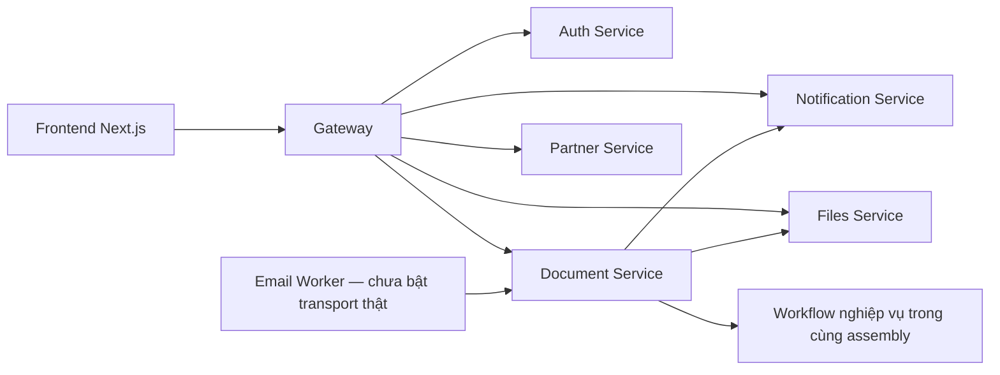

# Kiến trúc và nơi sửa mã

Mỗi service có database/context riêng. Migrations ở `database/migrations/<service>/` được compile vào service tương ứng, không chuyển thành một database chung. Prisma chỉ phục vụ phần auth template frontend đang có; database công văn nằm ở .NET backend.

`workflows/business/` chứa nguồn C# liên kết vào đúng project. Đây là cách tổ chức mã, không phải service chạy độc lập. Controller, DTO, resource authorization và integration clients vẫn ở `backend/services/`.

| Thay đổi | Nơi bắt đầu |
|---|---|
| Giao diện, gọi API, token client | `frontend/src/views/apps/`, `frontend/src/services/` |
| HTTP endpoint, DTO, quyền truy cập | `backend/services/<service>/Controllers/`, `Authorization/`, `Models/` |
| Đăng ký và cấp số | `workflows/business/document-service/Registration/`, `Numbering/` |
| Sửa, phân phối, hủy, khôi phục | `workflows/business/document-service/Editing/` |
| PDF hiện hành và giao thức liên service | `workflows/business/document-service/Files/`, `backend/shared/PdfProtocol/`, Files Service |
| My Staff và task | `workflows/business/document-service/Tasks/` |
| Báo cáo và nhắc hạn | `workflows/business/document-service/Reports/`, `Reminders/` |
| Schema và migration | Entity/DbContext ở service sở hữu; migration ở `database/migrations/<service>/` |
| Kiểm tra và CI | `tools/run-checks.py`, `.github/workflows/core-ci.yml` |

Backend quyết định quyền và số công văn. Frontend capability/menu không cấp quyền. Task assignment không tự cho phép đọc công văn. PDF phải qua resource policy, claim/scanner/protocol; không dùng URL upload công khai làm bằng chứng quyền.

EAP/OCR đang hoãn. SMTP/TMS chỉ là các adapter đã chuẩn bị, cần cấu hình/hợp đồng và môi trường được xác nhận trước khi bật. Các bài test giả lập và build không thay thế nghiệm thu tích hợp thật. Xem [tiến độ](COLLABORATION-STATUS.md) và [quy tắc nghiệp vụ](BUSINESS-RULES.md).
