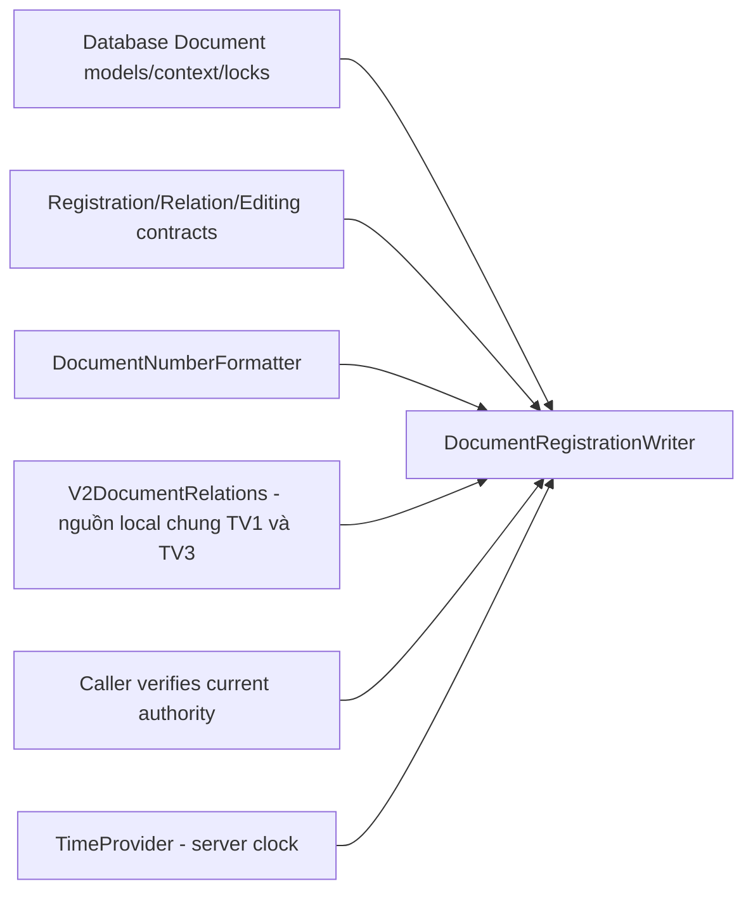

# Dependency của các module thành viên 1

Ngày: 09/10/2026. Nguồn kiểm tra: DAS-Collaboration local và official main `36f8f0f240214f2d50a93cc86bee34d880d3c250`. Chỉ audit/chuẩn hóa local; không merge official main, không chạy database khách hàng, không commit/push lượt này.

## Kết luận

Sáu bộ Entity/DbContext trong gói database compile được khi cấp đúng dependency EF của từng store. Document contracts compile được cùng model Document. Numbering compile được khi bổ sung V2DocumentRelations trong cùng assembly DocumentService. Numbering không phải library độc lập có thể thêm mỗi hai file vào một project rỗng.

Các nhánh chứa module source, không tự chuyển dependency runtime giữa nhánh Git. Việc cherry-pick một commit của nhánh không tự link MSBuild. Cần chọn một nơi compile cho từng khai báo và giữ nguyên các feature đang có của backend chính.

## Ma trận dependency

| Module | Nguồn phải compile cùng / tham chiếu | Dependency runtime |
|---|---|---|
| Database Document | Documents, DocumentV2Persistence, DeliveryEntities, kind details/recipient, relation, cancel/audit/PDF/catalog entities; DocumentDbContext, DocumentV2Model, BusinessCatalogSeed | Provider và connection string thuộc DocumentService; không nhận DB của service khác |
| Database Auth | AuthDbContext; User/Role/UserRole/Department/RefreshToken; ba Directory entity trong AuthService.Organization | Provider riêng; logic EAP/projection không đi kèm gói entity |
| Database Partner | Partner/PartnerAudit/constants/PartnerDbContext | Provider riêng; không ghép factory design-time có connection string vào package |
| Database Files | FileRecord/PdfClaim/PdfUpload/FileDbContext | Provider riêng, storage do Files quản lý |
| Database Notification | NotificationLog/InAppNotification/UserNotificationPreference/DeliveryInbox/NotificationDbContext | Provider riêng; worker/SMTP không bật theo việc thêm schema |
| Database Email | EmailImapSettings/EmailScanLog/EmailScanItemLog/EmailWorkerDbContext | Provider riêng; không đưa mật khẩu IMAP vào source |
| Shared Document contracts | Models/DTOs; DocumentActor; model Document cho các interface legacy; V2KindDetailsView chỉ dùng kiểu dữ liệu scalar | HTTP consumer kiểm envelope/schema; không ProjectReference sang Partner/Files |
| Shared Files contracts | ManagedFileInfo, ApiResponse trong FilesService.Models.DTOs | HTTP trả camelCase; projection FileMetadataDto ở DocumentService |
| Shared PDF contracts | backend/shared/PdfProtocol/Contracts.cs, namespace Das.PdfProtocol | ProjectReference tới PdfProtocol; transport/worker nằm ngoài gói contract |
| Number formatter | DocumentTypeConstants từ Documents.cs | Time zone Asia/Ho_Chi_Minh, clock server, quy tắc kind/company/phòng |
| Number writer | Formatter; DocumentDbContext và graph entity; RegistrationContracts, V2RelationContracts, V2EditingContracts; V2MutationLocks; V2DocumentRelations | DbContext scoped, TimeProvider; SQL Server/SQLite driver và EF execution strategy; caller đã xác minh authority |
| Architecture | Quy tắc nghiệp vụ và ownership service | Không phải assembly/runtime service |

### Version package theo project hiện tại

Target framework .NET 10. Auth/Document/Partner/Files sử dụng EF Core provider 10.0.3; Notification dùng EF 10.0.0; Email dùng EF 9.0.0. Lấy version từ csproj/lockfile của service sở hữu. Không nâng tất cả lên cùng version chỉ để tên package đồng nhất. Khi import vào backend chính phải đối chiếu cả SQLite/SQL driver, lockfile và transitive dependencies; gói source không mang dependency assemblies.

`DocumentNumberFormatter` có `[GeneratedRegex]` và partial method. Compile qua SDK .NET được source generator hỗ trợ; không viết một implementation regex giả để che lỗi source generator khi dùng compiler khác.

### Dependency bắt buộc của Numbering

Writer gọi `V2DocumentRelations.NormalizeRegistration`, `ValidateScope`, `PrepareAsync`, `Apply`. Các hàm này là internal; writer và Relations phải thuộc cùng assembly DocumentService. Cùng namespace nhưng đặt vào hai assembly khác nhau vẫn không truy cập được internal. Không public hóa các hàm để ghép nhanh hoặc tạo stub bỏ kiểm quyền.

`V2DocumentRelations` còn dùng V2EditorActor, V2RelationChange/V2RelationScope, DocumentEditAudit, DocumentOutboxEvent và V2MutationLocks. Đây là graph dependency thực tế. Khi đăng ký không có relations, mã writer vẫn phải compile được với các kiểu/hàm này; nhánh if runtime không bỏ dependency compile.

DI tương ứng trong nguồn phát triển: DbContext scoped, TimeProvider singleton; V2RegistrationService được đăng ký scoped và tạo `new DocumentRegistrationWriter(db, clock)` sau khi authority/refs được kiểm. DocumentBusinessService cũng tạo writer bằng context/clock của request. Writer và Relations hiện không có đăng ký DI riêng; không thêm singleton writer với DbContext scoped. Chỉ có formatter/writer không tạo HTTP endpoint hay authority provider.

## Đối chiếu với backend chính

Rà soát bốn service Auth/Document/Partner/Files trên official main phát hiện 78 tên kiểu đầy đủ đã tồn tại trong nguồn hiện tại; 32 khai báo chuẩn hóa khác nhau (gồm body/attributes/member/defaults, không phải 32 breaking DTO). Không compile đồng thời bản cũ và bản gói mới dưới cùng namespace.

| Kiểu trùng | Khác biệt đã đọc | Cách xử lý khi ghép |
|---|---|---|
| DocumentService.Document | Bản phát triển có Registration/KindDetails/Recipients navigation JsonIgnore | Ghép theo aggregate V2 cùng context/model; không thêm một class Document thứ hai |
| DocumentService.DocumentDbContext | Bản mới có các DbSet/model/ledger V2 | Ghép context/model cùng entity liên quan; không thay context mà bỏ bảng cũ |
| DocumentService.FileMetadataDto | Bản main chỉ 4 trường; bản hiện tại thêm State/CanDownload/Sha256/CanAttach | Chọn contract đầy đủ và client parser tương ứng; API Files cũ thiếu trường phải bị chặn, không tự gán canAttach=true |
| DocumentService.PartnerDto | ShortName trên main bắt buộc; bản hiện tại nullable | Thống nhất producer/consumer nullability và validation; không tự điền tên giả |
| DocumentService.DocumentActor | Bản hiện tại từ chối Guid.Empty; signature vẫn giống | Dùng một khai báo; không thay authority V2 bằng actor legacy |
| AuthService.User/AuthDbContext | Main có soft-delete và PasswordResetTokens; source hiện tại không có đầy đủ các tính năng này | Cần TV2 quyết định schema/feature giữ lại trước khi thay. Không ghi đè làm mất tính năng đang dùng |
| PartnerService.Partner và request/filter | Bản hiện tại thêm contact/normalized fields/version, nullable ShortName, IncludeDeleted | Ghép model + DTO + service validation từ nguồn local chung TV1+TV3; không chỉ chép model rồi để controller/client cũ |
| FilesService.Data.FileDbContext | Bản hiện tại thêm upload/claim/PDF constraints | Ghép theo protocol/authority Files; không nhận URL upload cũ như quyền đọc PDF |

Đối chiếu này là với main được lấy ở mốc trên, không khẳng định đã đọc và thống nhất mọi feature branch của đồng nghiệp. Nếu nhóm sẽ ghép từ một feature branch khác, cần dùng đúng commit đích để lặp lại so sánh.

## Đường dẫn nhánh và đường dẫn nguồn phát triển

| Nguồn trên nhánh | Nguồn canonical / project đích |
|---|---|
| database/source/document-service/Models/Entities/* | backend/services/document-service/Models/Entities/* → DocumentService |
| database/source/document-service/Data/* | backend/services/document-service/Data/* → DocumentService |
| database/source/auth-service/* | backend/services/auth-service/* → AuthService; ba directory entity chỉ lấy khai báo entity |
| database/source/partner-service/* | backend/services/partner-service/* → PartnerService; không copy connection factory |
| database/source/files-service/* | backend/services/files-service/* → FileService.API |
| database/source/notification-service/* | backend/services/notification-service/* → NotificationService |
| database/source/email-worker-service/* | backend/services/email-worker-service/* → EmailWorkerService |
| shared-contracts/document-service/RegistrationContracts.cs | backend/services/document-service/Models/DTOs/RegistrationContracts.cs |
| shared-contracts/document-service/DocumentActor.cs | backend/services/document-service/Authorization/DocumentActor.cs |
| shared-contracts/document-service/*Contracts.cs | backend/services/document-service/Models/DTOs/*Contracts.cs |
| shared-contracts/files-service/* | backend/services/files-service/Models/DTOs/* |
| shared-contracts/pdf/Contracts.cs | backend/shared/PdfProtocol/Contracts.cs |
| numbering/*.cs | workflows/business/document-service/Numbering/*.cs, compile vào DocumentService |
| architecture/*.md | docs/ARCHITECTURE.md, docs/BUSINESS-RULES.md và tài liệu tích hợp trong docs/contracts |

Backend chính hiện dùng services/... thay vì backend/services/.... Phương án hiện tại chọn layout canonical trên máy cho bốn service Document/Partner/Files/Notification và PdfProtocol; sửa project/solution references khi thực hiện, không tạo hai bản source cùng compile. Auth/Email ngoài phạm vi không bị chuyển/thay hàng loạt. Migrations/schema không được xử lý trong task này.

Chọn cách link Numbering giống local: giữ `workflows/business/document-service/Numbering` và Compile Include theo DasSourceOwner trong `backend/Directory.Build.props`, cùng với Relations và các workflow còn lại vào DocumentService. Không thêm một bản Numbering trong project hoặc compile folder package. Chưa sửa MSBuild/merge official checkout trong lượt lập phương án này.

Xem [phương án ghép TV1+TV3](MEMBER1-MEMBER3-INTEGRATION-PLAN.md) cho thứ tự ghép, DI và các gate; [bảng từng file](MEMBER1-MEMBER3-FILE-MAP.md) cho đường dẫn và hành động thay thế/bổ sung. V2DocumentRelations đã có trên máy, không còn là đầu việc chờ thành viên 3 cung cấp.

## Những việc đã thực hiện local

- Tách RegistrationContracts khỏi entity DocumentV2Persistence; tách năm entity ledger khỏi workflow sang DeliveryEntities. Không đổi namespace, field, default value, body hoặc JSON attribute của các khai báo C#.
- Sửa kiểu TypeScript để field snapshot chỉ thuộc DTO đọc, hai array nơi nhận chỉ thuộc DTO ghi. Không đổi request/response runtime hoặc endpoint.
- Bốn nhánh module đã được cập nhật ngày 09/10. DTO đọc V2KindDetailsView đã xuất bản trong shared-contracts theo yêu cầu mới; hướng dẫn/map cập nhật trong architecture. Mapper query mới vẫn thuộc workflow local, chưa xuất bản lên nhánh workflow.
- Chi tiết HTTP dùng V2KindDetailsView thay entity DocumentKindDetails; mapper query phải ghép cùng hai file contract, giữ nguyên JSON hiện hành.
- Lập [quy ước namespace/DTO](NAMESPACE-DTO-CONVENTIONS.md) với nguồn định nghĩa duy nhất và wire types.

Thiếu contract TMS/authority/mapping chính thức không ngăn việc xác định dependency code này. Tuy nhiên, compile module không chứng minh authorization tích hợp hoặc dữ liệu production phù hợp. Hoãn EAP/OCR, migration, customer data, SMTP/TMS thật theo phạm vi hiện tại.

## Dependency bổ sung sau J21–J23

| Module | Dependency nguồn | Ranh giới |
|---|---|---|
| J21 task filter/paging | MyStaffController, MyStaff workflow/tasks contracts, authority full staff scope, TMS connector hiện có, gateway và UI reports-staff | TMS thật chưa nghiệm thu; fixture tests không là adapter production |
| J22 admin browse | CatalogAdminQuery + CatalogService + CatalogsController + BusinessCatalogEntry/DocumentDbContext; CatalogManage | Admin API riêng, không nới lookup công văn; capability lấy server |
| Document history | V2HistoryContracts + V2LifecycleHistory + parser + DocumentHistoryController + DocumentEditAudit + IDocumentV2Authority | DI V2LifecycleHistory; audit reason per cycle; metadata lọc trước paging; không lấy current cancellation cho mọi event |
| Partner audit | PartnerAuditQuery (DTO/query) + PartnerHistoryController + PartnerAudit/PartnerDbContext | DI PartnerAuditQuery; CatalogManage; soft-deleted existence; metadata-only |
| History UI | history types/client + HistoryPanel + partner detail route + DocumentDetail | Cùng wire string Int64/UTCZ; session/abort/query owner; không fallback quyền/summary giả |

Bản đồ file local hiện có 120 source runtime/build; JSON liệt kê chính xác source/target/hash/owner. Đã bổ sung query/controller/history contracts và parser cần thiết của J21–J23. Bốn nhánh chuẩn bị local chỉ có nguồn thuộc đúng chủ đề; controller/query/frontend không bị đặt vào database/numbering. Không tự thêm migration hoặc chạy database khách hàng.
